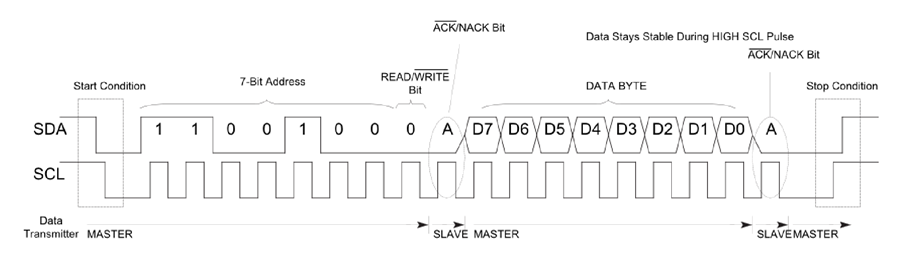
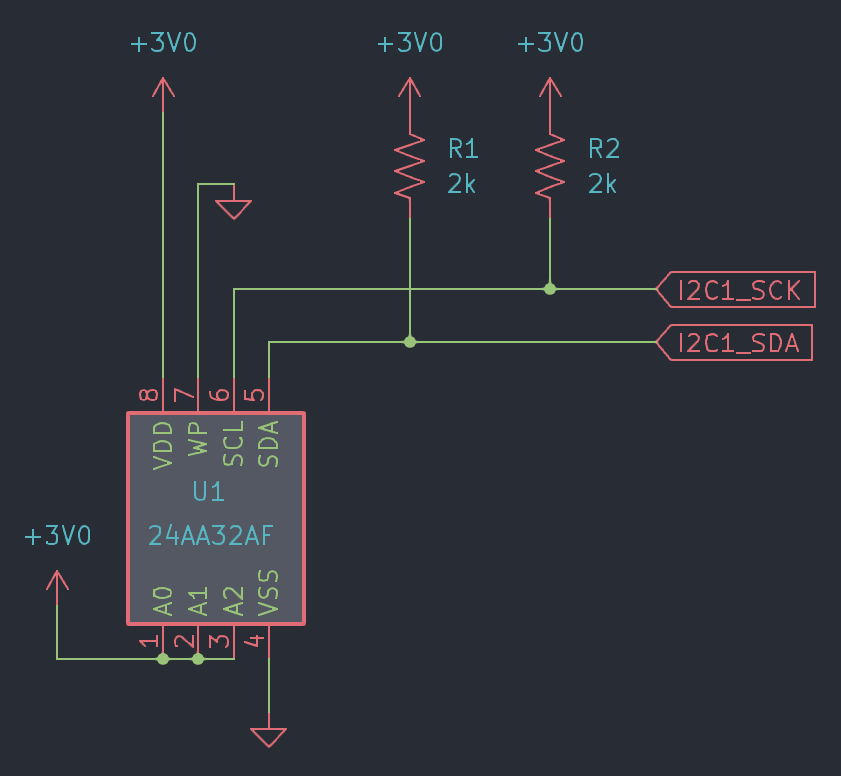
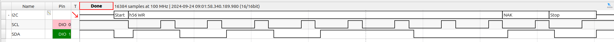
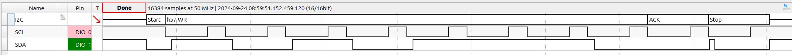

# Lab Guide
## Inter-Integrated Circuit (I<sup>2</sup>C) interface

### Table of Contents
<br>

(Not a for-credit lab, but the point structure is left in for reference.)

| Step    | Description                               | Points |
|---------|-------------------------------------------|--------|
| 0.1     | Set up your environment                   |        |
| 0.2     | Wiring the circuit                        |        |
| 1       | Configure the pins for I2C1               |  5     |
| 2       | Initialize the I2C1 peripheral            |  10    |
| 3.0     | Implement `i2c_start`                     |  10    |
| 3.1     | Implement `i2c_stop`                      |  10    |
| 3.2     | Implement `i2c_waitidle`                  |  5     |
| 3.3     | Implement `i2c_senddata`                  |  15    |
| 3.4     | Implement `i2c_recvdata`                  |  15    |
| 3.5     | Implement `i2c_clearnack`                 |  5     |
| 3.6     | Implement `i2c_checknack`                 |  5     |
| 3.7     | Check your I2C functions                  |  10    |
| 4       | Demonstrate a data read and write         |  10    |
|         |                                           |        |
| &nbsp;  | Total:                                    | 100    |
<br>

## Instructional Objectives
- To understand the Inter-Integrated (I<sup>2</sup>C) Circuit packet format.
- To initialize and configure an Inter-Integrated (I<sup>2</sup>C) Circuit peripheral.
- To use the I<sup>2</sup>C peripheral to communicate with a device.

## Inter-Integrated Circuit (I<sup>2</sup>C)

> [!NOTE]
> The terms master and slave are described here so that you know what they mean in case you come across them in older datasheets, including your STM32 datasheet.  They are **outdated** terms, and the canonical terms for these signals now are as follows:
> 
> Primary for master;  
> Secondary for slave;  
>
> We use both terms since the STM32 datasheets still use the former, and we don't want you to be confused when you see it.

The I<sup>2</sup>C communication protocol is generally used for creating large buses that include more than a singular **primary** (master) device. All connected devices communicate on the same set of **two** wires, unlike SPI with 3:

- **Serial Clock Line (SCL)**: This is the line that carries the clock signal that synchronizes the data transfer between the primary and secondary devices.  The primary device generates the clock signal, and the secondary device synchronizes with it.
- **Serial Data Line (SDA)**: This is the line that carries the data between the devices. It is bidirectional, so it can be used to send and receive data.  The primary device requests data by sending the **address** of the secondary device being contacted, and the secondary device sends data back to the primary device in response to the primary device's request.

The concept of the address allows an I<sup>2</sup>C primary device to communicate with multiple secondary devices on the same bus.  The address is a unique identifier for each secondary device, and the primary device uses this address to select the secondary device it wants to communicate with.  The address is typically 7 bits long, but can be extended to 10 bits for more complex systems.  Typically, you'll find the address (and its length) in the datasheet for the device you're trying to communicate with.

Here is an example packet format for I<sup>2</sup>C as sent from the primary device to the secondary device:



The SDA line is unique in that either the primary or secondary device can **drive it high or low**.  This is because the SDA line is **open-drain**, meaning that it is pulled high by a resistor, and driven low by the device.  This allows multiple devices to share the same bus without causing a short circuit.  The SCL line is driven by the primary device, and the secondary device synchronizes with it.

The I<sup>2</sup>C protocol is also a **multi-master** protocol, meaning that any of the devices sharing the same I<sup>2</sup>C bus can be a primary device. The primary device is the one that initiates the communication, and the secondary device is the one that responds to the primary. The primary device is responsible for generating the clock signal, and the slave device is responsible for synchronizing with the clock signal.

## Step 0.1: Set up your environment

Make sure to clone the code repository from GitHub Classroom.  Keep in mind to add, commit and push any changes you make so that your work is accessible from a lab machine.  

Similar to previous labs, make sure to open your repository in VScode by clicking File > Open Folder (or Ctrl-K + Ctrl-O), and then selecting the newly cloned repository.  

**Unlike previous labs**, no autotest project is provided.  Instead, you should create your own command shell that you can use to invoke "read/write" functions to perform I2C transactions for you from a command line over USART.  If you have not yet seen it, instructions to write and implement a command shell are in the [USART lab](https://github.com/ece362-purdue/labs/tree/main/lab7-usart/README.md).  In this lab, you are expected to have a working command shell to which you can add commands for I<sup>2</sup>C transactions.

## Step 0.2: Wiring your circuit

In your kit, you will find the 24AA32AF I2C EEPROM - it is a very small chip with 8 pins, likely on the black thermocol piece holding all your other chips.  This chip is  32Kbit (4KB) EEPROM that communicates over I<sup>2</sup>C, and can be used to store persistent data for your microcontroller that can survive your board being power-cycled or reset.  You will use this chip to read and write data to and from it using the I<sup>2</sup>C protocol - a common use case for projects that want to save and read persistent data.

At this point, your breadboard may be quite crowded.  We suggest placing the EEPROM to the left of your 74HC595 shift registers used for SPI in lab 6.  Another option from previous semesters, if you aren't using the keypad too much, is to place it **under** the keypad - the chip is small enough that it can actually fit under there.  

[Read the datasheet](https://engineering.purdue.edu/ece362/refs/24AA32AF.pdf) for the EEPROM, and wire up the chip to your STM32F0 board as follows:

- Connect the A2, A1, A0 pins such that the I<sup>2</sup>C address of the EEPROM is 0b111.  A2 is the most significant bit.
- Connect the VCC pin to 3.3V.
- Connect the GND pin to GND.
- Connect the SDA pin to the I2C1 SDA pin on your STM32F0 board.
  - Attach a 2 kΩ pull-up resistor to 3.3V, which is unique to the speed we will be using.  (Why? See the datasheet for more info.)
- Connect the SCL pin to the I2C1 SCL pin on your STM32F0 board.



## Step 1. Configure the pins for I2C1 (`enable_ports`)

The I2C1 peripheral is connected to the GPIO pins on the STM32F0 board.  You will need to: 

- Enable the peripheral clock for the GPIOx bus for the pins for I2C1 SCL and SDA. 
- Configure the pins for the I2C1 alternate function.

## Step 2. Initialize the I2C1 peripheral (`init_i2c`)

Next, we'll configure I2C1 to use the SDA and SCL pins to be able to conduct I2C transactions with our EEPROM.  You will need to:

- Enable the peripheral clock for I2C1.
- **Before doing anything else**, make sure the I<sup>2</sup>C peripheral is disabled.
- Turn OFF the analog noise filter.
- Turn ON the error interrupts enable.
- Disable clock stretching.
- To configure the I2C for 400 kHz "Fast Mode" transmission, we need to set TIMINGR register fields to specific values.
  - With `internal_clock()`, our STM32 clock frequency is 48 MHz.
  - The STM32 Reference Manual has a table that shows the values for the TIMINGR register for different examples of I2C speeds for different clock frequencies.
  - The timings settings assumes a I2CCLK of 8 MHz, so you will need to adjust the PRESC field to divide the clock down from 48 MHz accordingly.
  - You want to set the I2C speed to 400 kHz "Fast Mode", so you will need to adjust the SCLL, SCLH, SDADEL and SCLDEL respectively.
    - 100 kHz "Standard Mode" would work too.  Always check the datasheet for the device you are communicating with to see what speeds it supports.
- Configure I2C1 to be in **7-bit** addressing mode, and not **10-bit** addressing mode.
<!-- - Configure I2C1 to automatically send a STOP condition after the last byte of a transmission. -->
- Finally, enable the I2C1 peripheral.

## Step 3: Set up I2C communication functions

You will need to implement the following functions to communicate with **any** I2C device.  Any device that you communicate with will likely have their own separate functions (e.g. `eeprom_read` and `eeprom_write`) that will call these functions to perform the I2C transactions.

## 3.0: `i2c_start`

A START condition is composed of an initial START bit, where the SDA line goes from high to low while the SCL line is high, followed by a "control byte" with the 7-bit address of the target we wish to communicate with, followed by an 8th bit that indicates if the operation is a read or write.  

`i2c_start` takes three arguments to send the START condition.  

1. The `targadr` gives us the target address of the I2C secondary device we wish to communciate with, and is 7 bits long.  

2. The `size` gives us the number of bytes we wish to transfer.  This is important because the I2C secondary device needs to know how many bytes to expect or send.

3. The `dir` gives us the direction of the transfer.  The `dir`, when combined with the target address, gives an 8-bit "control byte" which is sent immediately after the START bit.  A 0 indicates a write operation, and a 1 indicates a read operation.

Unlike previous peripherals, changing the I2C peripheral's CR2 register is not very straightforward, since we need to change things like the target address, the number of bytes to transfer, and the direction of the transfer.  We can't just write to the CR2 register directly, since we need to preserve the other bits in the register.  We can do this by reading the CR2 register, modifying the bits we need to change, and then writing the modified value back to the CR2 register.

```c
// 0. Take current contents of CR2 register. 
uint32_t tmpreg = I2C1->CR2;

// 1. Clear the following bits in the tmpreg: SADD, NBYTES, RD_WRN, START, STOP

// 2. Set read/write direction in tmpreg.

// 3. Set the target's address in SADD (shift targadr left by 1 bit) and the data size.
tmpreg |= ((targadr<<1) & I2C_CR2_SADD) | ((size << 16) & I2C_CR2_NBYTES);

// 4. Set the START bit.
tmpreg |= I2C_CR2_START;

// 5. Start the conversion by writing the modified value back to the CR2 register.
I2C1->CR2 = tmpreg;
```

## 3.1: `i2c_stop`

A STOP bit is sent by pulling the SDA line from **low to high** while the SCL line is **high**.  This indicates the end of a transaction.  `i2c_stop` should send a STOP condition to the I2C bus.

To send a STOP bit:

```c
// 0. If a STOP bit has already been sent, return from the function.
// Check the I2C1 ISR register for the corresponding bit.

// 1. Set the STOP bit in the CR2 register.

// 2. Wait until STOPF flag is reset by checking the same flag in ISR.

// 3. Clear the STOPF flag by writing 1 to the corresponding bit in the ICR.
```

## 3.2: `i2c_waitidle`

We want to avoid changing any factors of the I2C transaction before sending any new data.  In this function, simply check if the I2C is **busy** according to the ISR and loop until it is not.

Better I2C implementations will use interrupts to handle the I2C transaction, but for now, we will use polling to check if the I2C is busy.

## 3.3: `i2c_senddata`

Given a target address, the data to send, and the length of the data, `i2c_senddata` should send the data to the target address.  This function should:

- **Wait** until the I2C is **idle**.
- Send a START condition to the target address with the write bit set.
- Start a loop from 0 to size - 1, and for each iteration:
  - Wait until the TXIS flag is set in the ISR, and quit if it takes too long:
  ```
  int count = 0;
  while ((I2C1->ISR & I2C_ISR_TXIS) == 0) {
      count += 1;
      if (count > 1000000)
          return -1;
      if (i2c_checknack()) {
          i2c_clearnack();
          i2c_stop();
          return -1;
      }

  }
  ```
  - Mask `data[i]` with `I2C_TXDR_TXDATA` so we ensure the data being transmitted is only 8 bits long, and write it to the I2C1 TXDR register.
- Outside the loop, loop until the TC and NACKF flags are not set.
- Once the loop quits, if the NACKF flag is still set, return -1 - this indicates the target device did not acknowledge the data.
- Finally, send a STOP bit, and return 0 to indicate success.

## 3.4: `i2c_recvdata`

Recieving data is quite similar to sending data, but with a few key differences.  Given a target address, a buffer to store the data, and the length of the data, `i2c_recvdata` should:

- **Wait** until the I2C is **idle**.
- Send a START condition to the target address with the read bit set.
- Start a loop from 0 to size - 1, and for each iteration:
  - Wait until the RXNE flag is set in the ISR, and quit if it takes too long:
  ```
  int count = 0;
  while ((I2C1->ISR & I2C_ISR_RXNE) == 0) {
      count += 1;
      if (count > 1000000)
          return -1;
      if (i2c_checknack()) {
          i2c_clearnack();
          i2c_stop();
          return -1;
      }
  }
  ```
  - Mask the data in the I2C1 RXDR register with `I2C_RXDR_RXDATA` so we ensure the data being received is only 8 bits long, and store it in `data[i]`.

## 3.5: `i2c_clearnack`

This is simple, just clear the NACK flag in the ICR.

## 3.6: `i2c_checknack`

This is simple. Just check if NACK flag is set in the ISR. Return a 1 if so.

## 3.7 Check your I2C functions

Before you attempt to write to the EEPROM, you will need to test your functions.  In the past, too many writes to the EEPROM has caused the memory to degrade, so it's best to avoid writing to it until you actually have your functions working.  Test it with an incorrect address like 0x56, as will be explained below.

The way to check if you have the correct transactions would be to use an AD2 or an oscilloscope to check the SDA and SCL lines.  On an AD2, use the Logic Tool, add an I2C bus with DIO0 as SCL and DIO1 as SDA, and set the speed to 400 kHz.  Set the Trigger to "Start" to ensure you capture the beginning of the transaction when you run that code from the STM32.  On an oscilloscope, click the "Serial"/"Digital" button to decode the I2C bus, using the same trigger options.

The following code will send a START condition to address 0x56, followed by a STOP bit.

```c
i2c_start(0x56, 0, 0);
i2c_stop();
```

You will then see the following on your AD2/oscilloscope:



This is an example of a "zero-byte write", where no data is written to the EEPROM.  In the case of this EEPROM, such a write is performed just before a read operation is requested, so that the EEPROM knows which address to read from.

```
0x56 WR = 101 0110 0  
0x56 RD = 101 0110 1
```

In this packet, you can see the START condition with the control byte containing the EEPROM address 0x56 (0b1010110), and the 8th bit set to 0, indicating a write operation.  Then, a NACK is "detected".  Since there is no device connected to the bus, no device pulls the line low during the expected "ACK" phase, resulting in No-ACK, or NACK.  This is the expected behavior when the EEPROM is not connected, or if the correct address is not specified.

Now change the address from 0x56 to 0x57, and you should see the following after rerunning the code above:



Since the address of the EEPROM is 0x57, which is because of the "control byte" that we have to send containing the 7-bit target address and 1-bit direction of data transfer (ReaD/WRite).

```
0x57 WR = 101 0111 0  
0x57 RD = 101 0111 1
```

The "7" in 0x57 comes from setting the A2/A1/A0 pins to a logic high on the chip, in case we have multiple EEPROMs on the same bus.  If we had pulled A0 to GND, the address would be 0x56 (and our EEPROM would have responded with an ACK the first time).

## Step 4: Demonstrate a data read and write

Once you have your ensured your EEPROM is being written to correctly, attempt a data write and read to the EEPROM.  You can use the `eeprom_read` and `eeprom_write` functions, which are given to you, to do this.  

If you haven't completed lab 7, or you simply wish to not use the command shell, you can write a simple `main` function that writes a sentence (max length 32 bytes) to the EEPROM, and then reads it back into a new string using the `eeprom_write` and `eeprom_read` functions.  You can then use the debugger to inspect the contents of the string to see if the data was written and read correctly.

Otherwise, you can copy in your lab 7 code as specified in the template file, and run the provided `main` function as is to start the command shell over your UART, similar to autotest from labs past.  Then, using the command shell, try to write and read data to and from the EEPROM.  Here are some examples:

```c
I2C Command Shell
This is a simple shell that allows you to write to or read from the I2C EEPROM at 0x57.

> write 0 This is a test.
Writing to 0x0: 'This is a test.'

> write 10 Another test.
Address 0x10 is not evenly divisible by 32.

> write 20 Another test.
Writing to 0x20: 'Another test.'

> read 0
String at 0x0 is: 'This is a test.'

> read 20
String at 0x20 is: 'Another test.'

> 
```

The addresses are in hex, and must be divisible by 0x10/32, since the memory pages are 32 bytes long.  Therefore, we ensure all writes are "page-aligned" to avoid writing to the wrong memory location, and we cap the length of the string to 32 bytes.  
