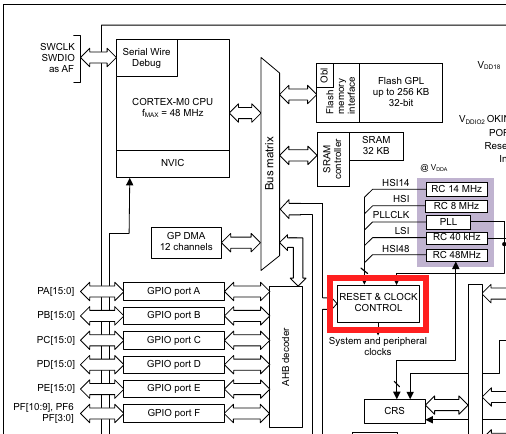

# Lab 1
## General Purpose I/O

### Table of Contents
<br>

| Step | Description | Points |
|------|-------------|--------|
| 0.1 | Set up your environment |   |
| 0.2 | Read the Good Wiring Practices guide |   |
| 1 | Configuring Port B | 20 |
| 2 | Configuring Port C | 20 |
| 3 | Set PORTB pin outputs | 10 |
| 4 | Read PORTB pin inputs | 10 |
|   | Wiring Up Your Circuit |   |
| 5 | Buttons and LEDs | 20 |
| 6 | Keypad and LEDs | 20 |
| 7 | In-Lab Checkoff Step | 20* |
| &nbsp; | Total: | 100 |
<br>

\* - You must get your whole lab checked off before the end of your lab section to avoid a late penalty of 20%.

## Instructional Objectives
- To learn how to connect LEDs and push buttons/keypad to the STM32 GPIO pins.
- To learn how to configure the GPIO subsystems.
- To learn how to read values from and write values to the GPIO pins.

> [!IMPORTANT]
> Going forward, if you use hexadecimal or binary code, you should comment each line so we can see what you're intending to do. If it's in CMSIS (i.e. if you're using a descriptive macro like RCC_AHBENR_GPIOAEN to set a value), it does not require a comment.
> 
> By now, your breadboard should have been signed with a silver sharpie with your username and the signature of the TA.  If you have not yet done this, please notify a TA and get it signed as soon as possible.  **Failure to do so by lab 2 will result in a zero for the lab currently running in that week.**
> 
> Keep in mind the food-and-liquids policy of the lab, which is to bring absolutely no food or liquid with you to your lab sessions.  If you must bring it, keep it under the window in the back of BHEE 160.  **Failure to follow this rule will result in a penalty.** 

> [!NOTE]
If at any point you need to get checked off, or need to get help, you can add yourself to the [lab queue](https://engineering.purdue.edu/~menon18/queup/?room=36200).  **Bookmark this link in your lab machine browser.**

## To Understand The General Purpose Input/Output (GPIO)

In this experiment, you will learn how to connect simple input devices (push buttons and keypad) and simple output devices (LEDs) to an STM32 development board. You will learn how to configure the General Purpose Input/Output (GPIO) subsystems. You will read values from and write values to these pins.

By default, every subsystem in a microcontroller is disabled in order to reduce power consumption, and the GPIO subsystem is no exception. Each port must first be enabled by turning on a clock for the port controller. Only after that, can the port be configured. The following two steps are needed to configure I/O pins for use:

1. The Reset & Clock Control (RCC) subsystem must be configured to enable a GPIO port for use. This is done by turning on the specific bit in the `AHBENR` (Advanced High-Performance Bus Enable Register). In doing so, be sure not to turn OFF important bits such as the SRAMEN bit. Use your lecture notes to determine how to do this. For this lab, in particular, you should enable Ports B and C by ORing the appropriate values into the `AHBENR` register. A figure of the Reset and Clock Control is shown below:



2. An enabled port must have its pins configured as either inputs or outputs (or some other functions that we will use in future labs). For this lab, we will initially use Port B pins as inputs and Port C pins as outputs. For instance, the inputs used will be pins PB3 and PB4 (pins 3 and 4 of Port B).  For both ports there are some pins whose function you should not modify. In particular, you should not change PA13, PA14, PC14, or PC15 since these are used for an External Oscillator, Debugging, and Programming interfaces.  Instead, use code from your lecture notes to learn how to set and clear only the bits you want without altering other bits.

A functional diagram for an STM32F0 GPIO port is shown below:


In this experiment, you will enable general purpose (digital) inputs and outputs. That will involve using the `IDR` (input data register) and `ODR` (output data register) for each port. We will consider analog inputs and outputs in future lab experiments.

## Step 0.1: Set up your environment

Make sure to clone this repository.  Keep in mind to add, commit and push any changes you make so that your work is accessible from a lab machine.  

To start, open the "code" folder in VScode.  Do this by opening VScode, clicking File > Open Folder (or Ctrl-K + Ctrl-O), and then selecting the "code" folder.  By default, PlatformIO should auto-detect the project and open the PlatformIO side panel for you to use, including build and debug options that you used in lab 0.  Re-read lab 0 if you need a reminder on how to build, flash and debug your code.

> [!NOTE]
> If you're getting tired of having to click "Build" and "Upload", start getting used to **shortcuts**.  See this [PlatformIO note](https://docs.platformio.org/en/latest/integration/ide/vscode.html#key-bindings) on what keybindings to use for building and uploading your code.
> In general, if you feel like a process is arduous, there is very likely an easier way to do it.  (This is an example of [Occam's Razor](https://en.wikipedia.org/wiki/Occam's_razor).)  Google should always be your first recourse.  If you can't find anything, ask a TA or your peers.

In addition, a precompiled autotest object has been incorporated into the template folder. You can utilize it to test the subroutines (another word for functions). To do so, make sure you have connected the UART serial adapter and the STLink to the microcontroller. Then you will need to uncomment the line `autotest()` in the `main.c` file and start the debugging on System Workbench. After the debugger successfully launches, make sure it goes into the `autotest()`, and launch a serial connection to the microcontroller in a terminal by clicking "Upload and Monitor" in the PlatformIO tab (the same one in lab 0).  

If you are on Windows, take care to select the correct COM port in the menu if it appears after clicking "Upload and Monitor".  You can also hardcode the serial port name under "monitor_port" in your `platformio.ini` file.  

If you are on Linux (eg. a lab machine) and want to see the output in a separate window from VScode, you can also launch a serial connection in a separate window by clicking "Upload" only, and then typing `screen /dev/ttyUSB0 115200` into a terminal.  To exit `screen`, press Ctrl-A, backslash (\\) and then 'y'.

If you don't see anything after the serial port connection is established, press the reset button on the microcontroller to see the introductory text from `autotest`.  Try typing something, and you should see the characters appear.  That should confirm the connection is working as intended.

You should see a prompt similar to the following:

```text
GPIO Lab Test Suite
Type 'help' to learn commands.

> 
```

You can then type `help` to learn what commands you can use to test a certain subroutine.  You will use this to demo your implementation and wiring to the TAs.

> [!NOTE]
> If you are trying to debug and are getting an error in the Debug Console about not being able to find `openocd`, try changing the location of the tool under the `debug_server` key in the `platformio.ini` file to `${platformio.packages_dir}/tool-openocd/bin/openocd`.

## Step 0.2: Read the Good Wiring Practices guide

Under your course Brightspace > Labs > Resources, read the Good Wiring Practices PDF to get an idea for how to properly organize your breadboard.  Each lab builds on the previous ones, so you should be sure to have the right setup for each lab to avoid possible overcrowding and messy wiring.

## Step 1: Configuring Port B

Using the `main.c` template file provided for this lab, fill in the C procedure for `initb`. This should: 

- Enable the RCC clock for Port B.
- Set pins PB8 - PB11 as outputs and; 
- Set pins PB0 & PB4 as inputs. 

Refer to the lecture notes to learn how this is done, and how each line affects the corresponding register to, in turn, configure the specific peripheral and/or pin.  This should be done without disabling other pins in `RCC` - a disastrous mistake, as changing other pins may cause your microcontroller to stop working entirely.   

The global variable `RCC` is provided for you to use as the base address for the Reset and Clock Control I/O registers.  Use the global variable `RCC->AHBENR` to access the `AHBENR` I/O register. In addition, the enable values are also predefined as well. For instance, you can use `RCC_AHBENR_GPIOBEN` as a constant to enable the `GPIOB` bit in the `AHBENR` register. Most of these symbols should have the same names as in the Family Microcontroller manual, which you can find under Piazza > Resources.  You can use `CTRL + Space` to autocomplete these symbols in VScode.

Similarly, the global variable `GPIOB` is provided along with the symbols for `MODER`, `IDR`, `ODR`, `BSRR`, etc. Use these in a similar manner to `RCC` and `AHBENR` (i.e. `GPIOB->MODER` will access the `MODER` register for GPIO port B) to configure pins PB8-PB11 as output pins (and to read and write their driven values in later sections.)

If you look at the documentation in the Family Reference Manual regarding a GPIO port's `MODER` register, you will notice that all pins, that can be used as inputs, are set as inputs by default. Regardless of that, we want you to get some practice clearing bits of the `MODER` as well as setting bits, so you must set these pins as inputs **explicitly**.  Configure pins 0 and 4 of Port B as inputs as if they were configured as outputs.  This means you should clear the 2-bit value for each pin in question to **00**.

Once you have finished this subroutine, try it out with the `autotest` function call uncommented.  The `autotest` module provided for you will call this and every other subroutine you write multiple times in different ways.  It will deliberately set and clear other bits in the `AHBENR` to make sure that you are doing a proper OR operation to set only the necessary bits and not setting or clearing any other bits.  The procedure for ORing bits into a configuration register may seem cumbersome, but it will occur repeatedly for many types of peripherals.  You'll get used to it.

When debugging individual subroutines you should leave the call to `autotest` commented out so that you can step through the operation of each subroutine.  You must complete each step of implementation in sequence. **You will not get credit for steps 2 through 6 without first satisfactorily completing step 1.**

> [!NOTE]
> When debugging your code for a specific peripheral, you can access the peripheral's control registers via the Peripheral panel in the debug view.  Certain names may be different - for example, GPIOBEN is IOPBEN in the RCC->AHBENR view.  **This is a process you will use throughout the rest of the semester.**
> 
> 

> [!IMPORTANT]
> Demonstrate to your TA that your code passes the `initb` test in `autotest`.  Commit all your code and push it to your repository now.  Use a descriptive commit message that mentions the step number.  

## Step 2: Configuring Port C

For this section, you will need to complete the subroutine `initc` in `main.c` so that GPIOC's clock is enabled in RCC and it configures **only pins 4, 5, 6 and 7 of Port C as outputs**. These pins will drive the colunms of the keypad (the wiring and schematic for which will be introduced later). Set **pins 0, 1, 2, and 3 as inputs and to use the internal pull down resistors by setting the relevant bits in the PUPDR register**. These will read the rows of the keypad and need to be pulled down to keep from reading erroneous floating signals. You should use the symbolic constant `GPIOC` to access registers of GPIO port C. Similar to GPIOB, you can use `GPIOC->MODER` and `GPIOC->PUPDR` to access the mode register and the pull-up/down register for port C. 

> [!NOTE]
> Reminder: Be sure not to change the configuration for GPIOC pins 13, 14, and 15.

> [!NOTE]
> Recall the Peripheral view we used earlier?  You can actually right-click and press "Update Value" to change the value in the corresponding register!  Don't worry if it doesn't update immediately - the value will update when you move to the next line in the debugger.
> A good way to test this is by stepping through your initc function, and stopping before the line that changes your pins to use the internal pull down resistors.  Then, change bits 6-7 of the ODR register under the GPIOC peripheral to 1.  You'll see the LEDs on your STM32 board light up!

> [!IMPORTANT]
> Demonstrate to your TA that your code passes the `initc` test in `autotest`.  Commit all your code and push it to your repository now.  Use a descriptive commit message that mentions the step number.

## Step 3: Set PORTB pin outputs

For this section, you will need to complete the subroutines `setn` in `main.c`. The first parameter is the bit number (the same as the pin number) to be set (by `setn`). The second parameter is the value to set the pin to (either zero or anything not zero). 

The `setn` subroutine turns off the pin/bit number in the `GPIOB_ODR` register if the value in the second parameter is zero. Otherwise, it turns on the pin/bit number. 

For example, if you execute `setn(8, 0)`, it would turn pin 8 off. If you execute `setn(8, 59823)`, it would turn pin 8 on. Here, the value `59823` is arbitrary. Any value other zero in the second argument should turn the pin on. Use the variable `GPIOB->ODR` to ACCESS the output data register. You are encouraged to use the `BRR` and `BSRR` registers to implement these subroutines.

> [!NOTE]
> Hint: Students often ask why they can't just *toggle* the corresponding bit in the ODR directly.  The reason is that you may risk multiple changes to the same pin by different parts of your code, e.g. when an interrupt is triggered and you want to turn on a pin, but your main code is turning it off.  (If that doesn't make sense yet, wait for the lecture on interrupts.)  The BRR and BSRR registers are designed to prevent this from happening, as a write operation will **atomically** (independently, without interruption) set or clear the corresponding bit.

## Step 4: Read PORTB pin inputs

Complete the subroutine `readpin` in `main.c`. This function accepts a bit number as parameter 1. It returns the value in `GPIOB_IDR` at the bit specified by parameter 1. In other words, the subroutine should return `0x1` if the pin is high or `0x0` if the pin is low.

## Wiring Up Your Circuit

> [!IMPORTANT] 
> **Before you proceed**: Unplug the programmer the USB port to remove power from the development board before you wire components. Anytime you plug things in to the microcontroller when the power is on, you run the risk of connecting something you shouldn't have and causing damage. By removing power, you have the opportunity to double-check your work before you reconnect power. You can ask one of your TAs to triple-check your work.

After you remove the power from your development board, wire your circuit as shown below. Ensure that you are connecting resistors for the buttons to the 3V power. You are advised to connect the power buses on your breadboard array to the GND and 3V connections on the development board. (Leave the 5V pins unconnected to avoid using them.)


Use your choice of red, yellow, and green LEDs to build the circuit above. To determine the orientation of an LED, look at the length of the leads. The long lead of the LED is usually the anode (the positive terminal) and the short lead is the cathode (the side connected to ground in the schematic). You can also search for a flattened section of the circular rim of the LED. That also indicates the cathode.

Use four-lead "tactile" push buttons for the switches. The 6x6mm push buttons work the same way as the 12x12mm push buttons. Note that pins 1 and 2 are connected together internally as well are pins 3 and 4. The push button is "normally open". When it is pressed, pins 1 and 2 are connected to pins 3 and 4. See the diagrams below for more details.


You will use a 16-button keypad for this lab experiment. One configuration for such an arrangement of buttons would be to have two wires for each button (32 wires total) so that each button could be independently monitored. That would require a lot of pins on the keypad which might make it difficult to use on a breadboard. An optimization might be to have one common power connector and one more connector per button (17 wires total) so that each button could still be monitored individually. But this is still too many pins on the keypad than manufacturers will usually support, and the numbers would only be much worse for keypads with even more buttons.


The typical concession for keypads is to have multiple common pins that connect to groups of buttons. The logical extension to this trend is to configure a keypad as a matrix of rows and columns. If the number of rows and columns is about equal, this practice minimizes the number of pins on the keypad. The added challenge is that the keypad must be scanned one row or column at a time. For instance, a voltage can be applied to a row of buttons, and the columns can be sensed to detect if any of the buttons in the row are being pressed. Then the voltage can be removed from the row and re-applied to another row. By cycling through all the rows, all keys can eventually be detected.

When you are finished, your circuitry should look something like below. You can, of course, arrange your circuitry in any manner you want, but we will be using the keypad in this configuration for the rest of the semester, It might be good if you keep it as close to this picture as possible. In particular, look at those blue resistors whose leads have been cut short to let them sit flush in on the breadboard. You are strongly encouraged to do the same. Later in the semester, we'll put the resistors under the keypad, and there is no good way to do that without making the leads short. Cut each lead so that only 8mm - 10mm extends from each side. Bend the leads at an angle, and push the resistor down into the breadboard. (Resistors are inexpensive. Don't feel bad about snipping them.)


## Step 5: Buttons and LEDs

Complete the subroutine `buttons` in `main.c`. This function will be called repeatedly in a loop. The purpose of this function is to map the button presses (inputs on PB0 and PB4) to 2 of the 4 LEDs (on PB8-PB11). So if a button is pressed, the corresponding LED should turn on, and once it is released, the LED should turn off.  The pseudo-code for this function is:

```C
void buttons(void) {
    // Use the implemented subroutines
    // Read button input at PB0
    // Put the PB0 value as output for PB8
    // Read button input at PB4
    // Put the PB4 value as output for PB9
}
```

> [!IMPORTANT]
> Demonstrate to your TA that your code passes the `buttons` test in `autotest`.  Commit all your code and push it to your repository now.  Use a descriptive commit message that mentions the step number.

## Step 6: Keypad and LEDs

Complete the subroutine `keypad`. It will be called in an infinte loop. The subroutine should iterate through all the column pins (PC4-PC7), setting one high and the rest low on each iteration. In each iteration, it should check all the row input values (PC0-PC3). For each column, if a button in a certain row is pressed, a light should turn on, and when it is released, it should turn off. No two columns can use buttons on the same row (the simplest arrangement will be the diagonal **1, 5, 7, 9** so that only buttons on this diagonal can turn on/off the LEDs) and no two columns can use the same LED. Pseudo-code for this function is provided below:


```C
void keypad(void){
    loop i = 1, 2, 3, 4 {
        set ith column to be 1 using GPIOC->ODR
        call nano_wait(1000000)
        read the row inputs PC0-PC3 using GPIOC->IDR & 0xF
        check the ith row value and set this to ith LED output pin using `setn`
    }
}
```

Notice the function `nano_wait` in the body of the function above. This is needed because if you were to press both the 7 and * key (for example), the light wouldn't turn on, even though with the code above, it should. This is because the microcontroller sets and checks the pins too quickly, not giving the driving column enough time to charge the row lines (think of an RC circuit)! With the call to `nano_wait` inserted in between the set and check, this issue is averted.  `nano_wait` is a function that takes in a number of nanoseconds to wait, and it is provided for you in the `autotest` object file.

In other words, just waste some time so that we can correctly read in the expected values.

Students often get confused at this step - if you'd like a visualization of what's supposed to happen when reading the keypad, here's a flowchart.  Each key on the diagonal should turn on one LED, and their associated positions are shown on the diagram:


So, holding 1 should turn on the LED at PB8, holding 5 should turn on the LED at PB9, etc.

> [!IMPORTANT]
> Demonstrate to your TA that your code passes the `keypad` test in `autotest`.  Commit all your code and push it to your repository now.  Use a descriptive commit message that mentions the step number.  

## Step 7: In-Lab Checkoff Step

> [!CAUTION]
> Run `verify` in `autotest` to generate your confirmation code.  Make sure to first set your username in the `main.c` file.  Save the confirmation code ONLY into a new file called "confirmation.txt" in the root of your repository.  
> Add, commit and push it to your remote repository, and submit your GitHub repository to the Lab 1 assignment on Gradescope.  The autograder will decode your confirmation code, and you will receive a score proportional to the tests you passed.  **You will not receive credit for this lab if you do not submit your confirmation code in your repository to Gradescope.**

> [!IMPORTANT]
> Please make sure to close all windows, log out of the machine (click on your name on the top bar, and click Log Out, or similar), take all your belongings with you, and **wait for a TA to confirm that you can leave.**.  They will ask you to check that you submitted your work, that you have logged out properly, and that your station is clean.  **Failure to do so will result in a penalty (cleanliness, late) for the lab currently running in that week.**
> If you did not manage to finish by the end of the lab, **you should still submit the confirmation code to Gradescope**.  We will later apply the late penalty on Brightspace.  Keep in mind that the late penalty period is only in effect from the time your lab section ends, to the beginning of your next lab section.  **After that, it is a zero on the lab.**
> If you have a case where your pre-deadline submission score is higher than your post-deadline submission score, we will take the higher of the two.  For example, if you got a 90 before the end of your lab section, but fixed your code and resubmitted to Gradescope after the deadline and got an 80, your score will be 90.  However, it is in your best interest to finish all work correctly, as code from some labs may be relied on in future labs.