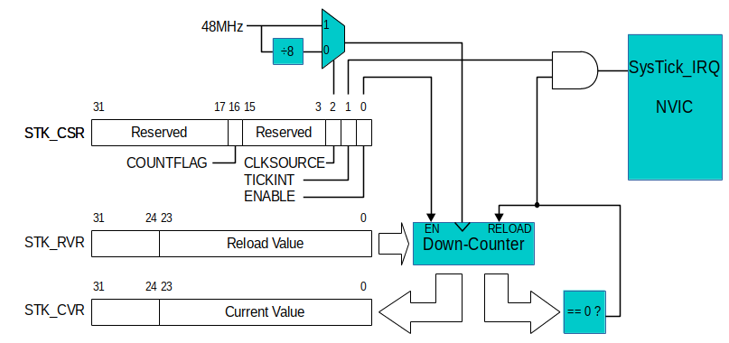
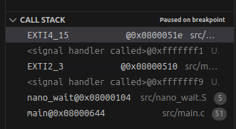

# Lab 2
## Interrupts

### Table of Contents
<br>

| Step    | Description                           | Points |
|---------|---------------------------------------|--------|
| 1       | Implement several GPIO subroutines    | 30     |
| 1.1     | initc                                 | 10     |
| 1.2     | initb                                 | 10     |
| 1.3     | togglexn                              | 10     |
|         |                                       |        |
| 2       | External Input (EXTI) Interrupts      | 30     |
| 2.1     | `init_exti`                           | 15     |
| 2.2-2.5 | Toggle specific pins                  | 15     |
|         |                                       |        |
| 3       | Implement the SysTick interrupt       | 40     |
| 3.1     | Enabling the SysTick interrupt        | 20     |
| 3.2     | SysTick_Handler and `set_col`         | 20     |
|         |                                       |        |
| 4.      | Observations and Adjustments (Bonus)  | 5      |
| 4.3     | The `adjust_priorities` subroutine    | 5      |
|         |                                       |        |
| 5       | In-Lab Checkoff Step                  | 20*    |
| &nbsp;  | Total:                                | 105    |
<br>

\* - You must get your whole lab checked off, and submit all your work to Gradescope including a confirmation code if any, before the end of your lab section to avoid a late penalty.

## Instructional Objectives
- To learn about the SysTick and External GPIO interrupts (EXTI) of a microcontroller.
- To learn how to implement Interrupt Service Routines for different interrupt sources.
- To learn how to prioritize one interrupt over another.

> [!NOTE]  
If at any point you need to get checked off, or need to get help, you can add yourself to the [lab queue](https://engineering.purdue.edu/~menon18/queup/?room=36200).  **Bookmark this link in your lab machine browser.**  
>  
> If you haven't already, read the Good Wiring Practices guide under your course Brightspace > Labs > Resources.  It is intended to teach you to properly organize your breadboard.  Each lab builds on the previous ones, so you should be sure to have the right setup for each lab to avoid possible overcrowding and messy wiring.  **Make sure to read and familiarize yourself with this, especially for lab 3.**

> [!WARNING]
> This lab, and any other lab, can be completed quite easily with any sort of LLM code-completion tool, like GitHub Copilot.  You get to use these freely in the real world, and can be a boon if you are working with new microcontrollers that you are unfamiliar with.  
> 
> However, using these tools will keep you from practicing two far more crucial skills in embedded systems - reading the documentation, and doing **a lot** of trial and error to get things to work right.  Using an LLM code-completion tool can make it seem like you know how to program a microcontroller, but you will not be training yourself to fix issues when the AI tool itself inevitably makes a mistake.
> 
> Ultimately, the job of this course is to teach you how to design an embedded system, not test your ability to ask an LLM completion tool to do it for you.  The purpose of a lab practical is to test your ability to do these two things, and if you have not been practicing them as you progress through each lab, **you will not do well on it**.


## Event-Driven Programming with Interrupts

As you may have noticed last lab, microprocessors consistently follow a straight sequence of instructions.  You may also be used to this idea from other programming classes, where you wrote a single program, and it seemingly executed from top to bottom.  

However, that doesn't make it very useful for applications where we want our microcontroller to do different things at once, which would not be possible, or at least would be very inefficient, to implement in a sequential program.  This is where **interrupts** come in.

The concept of an interrupt is exactly what the word means - when your microprocessor is executing a program, the sequential program flow can be **interrupted** by some event - a change in the logic level of an input pin, a timer reaching a certain value, even invalid instructions or an out-of-bounds memory access.  The processor saves its state, switches to the **interrupt handler** - a function that is called when the interrupt occurs - and then returns to the original program flow when the interrupt handler is finished.  This allows us to implement **event-driven programming**, where the microcontroller can respond to events as they occur, rather than having to constantly check for them as part of the sequential program.

By virtue of the fact that they *interrupt* regular program flow, interrupt handlers should be short, do only what is essential, and return as soon as possible.

In this lab experiment, you will configure two kinds of interrupts - an external GPIO interrupt and the SysTick interrupt.  The SysTick interrupt is generally the simplest interrupt source to configure.  Although a GPIO interrupt is conceptually simple (press a button to invoke a subroutine/function), the steps needed to configure it are numerous, and they are difficult to accomplish by a novice reading of the manual.  

While we carefully document these steps for you now, you should learn how to configure these on your own by the end of the lab.  Later, you may be asked to configure interrupts for other peripherals (maybe for a lab practical, or maybe to do other interesting things), and you will need to be able to do so without a step-by-step guide.

## Step 0: Set up your environment

Make sure to clone the code repository from GitHub Classroom.  Keep in mind to add, commit and push any changes you make so that your work is accessible from a lab machine.  

Similar to lab 1, open the cloned repository in VScode by clicking File > Open Folder (or Ctrl-K + Ctrl-O).  

Similar to lab 1, there is an precompiled autotest object that will provide tests for each of your functions.  It is automatically included with your code when you upload to your STM32.  Running "Upload and Monitor" will show the output of the autotest (if the function call has been uncommented) in the terminal.  If you don't see anything yet, make sure to press the reset button on the microcontroller to restart the program and print the output to your serial monitor.

You should see a prompt similar to the following:

```text
Interrupts Lab Test Suite
Type 'help' to learn commands.

> 
```

You can then type `help` to learn what commands you can use to test a certain subroutine.  You will use this to demo your implementation and wiring to the TAs.

## Step 1: Implement several GPIO subroutines

Take a look at the `main` function in your main.c file.  You'll notice an infinite loop near the end where we'll "toggle" pin 9 on the GPIOC peripheral (PC9).  This is connected to one of the LEDs on the your microcontroller.

Note the use of the `nano_wait` function.  This is a very carefully timed function such that each iteration of teh loop takes 83 nanoseconds when the CPU clock is 48 MHz.  Passing 500_000_000 will cause the loop to run for 500 milliseconds, or half a second.  The function is implemented in the `nano_wait.S` file as follows:

```assembly
.global nano_wait
nano_wait:
    subs r0, #83
    bgt  nano_wait
    bx lr
```

Go ahead and implement the following functions.  Use the `autotest` command to test your individual functions.  

### 1.1 initc

In the template file `main.c`, implement the `initc` function that enables the RCC clock for *GPIO Port C* (without affecting the other clock enable bits in the `AHBENR`) and configures the appropriate pins as follows:

- PC0-PC3 as input pins with the pull down resistor enabled
    - This is for the keypad you set up in the last lab.
- PC4-PC9 as output pins
    - This is for the keypad and the LEDs on the board.

Make sure, for this subroutine and the next one, to change only the pins specified.

> [!NOTE]
> You can use `RCC->AHBENR` to access the `AHBENR` register and use `GPIOC->MODER` to access the GPIO port C's `MODER` register. The same mechanism applies to the internal push-down/up resistor configuration.  Find the STM32F0x1 Family Reference on Piazza under General Resources, or the lab prep slides, to see which register this is - this is a habit you should form when you don't know what register to change!

### 1.2 initb

Implement the `initb` function that enables the RCC clock for *GPIO Port B* (without affecting the other clock enable bits in the `AHBENR`) and configures the appropriate pins as follows:

- PB0, PB2, PB3, PB4 as input pins
- Enables pull down resistors on PB2 and PB3
- PB8-PB11 as output pins

### 1.3 togglexn

Implement the `togglexn` that accepts two parameters which are the GPIO base address and the pin number whose output is to be changed from 1 to 0 or 0 to 1.  Therefore, to toggle GPIO pin 6, or PC6, one would call `togglexn(GPIOC, 6)`.

> [!NOTE]
> The `togglexn` has signature of `void togglexn(GPIO_TypeDef *port, int n)`.
> 
> Hint: You can use the same trick as in `initb` and `initc` to access the `GPIO_TypeDef *` GPIO port pointer's control registers.  Use the autocomplete to check the fields of the pointer or look up its definition by using `Alt + Left Click` on the structure name `GPIO_TypeDef` in PlatformIO.  You'll see something like:

```c
typedef struct
{
  __IO uint32_t MODER;        /*!< GPIO port mode register,                     Address offset: 0x00      */
  __IO uint32_t OTYPER;       /*!< GPIO port output type register,              Address offset: 0x04      */
  ...
} GPIO_TypeDef;
```

### 1.4 Testing

Once you have implemented each of the subroutines described so far, you should run your program to test that it works correctly.  The program should slowly blink the blue LED (LD3) connected to PC9. The rate should be approximately .5 Hz. 

Uncomment `autotest` to check that your GPIO configuration subroutines are implemented correctly by typing 'initb', 'initc and 'togglexn'.  Once you're done, comment it out again.

> [!IMPORTANT]
> Demonstrate to your TA that your code passes the `initb`, `initc` and `togglexn` tests in `autotest`, and that your LED is turning on and off at a rate of 2 Hz (in other words, turning on at a rate of 1 Hz).  Commit all your code and push it to your repository now.  Use a descriptive commit message that mentions the step number.  


## Step 2: External Input (EXTI) Interrupts

The external GPIO interrupt (EXTI) mechanism allows a GPIO pin to be configured so that a rising edge or falling edge (or both) can trigger the invocation of an interrupt service routine.  We'll do this for pins PB0, PB2, PB3 and PB4.

(You may recall from 270 that a "rising edge" is when a signal changes from 0 to 1, and a "falling edge" is when a signal changes from 1 to 0.)

The steps to set up external interrupts are quite intricate, so read them carefully.

### 2.1 `init_exti`

We need to configure our STM32 to trigger EXTI interrupts when the appropriate pins change.  We do this by doing the following:

1. Enable the SYSCFG clock in the RCC `APB2ENR` register.  You may have to look through the header files to find the correct name to use to turn on the correct bit.
2. Select PB0,2,3,4 as your interrupt "sources" by setting the `EXTI` configuration registers, `EXTICR1` and `EXTICR2`.  Keep in mind that 1) the `EXTICR` register is oddly placed under the `SYSCFG` peripheral, and 2) the `EXTICR` is a single array of registers, so `EXTICR1` will correspond to `EXTICR[0]`, etc.  Note that once you set up the EXTI interrupt for GPIOB, you will not be able to use it for GPIOA, C, D, etc.  (which is fine for our purposes, but it's worth remembering.)
3. Next, indicate that we want our interrupt to trigger on the **rising edge** of the signal by modifying the `EXTI` rising trigger selection register, `RTSR`.  The bits correspond directly to the pin numbers, and the symbol `EXTI_RTSR_TRx` is defined for you to easily access the bit you want to set for pins 0, 2, 3 and 4.  You will need to **set** those specific bits by ORing them in. 
4. Next, **unmask** the interrupt so that it can be triggered, by modifying the `EXTI` interrupt mask register, `IMR`.  The bits correspond directly to the pin numbers, and the symbol `EXTI_IMR_IMx` is defined for you to easily access the bit you want to set for pins 0, 2, 3 and 4.  You will need to **set** those specific bits by ORing them in.
5. Finally, enable the interrupts in the `NVIC` by setting the appropriate bit in its `ISER` register.  You can look at the the Vector Table (Table 37) on the STM32F0x1 Family Reference to determine what bit position to write to for pins 0-1, 2-3 and 4, or use the symbol to specify the bit position, eg. `EXTI0_1_IRQn`.  You'll need to access the ISER at `ISER[0]`.

For each of the steps above, you will need to know what bit of what register to change.  You can find this information in the STM32F0x1 Family Reference under Piazza resources.  For example, to know what bit to set in the EXTICR registers, do a Ctrl-F for it in the document, and you should eventually arrive at the corresponding register layout diagram for EXTICR1, EXTICR2, RTSR, etc.

You can write out the value that will set or clear the specific bits you need, or you can find all the macros you need to set specific bits in certain registers in the `stm32f091xc` header file.  Open the file by holding down Alt and clicking on one of the macros you wrote earlier, eg. RCC_AHBENR_GPIOCEN.  Do a Ctrl-F for terms that will help you find the macro, like `RCC`, `EXTICR`, etc.

Next, we'll set up the functions that will serve as our interrupt service routines.  They should get called when the interrupt occurs.

### 2.2 Identify ISR names

To set up our ISRs, we first need to find their **names**.  These are the functions that will be called when the interrupt occurs, so it is very important that you find the correct name.  The names of the ISRs are listed in the `startup_stm32f091xc.s` file.  You can find this file by doing the following:

1. In your main.c file, hold the Alt (or Command) key, and click on `#include "stm32f0xx.h"`.  This will open the file in a new tab.
2. Press Ctrl-O to open a new file.  This should pull up the Open File dialog, with the current directory being the one containing the file you just opened.  This should be the `Include` folder inside the `framework-cmsis-stm32f0` folder.
3. Go up to the `framework-cmsis-stm32f0` folder, and go through `Sources`, `Templates`, `gcc`, and you should see `startup_stm32f091xc.s`.  Open this file.
4. Scroll down to the section named `g_pfnVectors` - this is the list of names for all the ISRs you can use.

Here is how it's done in Windows:

https://github.com/ece362-purdue/lab2-interrupts/assets/12859429/b1adcd5f-652c-4bff-b90f-6ea9a6c96c24

You can also find the names under the Acronym column in the Vector Table under the "Interrupts and Events" section of the STM32F0x1 family reference.  Make sure to append "_IRQHandler" to the name to get the function name.  (One known exception - the USART3_4_5_6_7_8 handler is called USART3_8 in PlatformIO.)

With time, you may remember what the names are and you won't need this file as much, but be warned that even the smallest typo in the name will result in the interrupt handler never being called.  You may want to use the debugger to ensure that the control flow eventually reaches the interrupt handler when the interrupt occurs, to make sure you got the name right.  

### 2.3 Implement ISRs

From the `g_pfnVectors` table, find the ISR names for all the EXTI interrupts.  One of them handles events configured for pins 0 and 1, the second handles pins 2 and 3, and the third handles events for pins 4 to 15 - we'll be using all three for the pins we mentioned earlier.  Once you have the names, implement each of the EXTI ISRs with a `void` return type and no arguments under each of the corresponding comment blocks in the files.  

### 2.4 Clear the pending bits

Under each ISR, acknowledge the interrupt source by clearing its pending bit in the `EXTI PR` Pending Register.  **Not doing this, or doing it incorrectly, will result in the ISR being continuously called when only one interrupt occurs.**  For example, to clear the pending bit for `EXTI0`, you can do this easily by **writing** the value `EXTI_PR_PR0` to the `EXTI` PR.  This symbol, among others, is defined for you to easily access the bit you want to clear.

> [!NOTE]
> Note the use of the term **writing** (assigning) as opposed to **ORing** in.  When we say the former, we mean: `periph->register = ...`, whereas the latter means `periph->register |= ...`.  The difference is that the former will **clear** all bits in the register before writing the value, whereas the latter will **preserve** all bits in the register before writing the value.  This is important when you only want to clear a single bit, and not affect the others.
> However in the case of EXTI_PR, using the value of PR may not work correctly, because the register is also used to hold the value of pending events.  ORing the value in means that you may inadvertantly acknowledge events that you did not intend to.  This is why we only write a single bit to the register, rather than ORing in the value of the symbol.

To find similar symbols for the other ISRs, hold Alt and click on the symbol to see its definition.  You will see related symbols on other lines near the definition, eg. `EXTI_PR_PR2`.  For the EXTI2-3 interrupt handler, write PR2 to the PR.  For the EXTI4-15 interrupt handler, write PR4 to the PR.

> *Why shouldn't we write PR3 if we have it enabled?*  We'll tackle this in the last section.

Look at the documentation for the `EXTI PR` in section 12.3.6 of the STM32F0 Family Reference Manual.  Note that each of the bits for the `EXTI PR` is listed with the behavior `rc_w1`.  If you look at section 1.1, "List of abbreviations for registers" on page 41 of the Family Reference Manual, you will see that `rc_w1` means that software can **Read** as well as **Clear** these bits by writing a 1.  Writing a 0 has no effect. 

The larger meaning of this designation is that, if you want to clear a single bit when others may be set, you must not do a load-ORRS-store operation since that would clear bits set in the `EXTI PR` that you had no intention of acknowledging.  For example, if you want to clear only bit 7 (1<<7 = 0x80), but leave the 6 bit still set to 1, you need only write the value 0x80 to the `EXTI PR` register.  Only the 1 bits in the value being written will have an effect.

### 2.5 Toggle specific pins

After clearing the pending bits, do the following under each ISR:
- When PB0 is pressed, use `togglexn` to toggle PB8.
- When PB2 is pressed, use `togglexn` to toggle PB9.
- When PB4 is pressed, use `togglexn` to toggle PB10.

### 2.6 Testing

At this point, your interrupts should be fully configured with LEDs to toggle when they are triggered.  Press the external buttons connected to PB0 and PB4. Ensure that they cause the LEDs on PB8 and PB10 to toggle each time they are pressed. Button SW3 on the development board is connected to PB2. Make sure that it toggles PB9. This button is not debounced, so it may not be reliable (and that’s not anyone’s fault), but it should still be useful to demonstrate interrupts on PB2.

> [!IMPORTANT]
> Demonstrate to your TA that your code passes the `init_exti` and `isrs` tests in `autotest` and that pressing PB0, PB2 and PB4 will turn on PB8, PB9 and PB10 respectively via interrupts only.  Commit all your code and push it to your repository now.  Use a descriptive commit message that mentions the step number.  

## Step 3: Implement the SysTick interrupt

The SysTick subsystem is a “core peripheral” of the microcontroller that cannot be disabled, so there is no RCC clock to enable to make it work. It consists of a 24-bit down-counter that automatically reloads a new 24-bit value each time it reaches zero. See the illustration below for the organization of the counter and its control registers. Since they are limited to 24-bit values, the maximum value of the counter and reload value are 2^24 - 1 = 16,777,215.



> [!NOTE]
> In the PM0215 Programming Manual that describes the SysTick timer and the diagram above, the terms CSR, RVR and CVR are used in place of (respectively) CTRL, LOAD and VAL.  The latter terms are used because they are the corresponding names of the macros as defined in the STM32 libraries.  
> 
> The reason for this, from what we can tell, is that SysTick is a timer that is part of the ARM Cortex-M0 microprocessor specification.  While the STM32 itself provides many other peripherals, the SysTick is a core peripheral.  The name mismatch is likely because STMicroelectronics gave SysTick registers different names while designing the microcontroller around the CPU.
> 
> This is an example of a weird quirk that may make it difficult to find certain registers, or even peripherals, on unfamiliar microcontrollers.  Manufacturers may not explain inconsistencies very well in their documentation, so your research effort just needs to be twice as thorough if something isn't well explained.  When in serious doubt, ask.

All that is needed to enable the SysTick counter is to set the `ENABLE` bit in the SysTick Control and Status Register (`SysTick_CTRL`, `STK_CSR` in the diagram). Thereafter, the counter decrements once per clock tick. The clock used for the counter is selectable by the `CLKSOURCE` bit of the CTRL. When the `CLKSOURCE` bit is set to 1, the counter runs at 48 MHz. When `CLKSOURCE` is set to 0, a divide-by-8 prescaler is used to create a 6 MHz clock for the counter.

The value of the down-counter can be read (or set) at any time by accessing the SysTick Current Value Register (`SysTick_VAL`, `STK_CVR` in the diagram). When the value decrements to zero, the next clock tick will cause a new value to be loaded into the counter from the SysTick Reload Value Register (`SysTick_LOAD`, `STK_RVR` in the diagram).

After decrementing to zero, the counter takes one extra clock cycle to reload the new value. The effective frequency of roll-over is then `ClockRate / (LOAD + 1)`. 

For instance, if the **6 MHz clock was selected**, and the `SysTick_LOAD` register was set with the value **1,499,999** then the counter would reach zero exactly **4 times per second**.  We won't use the SysTick subsystem for anything else in this course, but you should get used to writing a value that is **1 less than the effective value you want into a configuration register**.  You will see this again and again with other peripherals, such as timers.

If the `TICKINT` bit of the `SysTick_CTRL` is set, a decrement-to-zero event causes the SysTick interrupt request line to the `NVIC` (Nested Vectored Interrupt Controller) to be asserted briefly. This will cause the CPU to immediately invoke the `SysTick_Handler` interrupt service routine (ISR). This interrupt is one of the highest priority exceptions (for our purposes, it is second only to the Hardfault exception), it cannot be disabled, it does not need to be enabled, and it does not need to be acknowledged.

Basically, all you need to do to have a periodic interrupt is create an ISR with the proper name (`SysTick_Handler`), and initialize the `VAL`, `LOAD`, and `CTRL` registers. Thereafter, the ISR will be invoked repeatedly until the `SysTick CTRL ENABLE` or `TICKINT` bits are cleared.

#### 3.1 Enabling the SysTick interrupt

To configure and enable the SysTick interrupt, complete the `init_systick` subroutine. It should do the following things:

- We want `SysTick->LOAD` set to a value that will cause the counter to reach zero in a small time so that the columns will be scanned rapidly. Each invocation of the `SysTick_Handler` ISR will scan one of the four rows.  So, set a Reload Value Register value (`SysTick->LOAD`) so that all four rows are scanned 4 times per second. (i.e., a new row is scanned once every 16 times in a second.)  What value should you compute to do this?  
    - Keep in mind that the frequency is 48 MHz, since we configured it when we called `internal_clock` at the beginning of `main`.
- Initialize `SysTick->VAL` to 0.  This ensures we start from the beginning, as it is likely that the counter has been running since the microcontroller was powered on.
- Write a value to the `SysTick->CTRL` register (SysTick Control and Status register) that turns on the `TICKINT` and `ENABLE` bits. For the `CLKSOURCE`, choose the 6 MHz clock derived from the ÷8 prescaled clock.
    - Look in the PM0215 Programming Manual to know which bits to set for the CTRL register.

#### 3.2 SysTick_Handler and `set_col`

Implement the SysTick_Handler interrupt service routine and `set_col`, whose basic skeletons have already been written for you in the `main.c` template. 

Notice the subroutine is properly spelled `SysTick_Handler`. Because the function is a global symbol, it will take the place of the weak symbol in the `startup_stm32f091xc.s` file you opened earlier.  The address of the ISR you write will be placed into the exception vector table instead of the `DefaultHandler`. 

In the previous lab, we had the microcontroller changing the energized column, polling the rows, and deciding which LED to light in the main loop. This is a waste of resources, taking up the micro's time when it could be doing more useful work (like calculating the gcd of two large numbers) or just sleeping and saving power. We will now move that logic to the `SysTick` ISR with a few changes.  **You'll want to pull up your lab 1 code to compare.**

- First, since the subroutine is called every so often and then exits, there is no local variable for the current column we are energizing, so we will make this a global variable.  This has been defined for you above `SysTick_Handler`, called `current_col`.

- Second, instead of turning on the LED when a press is detected, we will use the togglexn subroutine. The constraint in the previous lab still holds where no two row-column pairs can use the same row or column, i.e:

$${(r_i, c_i) \quad | \quad r_i \neq r_j \,\, \forall \,\, i \neq j; \quad c_i \neq c_j \,\, \forall \,\, i\neq j; \quad i,j = 1...4}$$

> Note: $\forall$ means "for all".

The pseudo-code is as follows:

```C

volatile int current_col = 1;

void SysTick_Handler(void) {
    // 1. Read the row pins using GPIOC->IDR
    //    You can check the pins used for rows 
    //    of keypad in lab 1 manual
    // 2. If the var `current_col` corresponds to
    //    the row value, toggle one of the leds connected 
    //    to PB8-11.
    //    Basically the same we have done in lab 1
    // 3. Increment the `current_col` and wrap around
    //    to 1 if `current_col` > 4. So that next time
    //    we scan the next column
    // 4. Set the changed column pin designated by `current_col`
    //    to 1 and rest of the column pins to 0 to energized that
    //    particular column for next read of keypad.
}

void set_col(int col) {
    // Set PC4-7 (i.e. all columns) output to be 0
    // Set the column `col` output to be 1
    //  if col = 1, PC7 will be set to 1 as 
    //  it is connected to column 1 of the keypad 
    //  Likewise, if col = 4, PC4 will be set to 1
}
```

Recall that we used a delay in the loop for scanning the keypad to let the "RC network" of the matrix to settle before reading the value from the keypad to find what button was pressed. In this case we do not. Instead, we use a technique that will be used in subsequent labs. On entry to the ISR, we read the `GPIOC_IDR` to read the rows. At the end of the ISR, we update the electrical signals driven to the columns. This means that an entire `SysTick` period elapses between writing the columns and reading the rows. All we need to do is ensure we do not invoke the `SysTick` ISR so rapidly that the signals do not have enough time to settle between invocations.

The test code in main is already configured to invoke `init_systick`.  When you run the program you've implemented so far, you should see the LEDs on PC6 (LD6) and PC7 (LD5) blink rapidly as it scans the columns.  Pressing each of the diagonal buttons (1, 5, 9, D) should toggle PB8-11 on or off, and only once.  (You may have to time it right so that you catch the correct energized column from SysTick.)

> [!IMPORTANT]
> Demonstrate to your TA that your code passes the `init_systick`, `set_col` and `keypad` tests in `autotest` and that your keypad is capable of turning on PB8-11.  Commit all your code and push it to your repository now.  Use a descriptive commit message that mentions the step number.  

## 4. Observations and Adjustments (Bonus)

Compile and run your completed program. The combined effect of all of the subroutines you have written will be that:

- The red (LD6) and yellow (LD5) LEDs flash independently as the SysTick interrupt scans the columns, and; 
- The debounced buttons attached to pin PB0 and PB4 invokes ISRs that toggle the green LED on PB8 and PB10 respectively. 

Each of the four keypad buttons on the diagonal should also toggle one of the LEDs on PB8-PB11 (If you hold them down, the LED will blink. We might do edge detection on the keypad buttons in a later lab). The blue LED (LD3) should also illuminate at a rate of 1 Hz as the nano_wait is invoked with half a billion each time and calculated repeatedly.

It would be difficult to build a single sequential program that could blink LEDs in this manner. Interrupt handling allows us to create the illusion that multiple things are happening simultaneously in the microcontroller. In reality, only one piece of code is executing at any time. Nevertheless, if the microcontroller can rapidly switch back and forth between different pieces of code, it can preserve the illusion.

### 4.1 Unacknowledged interrupts

Recall that you enabled the entire EXTI infrastructure for pins PB2 and PB3, but the ISR that is invoked for it only acknowledges an event on pin 2 by writing bit 2 to the pending register. Note what happens when you move the button on PB4 to PB3 and press it.  When you do so, the LED on PB9 should turn on, and stay on regardless of how many times you press SW3 or the debounced push button attached to PB3.  Also, notice that the blue LED (LD3) no longer blinks, but the yellow (LD5) and red (LD6) ones continue blinking at their previous rate and the keypad still works. Finally, the LED on PB8 does not toggle if you press the button connected to PB4 (you will have to move it back from PB3).

> [!NOTE]
> If you're not seeing this behavior, it could be that you used `|=` rather than `=` when clearing the pending bit in the EXTI_PR register in your interrupt handlers.  Assign the value (`=`) rather than OR it in (`|=`).

What is happening here?

Recall that the blue LED was toggled by the `main` subroutine in between calls to a long-running calculation. When an interrupt service routine does not acknowledge the mechanism that raised the interrupt, the ISR is immediately **reinvoked** the moment it exits. That is to say, PB2 sets bit 2 of the `EXTI_PR`, which leads to the invocation of an ISR. That ISR clears only bit 2 of the `EXTI_PR`. As soon as the ISR returns, the NVIC sees that the cause of the interrupt still exists, so it immediately reinvokes the ISR to service the interrupt. The continual reinvocation toggles the LED on PB9 as fast as it can, so it looks like it remains on. 

Other higher-priority interrupts can still **preempt** an ISR that is running.  The word **preempt** means to  This is the case with the SysTick interrupt. Because **SysTick has a higher priority than any of the EXTI interrupts**, it can still be invoked at its normal time, and operate the keypad.  (Try toggling one of the diagonal keys to see if it still works, with the exception of PB9).  

Toggling PB0 will still work since EXTI0_1 has a higher priority than EXTI2_3, so it too can preempt the EXTI2_3 ISR.

As for the blue LED, the EXTI pin 2-3 ISR never returns back to the main program, so the blue LED no longer toggles. 

The EXTI pin 4-15 ISR has a lower priority, and it cannot preempt the continually-running EXTI pin 2-3 ISR (so the LED on PB10 will not be toggled even when you move it back to PB4). Pressing the button connected to PB4 causes that interrupt to remain in the pending state forever without being invoked and acknowledged.

### 4.2 Adjusting interrupt priority

It is possible to change the *priority* of any typical interrupt by adjusting an entry in the `NVIC_IPR` (interrupt priority register) table. This is an array of 32 32-bit words in the NVIC that control the relative importance of running ISRs compared to pending interrupts. Each 32-bit word contains four 8-bit fields to represent the priority level of four interrupts. Interrupt numbers 0 - 3 are handled by the first word in the table at offset IPR from NVIC. *Each 8-bit field can hold only the following four values: 0, 64, 128, or 192*. This is to say that only the top two most significant bits of the field are meaningful, so there are really only four priority levels. The lower the value, the higher the priority of the interrupt type. (This may seem counterintuitive, but consider that something that is priority #1 for you is more important than priority #2.) Finally, the designers of the NVIC did not want to make it too easy for you to change priorities, so they designated that the IPR table values can only be read or written in 32-bit chunks. You cannot change the priority of an interrupt by writing a single 8-bit byte into the table at the proper location. You must read the 32-bit word that contains the 8-bit field, clear the 8-bit field, then OR it with the new value, and write the entire word back to the IPR.

By default, every interrupt has a zero priority in the IPR. Relative priorities are further ranked by a type priority. If you examine Table 37 of the Family Reference Manual which begins on page 217. The "Position" column of the table shows the interrupt number. This is the bit position of the interrupt in the `NVIC_ISER`, `NVIC_ICER`, `NVIC_ISPR`, and `NVIC_ICPR` registers. The interrupt number is also the byte offset of the interrupt in the `NVIC_IPR` table. The second column, labeled "Priority" indicates the relative priority of the type of each interrupt if there is no difference in the `NVIC_IPR` table. By default, the EXTI interrupt for pins 2-3 has a lower priority value — and, therefore, a higher importance — than the `EXTI` interrupt for pins 4-15.

Non-maskable interrupts such as SysTick appear at the top of Table 37 in the gray zone. They have no position number because there is no entry for them in registers like `NVIC_ISER` or `NVIC_IPR`. Note that the "Type of priority" lists them as "settable", but the mechanism to do so does not involve the `NVIC_IPR` table. Take a look at section 4.3.6 of the programming manual to learn about the System Handler Priority Registers (SHPRx) - you may find it useful in the future.

#### 4.3 The `adjust_priorities` subroutine

Complete the `adjust_priorities` subroutine for which there is already a skeleton in `main.c`. It should do the following:

- Set the IPR (`NVIC->IP`) priority of the EXTI interrupt for pins 2-3 to 192 (0xc0).  
- Set the IPR priority of the EXTI interrupt for pins 4-15 to 128 (0x80).
- Do not change the priorities of any other interrupts.

> [!TIP]
> The "interrupt number" of the EXTI 2-3 interrupts is given by `EXTI2_3_IRQn`, and for EXTI 4-15 is `EXTI4_15_IRQn`.
> 
> Under **IPR bit assignments**, see **Function**, which says that only bits 7 through 6 are considered instead of bits[5:0].  Consider the bit representation of 192 and 128, and consider what the **effective priority value** is if it were assigned in the register.
> 
> Now that you have both of these things, use the `NVIC_SetPriority` function to set the priority of the interrupts.  You might want to see the examples at the bottom of the STM32F0x1 Family Reference Manual for examples of how it can be invoked.

Upon implementing this, the EXTI interrupt for pins 2-3 will have the lowest priority of anything on the microcontroller, and the EXTI interrupt for pins 4-15 will have the second lowest priority. The `adjust_priorities` subroutine is already invoked by the `main` subroutine. 

Now, when you run the program and press the SW3 button to assert PB3, the ISR for EXTI pins 2-3 will be invoked, the ISR will not acknowledge the interrupt, and the ISR will be immediately reinvoked upon exit, so the LED on PB9 will still remain forever lit.

Now, however, pressing the push button connected to PB4 will invoke a higher-priority interrupt. The ISR for pins 4-15 will be invoked. If you set a breakpoint for this higher-priority ISR in the debugger, press SW3 to invoke the non-stop lower-priority ISR, and then press the button connected to PB4 to invoke the higher-priority ISR, you can trace through the execution in the debugger. When the higher-priority ISR returns, it will (most likely) return to the lower-priority ISR. This is also easy to see on the Call Stack window under the Debug Panel. Upon entry to the higher-priority ISR, the stack trace should look like:



> If you don't see `EXTI2_3` ISR show up, it could be that you got lucky and managed to trigger it at the exact moment that the `EXTI2_3` ISR exited.  Try a few more times, and you should see it.

### 4.4 Repairing the acknowledgement problem

You might repair the acknowledgement problem by writing a '1' to bit 3 of the `EXTI_PR` register. Set a breakpoint in the ISR for pins 2 and 3. Press the buttons for PB2 and PB3 and observe the behavior of the `EXTI_PR` register by looking at it in the Peripherals view in the Debug Panel. You can press one of the buttons to invoke the ISR, look at the `EXTI_PR` register, press the other button, then double-click on the `EXTI_PR` register to update its value. Notice that it now shows the other pin is pending. By reading the `EXTI_PR` register an ISR that manages multiple pins (like the one that is invoked for any of pins 4 - 15) can determine which of the pins mapped to it have activity.

Once you repair the ISR to acknowledge an interrupt generated by pin 2 as well as pin 3, try running the program again. Notice that when you press the external buttons connected to PB3 and PB4, you toggle the PB9 and PB10 LEDs exactly once. When you press the onboard SW3, you may see the LED on PB9 change or you may see it apparently remain in the same state. This happens because SW3 bounces. It is difficult to work with a bouncy button in the context of an interrupt service routine. You will get a good deal of practice handling this well in lab 3.

> [!IMPORTANT]
> To obtain the bonus, demonstrate to your TA that your code passes the `adjust_priorities` test in `autotest`, and that you understand and can show the differences in behavior before and after setting the EXTI interrupt priorities.  Commit all your code and push it to your repository now.  Use a descriptive commit message that mentions the step number.  

## Step 5: In-Lab Checkoff Step

> [!IMPORTANT]
> Run `verify` in `autotest` to generate your confirmation code.  Make sure to first set your username in the `main.c` file.  Save the confirmation code ONLY into a new file called "confirmation.txt" in the root of your repository.  
> 
> Add, commit and push it to your remote repository, and submit your GitHub repository to the Lab 2 assignment on Gradescope.  The autograder will decode your confirmation code, and you will receive a score proportional to the tests you passed.  **You will not receive credit for this lab if you do not submit your confirmation code in your repository to Gradescope.**
> 
> Please make sure to close all windows, log out of the machine (click on your name on the top bar, and click Log Out, or similar), take all your belongings with you, and **wait for a TA to confirm that you can leave.**.  They will ask you to check that you submitted your work, that you have logged out properly, and that your station is clean.  **Failure to do so will result in a penalty (cleanliness, late) for the lab currently running in that week.**
> 
> If you did not manage to finish by the end of the lab, **you should still submit the confirmation code to Gradescope**.  We will later apply the late penalty on Brightspace.  Keep in mind that the late penalty period is only in effect from the time your lab section ends, to the beginning of your next lab section.  **After that, it is a zero on the lab.**
