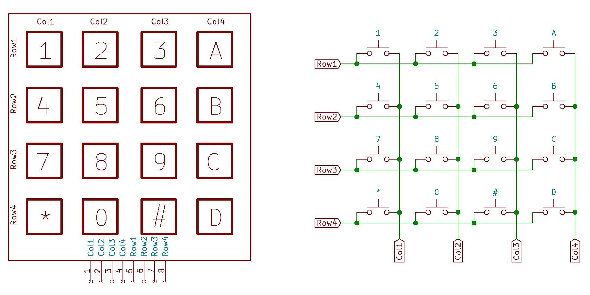
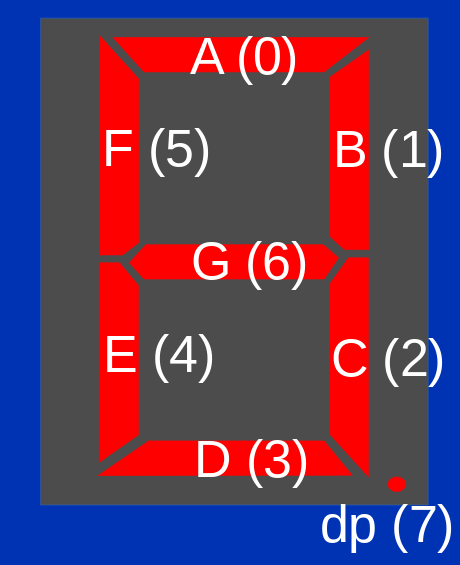
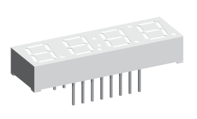
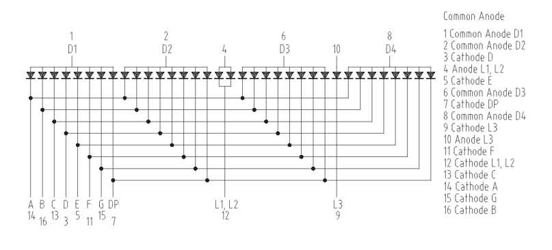
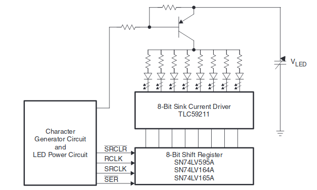
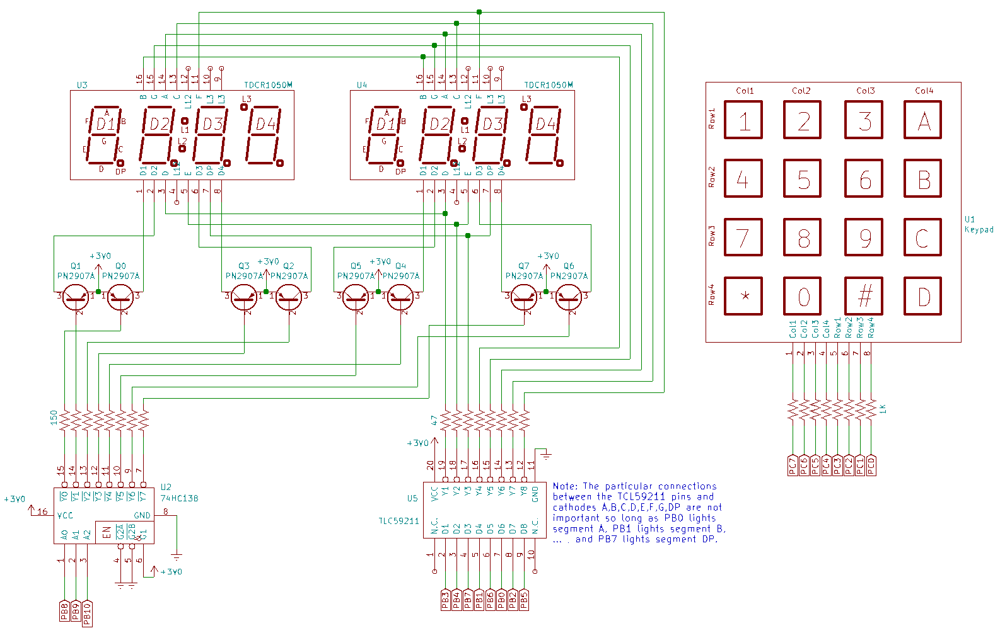
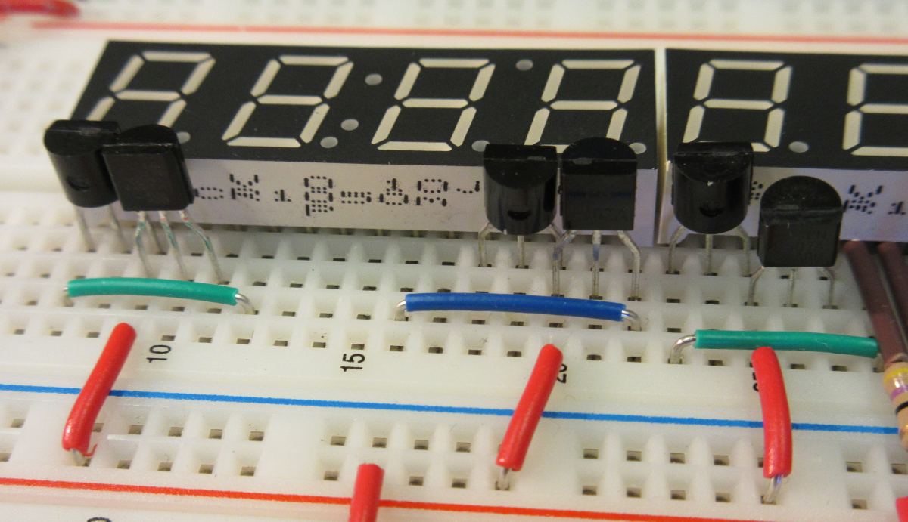
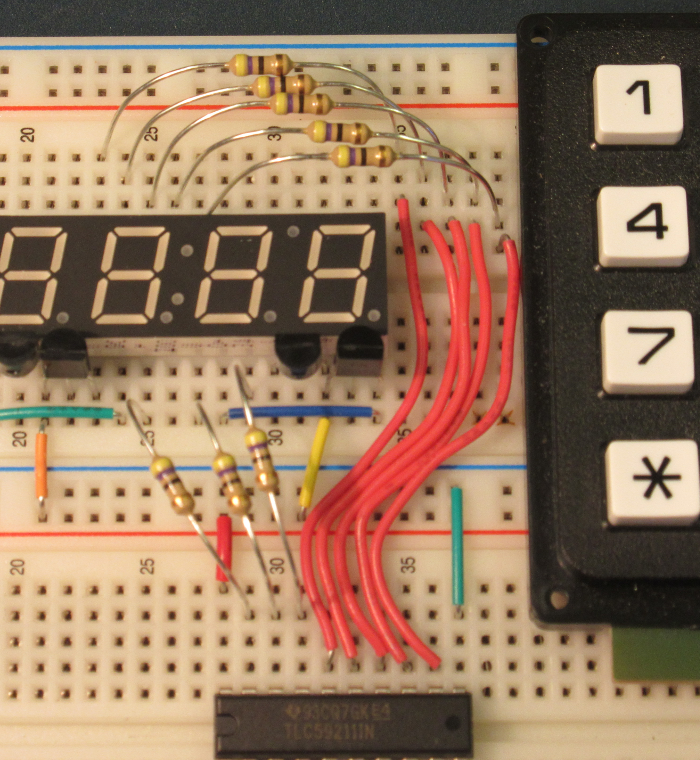
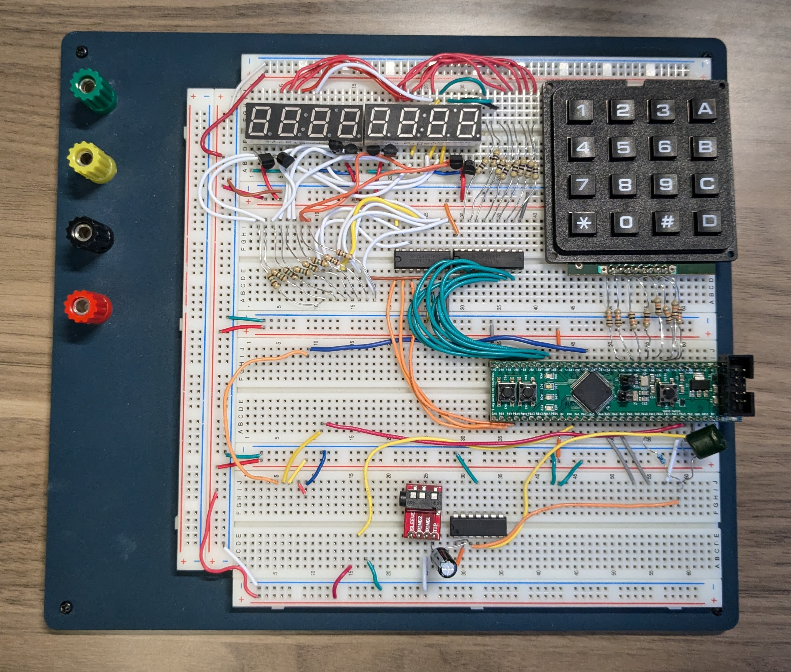

# Lab 3
## Timers

### Table of Contents
<br>

| Step    | Description                               | Points |
|---------|-------------------------------------------|--------|
| 0       | Wiring the circuit                        |        |
|         |                                           |        |
| 1       | Display multiplexing                      | 20     |
| 1.2     | `enable_ports`                            | 5      |
| 1.3     | `show_char`                               | 5      |
| 1.4     | `fill_alpha` (**must be shown in lab**\*) | 10     |
|         |                                           |        |
| 2       | Keypad scanning and handling              | 40     |
| 2.1     | `drive_column`                            | 10     |
| 2.2     | `read_rows`                               | 10     |
| 2.3     | `rows_to_key`                             | 10     |
| 2.4     | `handle_key`                              | 10     |
|         |                                           |        |
| 3       | Periodic game state updation              | 20     |
| 3.1     | Implement the TIM7 ISR                    | 10     |
| 3.2     | `setup_tim7`                              | 10     |
|         |                                           |        |
| 4       | Setting up the game display               | 20     |
| 4.1     | `write_display`                           | 5      |
| 4.2     | `update_variables`                        | 5      |
| 4.3     | Timer 14 ISR and init function            | 10     |
|         |                                           |        |
| 5       | In-Lab Checkoff Step                      | 20**   |
| &nbsp;  | Total:                                    | 100    |
<br>

\* - Due to the non-autogradable nature of this step or steps, you can only earn points by being checked off before the end of your lab section, in lab.  Take care to demo this as soon as possible to ensure you get the points, even if you may not finish by the end of lab.  **These points cannot be earned after your lab section ends.**

\*\* - You must get your whole lab checked off, and submit all your work to Gradescope including a confirmation code if any, before the end of your lab section to avoid a late penalty.

## Instructional Objectives
- To learn how to configure the timer subsystem.
- To learn how to use timer interrupts.
- To learn how to scan a matrix of buttons.
- To learn how to drive a multiplexed display.

> [!NOTE]  
> If at any point you need to get checked off, or need to get help, you can add yourself to the [lab queue](https://engineering.purdue.edu/~menon18/queup/?room=362OH).  **Bookmark this link in your lab machine browser.**  

> [!IMPORTANT]
> If you haven't already, read the "Good Wiring Practice in ECE 36200" guide under your course Brightspace > Labs > Resources.  It is intended to teach you to properly organize your breadboard.  Each lab builds on the previous ones, so you should be sure to have the right setup for each lab to avoid possible overcrowding and messy wiring.  **Make sure to read and familiarize yourself with this, especially for lab 3 (this lab!).**
> 
> This lab virtually requires that you follow the wiring instructions below to ensure a easy-to-understand layout that your TAs will be able to debug.  If you do not follow the wiring instructions, you may be asked to rewire your circuit before you can be checked off.  If you choose to use your own wiring layout, please understand that TAs will not be able to help debug it.  
> 
> If you need a wire kit because you may not have enough wires, there are some decent ones on Amazon: [this one](https://www.amazon.com/Breadboard-Minidodoca-Magnetic-Assortment-Alligator/dp/B0BT82DH1Q), or [this one](https://www.amazon.com/AUSTOR-Lengths-Assorted-Preformed-Breadboard/dp/B07CJYSL2T) or anything with a good rating and a decent number of wires that you estimate you need from the pictures below.
> 
> **Starting early on this particular lab is even more crucial due to the wiring requirements for this lab.**

## Timers

You are likely taking this class after taking ECE 270, where you implemented **counters** in SystemVerilog.  **Timers** are nothing more than sophisticated counters, with more options for configuration.  Timers can be used to produce periodic interrupts while the CPU is busy with other operations.  

In this experiment, we will use timer interrupts to periodically scan a matrix keypad, and reliably report button presses, as well as continually update a set of seven segment displays.  

## Step 0: Set up your environment

Make sure to clone this repository.  Keep in mind to add, commit and push any changes you make so that your work is accessible from a lab machine.  

Similar to previous labs, there is a "code" folder that will serve as your lab code template.  Make sure to open it in VScode by clicking File > Open Folder (or Ctrl-K + Ctrl-O), and then selecting the "code" folder.  

Similar to previous labs, there is an precompiled autotest object that will provide tests for each of your functions.  It is automatically included with your code when you upload to your STM32.  Running "Upload and Monitor" will show the output of the autotest (if the function call has been uncommented) in the terminal.  If you don't see anything yet, make sure to press the reset button on the microcontroller to restart the program and print the output to your serial monitor.

You should see a prompt similar to the following:

```text
Timers Lab Test Suite
Type 'help' to learn commands.

> 
```

You can then type `help` to learn what commands you can use to test a certain subroutine.  You will use this to demo your implementation and wiring to the TAs.

We'll use the autotest object to run a wiring check test on your circuit after you build it.  There is some lengthy background to read below before you start coding.  We understand that can be tedious, but please make sure to read it (and re-read it) carefully.  Follow the schematic, using the pictures as a guide to better component placement.

## Background

### Reading a button matrix

A matrix of buttons presents an additional complication to the challenge of debouncing since it is not possible to monitor each button separately. To understand why this is so, it's helpful to discuss how a matrix keypad works.

You will use a 16-button keypad for this lab experiment. One naive configuration for such an arrangement of buttons would be to have two wires for each button (32 wires total) so that each button could be independently monitored. That would require a lot of pins on the keypad which might make it difficult to use on a breadboard. An optimization might be to have one common power connector and one more connector per button (17 wires total) so that each button could still be monitored individually. But this is still too many pins on the keypad than manufacturers will usually support, and the numbers would only be much worse for keypads with even more buttons.

The typical concession for keypads is to have multiple common pins that connect to groups of buttons. The logical extension to this trend is to configure a keypad as a matrix of rows and columns. If the number of rows and columns is about equal, this practice minimizes the number of pins on the keypad. The added challenge is that the keypad must be **scanned one row or column at a time**. For instance, a voltage can be applied to a column of buttons, and the rows can be sensed to detect if any of the buttons in the column are being pressed. Then the voltage can be removed from the column and re-applied to another column. By cycling through all the columns, all keys can eventually be detected. The difficulty is that, due to the nature of bounce in any mechanical button, the bouncing must be tracked over multiple successive scans. 



An internal representation of the buttons inside the keypad as you may have seen in a prior lab is shown above.  Recall how energizing 1 column can allow a set of 4 buttons to be read via their corresponding rows.

### Driving multiplexed displays

A 7-segment display is one that has seven LED segments in the shape of a number "8". By selectively turning segments on, other numbers can be displayed. In practice, such displays have more than seven segments. An eighth segment shows a decimal point. Recall Figure 2, from ECE 270, that shows the names of the segments of a display. The top segment is customarily called "A". Proceeding clockwise, the next ones are named "B", "C", and so on. The middle segment is named "G". The decimal point is named "DP". 



For this lab experiment, you will be using the TDCR1050M 4-digit 7-segment LED display. This device was made to be used in a clock, so it has a middle colon for use in displaying a time. Another dot on the display can be illuminated to indicate things like an alarm setting. For this experiment, we will use only the digits and decimal points.



If you look at a picture of the physical device in figure above, you see that it has only two rows of eight pins on each side. Only sixteen pins are used to control more than 30 individual LED segments that must be independently lit to form four distinct digits and decimal points. To do so, it uses a "common anode" configuration so that one pin is connected to the anodes of all the LEDs on one digit. There are four distinct pins connected to the anodes of the four digits. There are another eight pins connected to similar cathodes on all the displays. For instance, one pin is connected to the four "A" cathodes on the four digits. This means it is possible to illuminate all four of the "A" segments on the four digits by applying a positive voltage to the four common anodes and a negative voltage to the pin connected to all of the "A" segments. It is not possible to simultaneously illuminate the "A" segment of all the displays and illuminate the "B" segment of only a single display. Figure below shows the schematic for the connections to all of the LED segments for the display. 



If it is not possible to independently turn on and off individual segments at the same time, how is it possible to display distinct numerals on the four groups of segments? This display is made to be *multiplexed*. In a manner similar to how we cannot detect the exact moment that a button in a matrix is pressed, we cannot simultaneously turn on every LED segment we need. Instead, the segments of the first digit are turned on, then the segments of the next digit are turned on, then the third, then the fourth. If each individual digit is illuminated for one second, then the display will not be perceived as a four-digit number. If, however, the cycling through the digits is done quickly enough, it will *appear* that all of the numbers are shown simultaneously. This is because of the human eye's **persistence of vision**. A flickering light—as long as the flickering is rapid enough—is perceived as continually on, although maybe dimmer than normal. 

As an example, consider the result of applying the following cycle of voltages applied to the pins of the display.  Think about what the display will look like when applying:

- A positive voltage to pin 1 (D1), and a negative voltage to pins 16 (B) and 13 (C)
- A positive voltage to pin 2 (D2), and a negative voltage to pins 14 (A), 16 (B), 3 (D), 5 (E), and 15 (G)
- A positive voltage to pin 6 (D3), and a negative voltage to pins 14 (A), 16 (B), 13 (C), 3 (D), and 15 (G)
- A positive voltage to pin 8 (D4), and a negative voltage to pins 16 (B), 13 (C), 11 (F), and 15 (G). 

When these four configurations are applied repeatedly and at high speed, it will appear that the four-digit number "1234" is present on the display.

How rapidly must you cycle through each digit to achieve the effect of persistence of vision?  Usually, anything flickering faster than 30 times per second appears to be continually on. As long as all of the digits of the display are turned on and off more than 30 times per second (even though none of them are on at the same time as others) the display will appear continuous. In this lab experiment, you will use two groups of the four-digit displays (eight digits in total), and you will turn on each digit for one thousandth of a second. By illuminating each individual digit for one-thousandth of a second, any one of the eight displays will be illuminated eight times less frequently (or 1/125th of a second). This is much faster than is needed to perceive the digits as all being on simultaneously. 

### Use of a sink driver and high-side transistors

Most students, when they approach the idea of multiplexing, would be more comfortable with a "common cathode" display instead since it could be configured so that a positive voltage applied to the pin connected to the anodes of all "A" segments would illuminate that segment when a negative voltage is applied to the pin connected to all the cathodes of the digit. If you were connecting the pins directly to your microcontroller, that might even make sense. Nevertheless, the current-flow requirements for the LEDs make it impractical to illuminate many of them using only the capabilities of the microcontroller.  Instead, it is common to use a **sink driver** connected to the cathodes of each type of segment (e.g., "A", "B", "C", etc...).  

A sink driver is a device that is capable of sinking (connecting to ground) a connection with a large current flow.  47Ω limiting resistors will be placed in between the sink driver and each cathode to prevent too much current from flowing through each segment. Conveniently, the sink driver will sink current through an output pin when its corresponding input pin is high.  In this way, it acts as an **open-drain inverter**, since a sink driver cannot push an output pin high.  Using the sink driver, a logic high applied to the driver will cause the particular segment to illuminate, which is how you would like to think about it. 



Consider the circuit in the figure above that appears in the TLC59211 datasheet. In this lab experiment, you will wire the microcontroller to the sink driver rather than an 8-bit shift register. The device at the top of the diagram is called a **PNP bipolar junction transistor (BJT)**. This device will conduct current through the top pin (the **emitter**, or **E**) in the direction of the arrow, and out the bottom pin (the **collector**, or **C**) when the middle left pin (the **base**, or **B**) has a voltage lower than the emitter (and a small current coming out of it).  It is conceptually similar to a P-Channel MOSFET except that a MOSFET does not require a substantial current flow through its gate (analogous to the base on a BJT).  By contrast, the collector current for a BJT is directly proportional to its base current. 


You will use one PN2907A PNP BJT (in a TO-92 package) for each anode of each digit of the display.  This should have come with your ECE 362 kit.  **If you can't find these, get them from the ECE shop as soon as possible.**  Pay careful attention to the designations for the pins (E,B,C for emitter, base, collector) on the device:

- Pin 1 is the emitter
- Pin 2 — in the middle — is the base,
- Pin 3 is the collector. 
 
The anode of a digit must be able to supply enough current for all eight segments of the digit simultaneously. The datasheet for the TDCR1050M shows that each of the eight segments of each digit could use as much as 25 mA, although you won't have that much current flow for this experiment - remember, we're only lighting up one digit at a time by multiplexing the displays, so one advantage of that approach is a smaller power draw.

A microcontroller pin would not be able to supply enough current to illuminate all of the segments of a digit, but a PN2907 transistor will provide at least 200mA if really needed. Because the transistor is driving the positive voltage to the display, it is referred to as the **high-side** driver for the display. You may think of the sink driver as the "low-side" driver for the display. 

Rather than try to deal with low voltage to enable current flow through each PNP transistor, we will add one more device: a 3-to-8 decoder with active-low outputs. Three input pins select one of eight outputs to be driven low. Each one of these outputs will be connected, through a series resistor, to the base of one high-side driver transistor. Altogether, eleven pins of the microcontroller will be used to drive the display: three to select the digit to turn on through the decoder and high-side driver transistors, and eight more to turn on the segments of the selected digit. A full schematic of the wiring for the display and keypad is shown in figure below.



## Wiring the circuit

> [!WARNING]
> If you have a breadboard you suspect has connection issues, or is loose fitting for jumper wires, **now** is the time to replace it.  See Brightspace for a link to a decent breadboard your instructor uses.  
> 
> Once you start, you'll be *[crossing the Rubicon](https://en.wikipedia.org/wiki/Crossing_the_Rubicon)*.  Once you wire this circuit up on your breadboard, it can be very time-consuming and difficult to move the circuit to a new breadboard if you discover problems later on.

You'll be assembling two 4-digit display modules, driven by 8 PN2970A transistors, a TLC59211 sink driver, 8 resistors between the sink driver and LED cathodes, a 3-to-8 decoder, and 8 more resistors between the decoder and the transistors. Another eight resistors will be used to connect the keypad to the microcontroller. With some planning, it will be possible to assemble this quickly and reliably. Here are several suggestions to make it as easy as possible... 

### Place the transistors next to the displays



The collector of a PN2907A transistor must be connected to each of pins 1, 2, 6, and 8 of both display modules. Notice that these pins are all on one side of the display, and that two of them are near the ends of the row of pins. There are no connections to the left or right of the connector, but there is a lot of space taken up by the displays. Rather than run long wires from the transistors to the displays, put the collector of one transistor on pin 1 and the collector of another transistor on pin 8. The other pins of each transistor are placed to the left and right, respectively. Add another two transistors further out by combining the emitters on the same breadboard row. Finally, connect the collectors of the outermost transistors to pins 2 and 6. Looking from left to right, the first backward-facing transitor will connect power to D2 (pin 2). The next forward-facing transistor will connect power to D1 (pin 1). The next transistor will connect power to D4 (pin 8), and the fourth transistor will connect power to D3 (pin 6). Note the alternating backward-facing, forward-facing manner in which the transistors are placed. The base (middle pin) of each of the transistors is what will be driven, through a 150Ω resistor, by the decoder.

### Wire the resistors to the display

Leave some space on the right side of the rightmost display module, connect the resistors on the top side of the display module, and run wires from the other side of the resistors to the TLC59211. Neatness of connections will avoid a great deal of problems when you reach the point of debugging. A maze of wires that loop far over the breadboard will not only block the LED segments, it will be difficult to diagnose, and be prone to damage when the wires are snagged on objects while in transport. 



### Chain the cathodes from one display to the other

The eight connections to the cathodes of display on the right should be made to the same eight pins on the display on the left. Use eight wires to connect them together. I.e., connect pin 16 on the left display to pin 16 of the right display, pin 15 to 15, etc. The pins to connect together on the top side of the displays are 16, 15, 14, 13, and 11. The pins on the bottom side of the displays are 3, 5, and 7. 

### Connect resistors to the decoder

The 150Ω resistors should be placed directly on the 74HC138 decoder. If you want to be tidy, you might cut the leads to minimize the amount that they stick out of the breadboard. If you do so, make sure that leads of every resistor is wide enough to span four breadboard holes. A width of only three would mean, for instance, that the resistor on the Y2 output would connect to the VCC pin of the chip. Wires should be run from the other ends of the resistors to the bases of the transistors. Connect output Y0 through a 150Ω resistor to the base of the PNP transistor connected to pin 1 of the left display. Note that output Y7 is on the bottom side of the 74HC138 decoder on pin 7. Pin 8 is the ground connection. The decoder's select lines, A0, A1, and A2 (pins 1,2, and 3, respectively) should be connected to PB8, PB9, and PB10. Pins 4, 5, and 6 should be connected to GND, GND, and VCC, respectively. These three pins are the enable pins for the decoder. Unless all three of these pins are enabled, **none of the decoder outputs will be asserted (driven low)**. 

### Check your wiring

Use the `check_wiring` test in the autotest menu or uncomment the call to `check_wiring()` in `main()`. 

When first started, the digits 01234567 should appear on the seven-segment displays. The decimal point on the leftmost digit should illuminate for 0.25 seconds, then turn off and the decimal point on the next digit should illuminate for 0.25 seconds. The decimal point should cycle through all of the digits in two seconds and continue again with the leftmost.

As the decimal point illuminates, make sure that the other segments of each digit remain at the same brightness. If the other segments of a digit grow dimmer, it may be that the driver transistor for that digit is backward. A BJT transistor normally amplifies a small base-emitter current with a large collector-emitter current, but a BJT can also work backward so that it amplifies a small base-collector current to a larger emitter-collector current. The amplification is not as high, and it limits the current provided to a digit. The more segments per digit are lit, the dimmer they are. Carefully note the orientation of the transistors connected to the D1, D2, D3, and pins of each display. 

At this point, your breadboard should look like this.  **Ignore the LCD in the corner** - we'll get to that in a later lab.



Some hints on where to look for specific issues:
- **If your digits are mixed up, or some of them are turned off**, check the wiring of the 3-to-8 decoder.  We are in common anode mode, so each 7-segment digit's anode voltage is being controlled via the BJT's base, which in turn is connected to the decoder outputs.
- **If you are missing all the segments for a digit**, check the wiring of the BJT's collector.  It should be connected to the anode of the digit.
- **If you are missing one or two segments for all the digits**, check the sink driver and the 47 ohm resistors connected from it that go to the "high-side" of the seven-segment displays to pins A-G and DP.  These are the cathodes of the segments.  If it's lit up on one set of 4 7-seg displays, but not the other, it's likely you didn't chain it from the 47 ohm resistor to the other side correctly.
- **If the lights are too dim**, the BJTs may not be powered via their emitter pins.  Ensure that their power rail is connected to the red rail (which should connect back to the 3V pin on the microcontroller).  

This is not a comprehensive list of issues, so you should be prepared to tackle issues as they arise.  If you are stuck, you can ask a TA for help, but keep in mind that at this stage, it will take them a lot more time to understand and debug your circuit than if you spend a few extra minutes carefully checking **your own** wiring.

## Step 1: Display multiplexing

The application to be built for this lab is the lunar lander game that you may have seen in ECE 270. You will use the concepts for this system, as well as the hardware it uses, for future lab experiments.  We'll start with some basic display functions.

### 1.1 - Data structures for the application

Some simple global "data structures" will be used to keep track of the values needed for this application. **They are already defined at the top of the `main.c` template file** - no need to redefine them!

- `col` is a single-byte integer, with a value ranging from 0 – 7, that indicates the digit presently being displayed. AND the lower two bits indicate the row that is being scanned. For purposes of these subroutines, digits will be numbered, left-to-right 0 – 7, and keypad columns will be numbered, right-to-left 0 – 3. For instance, if the value of `col` is 6, that would mean that digit 6 (second from the right) is illuminated, and that column 2 (containing buttons 2, 5, 8, and 0) is being scanned.
- `disp` is a 9-entry array of single-byte values, each of which represent the characters to display for each digit. The entries for this array should be pre-initialized to the following values `"Hello..."`
    - This string will be shown on the seven-segment displays on startup.
    - You might be saying "I only count eight characters there. Why do you say nine?" Remember that every string is terminated by a NUL (zero) byte. If you write a quoted string with eight characters in it, nine bytes of space are allocated. This will be important for us when we write messages into the string with `sprintf`. 
- `mode` is a one-byte value that determines what information is to be shown on the seven segment displays. We'll store a character value here to help us remember what the mode means.
- `thrust` is a one-byte value that indicates the last specified throttle setting. It will always have a numeric value of 0 to 9.
- `fuel` is a two-byte (halfword) value that indicates the remaining amount of fuel for the lunar lander. It is initialized with the value 800 (decimal).
- `alt` is a two-byte (halfword) value that indicates how far about the lunar surface the lander is. It is initialized with the value 4500 (decimal).
- `velo` is a two-byte (halfword) value that indicates the current velocity of the lander. We choose to represent velocities that decrease altitude as negative values. Since the lander is falling toward the lunar surface, the value of `velo` will normally be negative. The initial value of `velo` is zero. Gravity will gradually make it negative. 

### 1.2 - `enable_ports`: Enable the ports used for the application

Implement the function `enable_ports()` that does the following:

- Enables the RCC clock to `GPIOB` and `GPIOC` without affecting any other RCC clock settings for other peripherals
- Configures pins PB0 – PB10 to be outputs
- Configures pins PC4 – PC7 to be outputs
- Configures pins PC0 – PC3 to be inputs
- Configures pins PC0 – PC3 to be internally pulled low

As usual, you should not alter the configuration for any other pins. For instance, if you were to improperly alter the `MODER` setting for PC12, the serial port would stop working. 

### 1.3 - `show_char`: Display a single character

Implement the function `show_char` that will select a digit to light using PB8, PB9, and PB10 and also output the 8-bit pattern to display on that digit on PB0 – PB7. A table provided for you gives the mapping from the character number to the segments of the LEDs to illuminate. Such a data structure could arguably be called a `font` since it shows the elements of the data to display. You can call it exactly that. The font array is in read-only memory (i.e., in the text segment). It includes most of the printable ASCII character set, although some characters are not possible on a 7-segment LED (e.g., "m" and "w").

To implement the subroutine, the pattern should be read from the nth element of the font array. Since all of the Port B output pins are being used for the display, you may simply output the combined value to the ODR. Note that, as a defensive coding practice, you should ensure that the offset value is in the range of 0 – 7. 

```C
void show_char(int n, char c) {
    make sure 0 <= n <= 7, i.e. lies in the valid range, otherwise return
    // font[c] contains the bit setting for PB0-7 (the sink driver)
    write content of font[c] to the corresponding bits in `GPIOB->ODR` (i.e. those pins controlling the decoder and the sink driver)
}
```

### 1.4 - `fill_alpha`: Show sequential letters

Once you implement `show_char`, you may uncomment the call to `fill_alpha`, which is provided for you. It will call `show_char` with the values 'A' through 'H' to show the series on the display. You may use this for debugging. 

Remember that the upper 16 bits of BSRR clear pins and the lower 16 bit set pins. Setting takes precedence over clearing. 

> [!IMPORTANT]
> Demonstrate to your TA that your code passes the `enable_ports` and `show_char` tests, and that calling `fill_alpha` in your main function displays the letters A-H on the seven-segment displays.  Commit all your code and push it to your repository now.  Use a descriptive commit message that mentions the step number.  


## Step 2: Keypad scanning and handling

### 2.1 - `drive_column`: Update the keypad column being scanned

Implement the function `drive_column(int c)` that updates the column of the keypad that has a logic high applied to it. Remember that the column being scanned is the least two significant bits of the `col` variable (since we just have 4 columns). Not all of the pins of Port C configured for output are used for the same thing. You should not simply write to the `ODR` to implement this subroutine. Use the `BSRR` register to update only the bits 4 – 7: 

```C
void drive_column(int c) {
    c = least 2 bits of c
    first clear the bits 4-7 of GPIOC
    then set the bits corresponding to the column `c`
}
```

**The keypad columns are scanned from right-to-left, where the rightmost column is column 0 and the leftmost column is column 3. Rows are interpreted from bottom-to-top.**

### 2.2 - `read_rows`: Read the row values

Implement the following function to examine the IDR of Port C and return the 4-bit reading of the rows of the keypad. 

```C
int read_rows() {
    return the 4-bit reading of the rows
}
```

### 2.3 - `rows_to_key`: Translate row of a column to a key

Implement the following function that examines the rows reading for a particular column and turns it into a character. Remember that only the lower two bits of the `col` determine the column. We want to turn the row/column combination into a number and then use that number as the offset into an array called the `keymap_arr` that is initialized for you in `main.c`.

**The keypad columns are scanned from right-to-left, where the rightmost column is column 0 and the leftmost column is column 3. Rows are interpreted from bottom-to-top. **

```
Buttons:                 Offsets:
+---+---+---+---+        +---+---+---+---+
| 1 | 2 | 3 | A |        | f | b | 7 | 3 |
+---+---+---+---+        +---+---+---+---+
| 4 | 5 | 6 | B |        | e | a | 6 | 2 |
+---+---+---+---+        +---+---+---+---+
| 7 | 8 | 9 | C |        | d | 9 | 5 | 1 |
+---+---+---+---+        +---+---+---+---+
| * | 0 | # | D |        | c | 8 | 4 | 0 |
+---+---+---+---+        +---+---+---+---+
```

For instance, if the '8' button is pressed, the number for that button should be 0x9 (an offset of one from the start of column 2: 2\*4 + 1 = 9). When the '\*' button is pressed, the offset should be 12 (hexadcimal 0xc) since it is in column 3, row 0 (3*4 + 0 = 12).

The function to implement is: 

```C
char rows_to_key(int rows) {
    // Note `rows` will be a 4 bit value from reading the IDR register of the row pins of the keypad
    compute the offset of the button being pressed right now from `rows` and `col` (start checking from the lowest row)
    lookup `c` in the `keymap_arr` indexed by the offset
    return c;
}
```

This part can be a little confusing to get.  What it comes down to is that the value of "rows" is **not** just the index of the row.  You need to find the relationship between them, so consider what "rows" is indicating here.  

One hint: Think about what the `read_rows` function returns.  How does the value returned determine what row is being asserted?  What happens if no buttons were pressed?

Another hint: The keymap array is indexed by the calculated offset of the button being pressed.  Take a look at font.S to see what the arrangement of the keymap is to get a better idea of how the offset should be calculated.

### 2.4 - `handle_key`: Do something for a particular key

Implement the following function that decides what to do for a key passed as an argument. The function to implement is: 

```C
void handle_key(char key) {
    if key == 'A'/'B'/'D', set mode to key
    else if key is a digit, set thrust to the represented value of key, i.e. if key == '1', thrust = 1, not '1'
}
```

> [!IMPORTANT]
> Demonstrate to your TA that your code passes the `drive_column`, `read_rows`, `rows_to_key` and `handle_key` tests.  Commit all your code and push it to your repository now.  Use a descriptive commit message that mentions the step number.  


## Step 3: Periodic game state updation

Now, we'll (finally!) learn how to configure a timer.  We'll use this timer to trigger a periodic interrupt to watch the keypad, look for any new inputs, and update our display at the active column.

### 3.1 - Implement the TIM7 ISR

Find the name of, and implement, the ISR for timer 7. You should look up the exact name for it the `startup_stm32f091xc.s` file you found in the last lab (refer back to it if you need to find the file again).  In short, finding that file involves doing the following:

1. Alt-click on "stm32f0xx.h", 
2. Press Ctrl-O or Cmd-O
3. Go up one folder in the dialog, then Source/Templates/gcc, and open the file "startup_stm32f091xc.s"
4. Look under "g_pfnVectors:".

The ISR should *always first* acknowledge the timer interrupt. For EXTI pins, you did this by writing a 1 to the corresponding bit of the EXTI Pending Register.  For timers, you need to **clear** the UIF bit in the `SR` register of the timer.  You can do this by ANDing the SR register with `~TIM_SR_UIF`. 

Then, it should do the following things to invoke the functions you just wrote: 

```C
acknowledge the interrupt first
read the row values
if rows != 0 {
    convert it to key
    then handle with `handle_key`
}
Get character from the `disp` string at position `col`
show the character at column `col`
increment col by 1, remember to wrap it around if it is > 7
drive the new column
```

The reason we do not drive column and then immediately read rows is because it sometimes takes a little time for current to flow into the row of buttons and *settle* out to be read properly on the input pins. It doesn't always happen, but when students energize the column and immediately try to read the rows, and it doesn't work, then it's a Bad Day ™. 

### 3.2 - `setup_tim7`: Configure timer 7

Write a subroutine to enable and configure timer 7 that does the following: 

- Enable the `RCC` clock for `TIM7`.
- Set the Prescaler (`PSC`) and Auto-Reload Register (`ARR`) to result in a timer update event exactly once per millisecond. (i.e., a frequency of **1 kHz**).  The system clock connected to the timer is 48 MHz, so use the right combination of `PSC` and `ARR` to get it down to **1 kHz**.  
- Enable the `UIE` bit in the `DIER` to enable the `UIE` flag (use the symbol `TIM_DIER_UIE` for this). This will enable an update interrupt to occur each time the free-running counter of the timer reaches the ARR value and starts back at zero.
- Enable the interrupt for Timer 7 in the `NVIC ISER`.
- Enable Timer 7 by setting the CEN bit in the Timer 7 Control Register 1. (Set `TIM_CR1_CEN` in `TIM7_CR1`.)

> Note: A mistake made by students is to set the TIM7_ARR register to zero. When you do that, the timer won't do anything. That's worth a bigger warning... 

Once you are done with this function, uncomment the call to it in the `main()`.

> Debugging tip: It is often helpful to slow down the rate of interrupts to *human speed* to better understand what is going on. For instance, if you set the timer 7 rate to 1 interrupt per second, you'll be able to see exactly what is happening. You should see individual digits displayed for one second at a time on the LED displays. You'll be able to press buttons at exactly the right time to be detected by `read_rows`. 

> [!IMPORTANT]
> Demonstrate to your TA that your code passes the `tim7_isr` and `setup_tim7` tests.  Commit all your code and push it to your repository now.  Use a descriptive commit message that mentions the step number.  


## Step 4: Setting up the game display

Now that our timer is ready to continually update the display with new information, we will now implement functions to set up the display.

### 4.1 - `write_display`: Write a formatted message on the display

The subroutines written above will be used to show characters on the display and scan the keypad. They are called by the timer 7 ISR. Any update to the `disp` array will be immediately copied to the 7-segment LEDs a thousand times per second.

So far, there is nothing to interpret or use the keypad events to change the display. It just says "Hello...".  Now, you will write a function called `write_display` that will check the `mode` variable, and write a message into the `disp` array based on the selected mode. For instance, when we press the 'A' key, the display should show the altitude. When we press the 'B' key, it should show the current fuel level. When we press the 'D' key, it should show the speed of descent (velocity). If we make a soft landing, the display should show "Landed" and if we make a hard landing, it should display "Crashed".

To update the `disp` array, we will use the `snprintf` library function that is provided in the standard peripheral library. That will allow us to easily turn integer values into character strings.  This is like `printf`, except the output will be sent to your `disp` array instead of the serial port.  If you are unsure how to use `snprintf`, look it up - any C reference will do.

The subroutine to implement is as follows: 

```C
void write_display(void) {
    if mode == 'C'
        update `disp` to be "Crashed"
    if mode == 'L'
        update `disp` to be "Landed " (Note the space!)
    if mode == 'A'
        update `disp` to be the string produced by ("ALt%5d", alt)
    if mode == 'B'
        update `disp` to be the string produced by ("FUEL %3d", fuel)
    if mode == 'D'
        update `disp` to be the string produced by ("Spd %4d", velo)
}
```

Each time `write_display` is called, it will overwrite the previous contents of the `disp` array. The code invoked by the timer 7 interrupt will copy it to the 7-segment displays. 

### 4.2 - `update_variables`: Compute altitude, velocity, and acceleration

Implement a function `void update_variables(void)` to update the variables that describe the lunar lander.  Here's the pseudocode for the function:

```C
void update_variables(void) {
    `fuel` decrement by `thrust` amount
    if (fuel is <= 0) {
        set `thrust` and `fuel` to 0
    }

    increment `alt` by `velo` amount
    if (alt is <= 0) { // we've reached the surface
        check if `-velo` < 10
            then:
                mode = 'L'
            else:
                mode = 'C'
        return;
    }

    increment `velo` by `thrust - 5`
}
```

This subroutine will be called periodically. For each time period, an amount of fuel determined by the thrust is deducted from the fuel supply. When the fuel reaches zero (or less), there can be no more thrust, so the thrust and the fuel level are set to zero.

Each time this subroutine is called, the current velocity (`velo`) is added to the altitude (`alt`). You can think of this as a form of discrete integration. Velocity is the derivative of distance per unit of time. Distance is the summation of velocity over time.

If the altitude is zero (or less), we've reached the lunar surface. We have to check the velocity to determine what kind of landing it was. If the speed was less than 10, we'll consider it a successful landing. Otherwise, we'll consider it to be a crash landing. Remember that the velocity will be negative at the time of a landing, so we need to negate when we compare it to 10. **Once landed/crashed, we do not want to make further veclocity calculations, so the subroutine should return.**

Finally, the new velocity (`velo`) will the the summation of the accelerating forces on the lander. Here, we'll integrate those forces. The summed velocity will change by adding the thrust and subtracting the gravity (5).

These calculations are all that are needed to determine the motion of the lander. Note that we've deliberately avoided declaring units for any of the quantities we've described. You can feel free to imagine that the velocity is meters per second, feet per minute, furlongs per fortnight, or any other metric you prefer. The dimensions are not important so long as we have a playable game. 

### 4.3 - Timer 14 ISR and init function

To periodically invoke `update_variables` and `write_display`, create an ISR for timer 14. In it, do the following:

```C
void ISR(void) {
    Acknowledge the interrupt
    call update_variables
    call write_display
}
```   

And then implement the function `setup_tim14` to initialize Timer 14 to invoke an update interrupt twice per second (2 Hz).  This will be used to update the game state and display 2 times a second.

At this point, you should have a playable game! 

> [!IMPORTANT]
> Demonstrate the game to your TA.  This university has a long history of producing graduates who are able land on the moon. Once your program works, you may want a strategy to be equally successful. Here is one:
> 
> When the program starts, the altitude is 4500, and the thrust is zero, so the lander goes into a free fall. Continue to monitor the altitude.
> The moment the altitude drops to 3000, press '8' to slow the descent.
> Press 'D' to monitor the rate of descent. The speed shown should reduce in magnitude from -119. When it is less than -10, press '5' so that the thrust matches the force of gravity. The velocity will remain the same for the remainder of the descent.
> Press 'A' again to watch the altitude. There should be enough remaining fuel to have a controlled descent and soft landing. 
>
> Once you have shown both a soft and hard landing, show that you are passing the tests for `write_display`, `update_variables`, `setup_tim14` and `tim14_isr`.  Commit all your code and push it to your repository now.  Use a descriptive commit message that mentions the step number.

## Step 5: In-Lab Checkoff Step

> [!IMPORTANT]
> Run `verify` in `autotest` to generate your confirmation code.  Make sure to first set your username in the `main.c` file.  Save the confirmation code ONLY into a new file called "confirmation.txt" in the root of your repository.  
> Add, commit and push it to your remote repository, and submit your GitHub repository to the Lab 3 assignment on Gradescope.  The autograder will decode your confirmation code, and you will receive a score proportional to the tests you passed.  **You will not receive credit for this lab if you do not submit your confirmation code in your repository to Gradescope.**

Please make sure to close all windows, log out of the machine (click on your name on the top bar, and click Log Out, or similar), take all your belongings with you, and **wait for a TA to confirm that you can leave.**.  They will ask you to check that you submitted your work, that you have logged out properly, and that your station is clean.  **Failure to do so will result in a penalty (cleanliness, late) for the lab currently running in that week.**

If you did not manage to finish by the end of the lab, you should still submit the confirmation code to Gradescope, to which we will apply a late penalty on Brightspace.  Keep in mind that the late penalty period is only in effect from the time your lab section ends, to the beginning of your next lab section.  **After that, it is a zero on the lab.**
