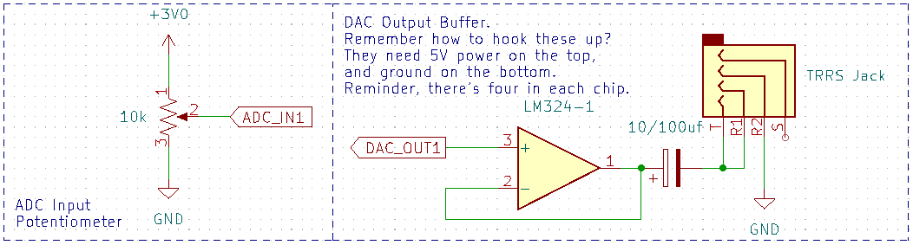
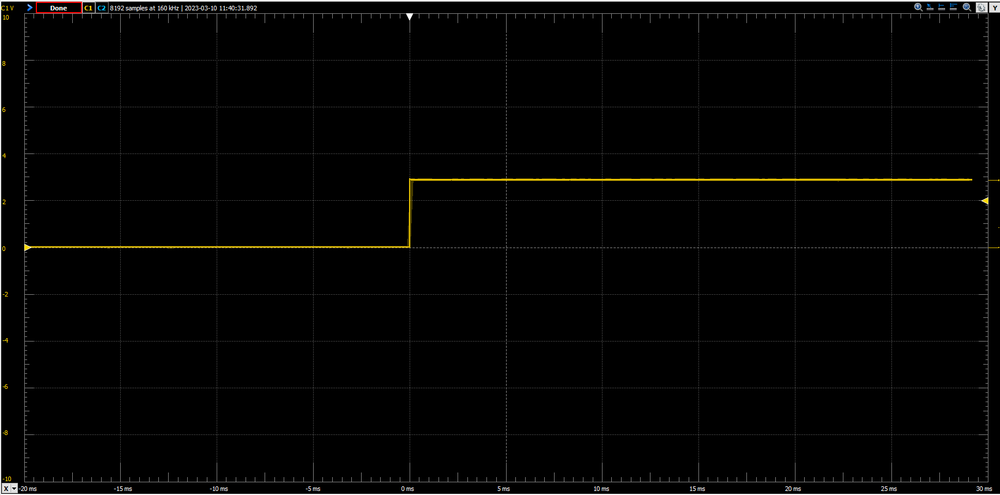
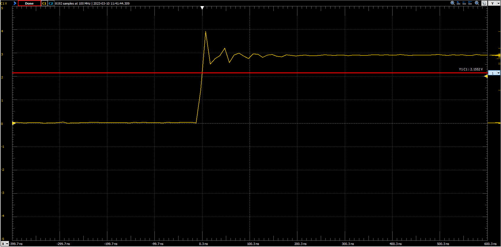
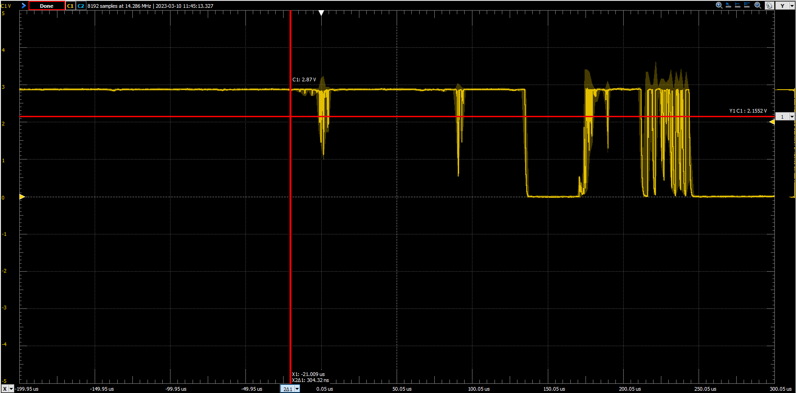
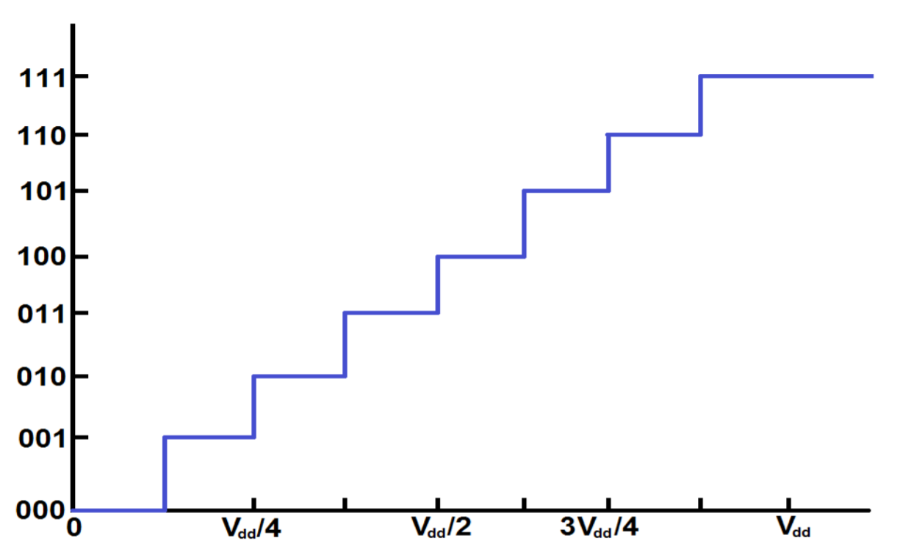
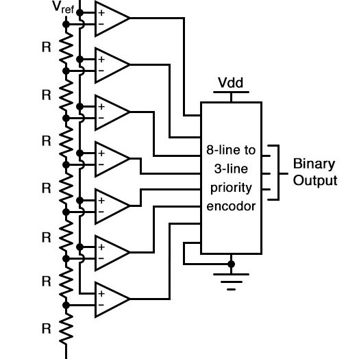
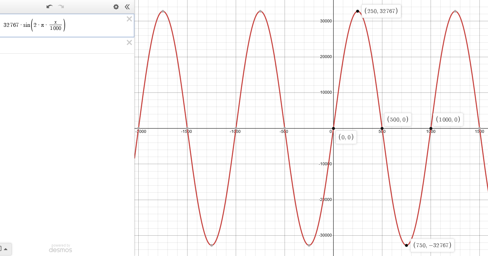
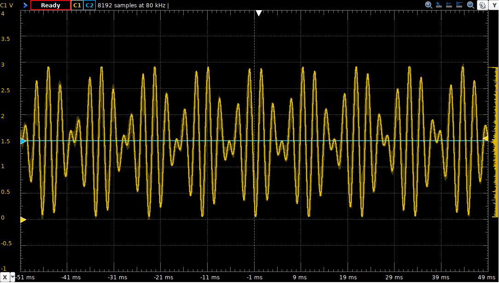
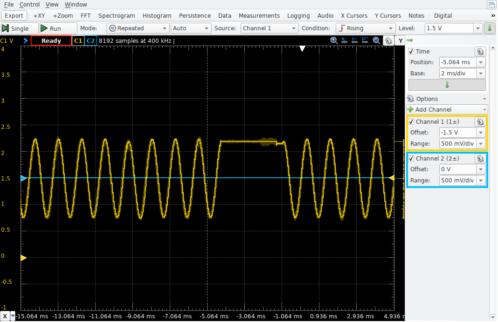

# Lab 4
## DMA, DAC, and ADC

### Table of Contents
<br>

| Step    | Description                               | Points |
|---------|-------------------------------------------|--------|
| 0       | Wiring the circuit                        |        |
|         |                                           |        |
| 1       | Configure Ports                           |   10   |
|         |                                           |        |
| 2       | DMA Transfer to 7-segment displays        |   20   |
| 2.1     | `setup_dma`, `enable_dma`                 |   9+1  |
| 2.2     | `init_tim15()`                            |   10   |
| 2.3     | When it doesn't work                      |        |
|         |                                           |        |
| 3       | Keypad Debouncing in Software             |   20   |
| 3.2     | Timer 7 ISR                               |   10   |
| 3.3     | `init_tim7()`                             |   10   |
| 3.4     | When it doesn't work                      |        |
|         |                                           |        |
| 4       | Create a volume control using the ADC     |   25   |
| 4.1     | Initialize the ADC (`setup_adc`)          |   15   |
| 4.2     | Timer 2 ISR                               |   5    |
| 4.3     | `init_tim2()`                             |   5    |
| 4.4     | When it doesn't work                      |        |
|         |                                           |        |
| 5       | Generate DTMF tones using the DAC         |   25   |
| 5.3     | Configure the DAC (`setup_dac`)           |   15   |
| 5.4     | Timer 6 ISR                               |   5    |
| 5.5     | `init_tim6()`                             |   5    |
| 5.6     | When it doesn't work                      |        |
|         |                                           |        |
| 6       | Interrupt Priorities                      |        |
| 7       | In-Lab Checkoff Step                      | 20**   |
| &nbsp;  | Total:                                    | 100    |
<br>

\*\* - You must get your whole lab checked off, and submit all your work to Gradescope including a confirmation code if any, before the end of your lab section to avoid a late penalty.

## Instructional Objectives
- To use DMA to automatically transfer data to and from peripherals.
- To understand the concept of digital-to-analog conversion.
- To understand the concept of analog-to-digital conversion.
- To connect various independent peripherals to build a coherent system.

> [!NOTE]  
> If at any point you need to get checked off, or need to get help, you can add yourself to the [lab queue](https://engineering.purdue.edu/~menon18/queup/?room=362OH).  **Bookmark this link in your lab machine browser.**  

> [!NOTE]
> You may have noticed that this repository is now a **fork** containing the template repository's original commits, instead of a fresh copy of the template repository for the original lab.  This is because we have opted in to a beta of GitHub Classroom where student repositories will now become forks, which makes it incredibly easy for you to sync new commits from our template lab in case we make mistakes and have to update the manual or code tests.  Make sure to click "Sync commits" every time you come back to this page in case you miss an announcement from us that we updated something.

> [!IMPORTANT]
> There are parts of this lab that require you to use both 5V and 3V pins on your micro.  Unless you are trying to destroy your microcontroller, please follow the instructions **carefully**.
> 
> **For this lab, you may want to invest in a pair of earphones/headphones with a 3.5mm plug**.  This will allow you to listen to the DTMF tones you generate in the last part of the lab.  These can be found for pretty cheap almost anywhere and online.  You can also use the oscilloscope to observe the output of the DAC, but if you're trying to finish the whole lab at home, you'll want the earphones to be sure you're getting the right sounds out of the DAC and that you can control the volume using the ADC.
> 
> Starting with this lab, your autograder helpfulness is reduced, and will **be phased out by next lab**, with only result reporting for Gradescope purposes.  With this lab, the feedback printed out will be binary (it worked or it did not work).  By now, you should be capable of debugging your own code well enough that you should know how to identify the issue and fix it.  Building this skill is a crucial part of learning how to make an embedded system with numerous kinds of microcontrollers and electronic parts, and (more immediately) will help you on the lab practical.
> 
> As always, start early.  This lab has quite a bit of code to go through.

## DMA, DAC and ADC

Some peripherals by themselves are quite simplistic, which encourages us to combine some peripherals in a single lab.  In this one, we'll use DMA, a data transfer peripheral, to continually update the 7-segment displays for us instead of wasting a whole timer and interrupt on it, and use the DAC and ADC to create a volume control and a phone dialer, and observe it on an oscilloscope and (optionally) listen to it using headphones.

## Step 0.1: Set up your environment

Make sure to clone this repository.  Keep in mind to add, commit and push any changes you make so that your work is accessible from a lab machine.  

Similar to previous labs, there is a "code" folder that will serve as your lab code template.  Make sure to open it in VScode by clicking File > Open Folder (or Ctrl-K + Ctrl-O), and then selecting the "code" folder.  

Similar to previous labs, there is an precompiled autotest object that will provide tests for each of your functions.  It is automatically included with your code when you upload to your STM32.  Running "Upload and Monitor" will show the output of the autotest (if the function call has been uncommented) in the terminal.  If you don't see anything yet, make sure to press the reset button on the microcontroller to restart the program and print the output to your serial monitor.

You should see a prompt similar to the following:

```text
DMA/ADC/DAC Lab Test Suite
Type 'help' to learn commands.

> 
```

You can then type `help` to learn what commands you can use to test a certain subroutine.  You will use this to demo your implementation and wiring to the TAs.

We'll use the autotest object to run a wiring check test on your circuit after you build it.  There is some lengthy background to read below before you start coding.  We understand that can be tedious, but please make sure to read it (and re-read it) carefully.  Follow the schematic, using the pictures as a guide to better component placement.

## Step 0.2: Wiring your circuit

> [!WARNING]
> Don't kill your board.  Be very careful about what pins you may accidentally bring in contact, and pay attention to the notes that follow.  To be safe, disconnect power and ground from your board when you are not using it, and when reconnecting, plug one thing in at a time and watch for any indications of a short (STM32/UART heating up, the red FTDI chip having two lit red LEDs where the green transmit/receive light usually is, smell of smoke, etc.)  If you see any of these, immediately disconnect and look for the short in your wiring.

For this lab we will keep the wiring from lab 3, and add some circuitry for the ADC and DAC.  In addition, you will use an oscilloscope to observe the output of the DAC.  If you haven't learned how to use an oscilloscope yet, you can read the [user manual](docs/MSO_User_Manual.pdf) for the scopes in lab.  **If you're working on this at home**, you can use the earphones for now until you get to lab, or borrow an AD2 from the ECE shop (pending availability).

You will use a potentiometer connected between 3V and GND with the center tap acting as a voltage divider.  The center tap of the potentiometer will be connected to an analog input.  As long as you are certain to connect the potentiometers only between **3V and GND**, no damage to the analog inputs is possible.



> [!NOTE]
> The output capacitor on the buffer can be either 10 or 100uF.

> [!WARNING]
> **DO NOT** give anything else aside from the output buffer 5V power. You will kill your development board. The transistors inside the LM324 will saturate and give incorrect output signals if you give it only 3V, which is why in needs 5V. 
> 
> **DO NOT** assume that the LM324 has the same pins for power and ground as your 74-series chip - they are not pins 7 and 14!  Look up the datasheet for an LM324 to identify the power and ground pins.

## Step 1: Configure Ports

Fill out the subroutine `enable_ports()` with the following configurations:

- Enables the RCC clock to `GPIOB` and `GPIOC` without affecting any other RCC clock settings for other peripherals
- Configures pins PB0 – PB10 to be outputs
- Configures pins PC4 – PC7 to be outputs
- Configures pins PC4 – PC7 to have **output type open-drain** (using the `OTYPER` registers)
- Configures pins PC0 – PC3 to be inputs
- Configures pins PC0 – PC3 to be internally **pulled high**

> [!NOTE]
> As usual, you should not alter the configuration for any other pins. For instance, if you were to improperly alter the `MODER` setting for `PC12`, the serial port would stop working.
> 
> You can use the `check_wiring` and `keypad` tests to ensure that your wiring from last lab is correct.

> [!IMPORTANT]
> Run the `enable_ports` to check if the initialization worked as intended and demonstrate it to your TA.  Commit all your code and push it to your repository now.  Use a descriptive commit message that mentions the step number.

## Step 2: DMA Transfer to 7-segment displays

### 2.0 Direct Memory Access - Background

The STM32F09x family of microcontrollers have 2 Direct Memory Access (DMA) controllers, each with 7 and 5 channels respectively, that can autonomously move one or more words of various sizes between memory and peripherals. Once values are written to a DMA channel’s configuration registers, the CPU can be used for other purposes while the transfer operations continue. Each incremental DMA operation can be triggered by a peripheral’s readiness to be written to or read from. Some microcontrollers allow DMA channels to be arbitrarily associated with peripheral devices, but the STM32F0 requires that each peripheral be used with only the specific DMA channel that it is wired to. Table 32 and 33 of the Family Reference Manual shows the peripheral-to-DMA channel mapping. **Find this table, as you'll need it later.**

### 2.1 Configure DMA Transfers

Here, you will set up a **circular DMA transfer**.  This will transfer data from the `msg` array (containing the digit to be displayed on and the seven-segment representation to be displayed, see `main.c`) to the `GPIOB` peripheral's `ODR` register to drive the seven-segment LEDs.  The DMA peripheral will be triggered whenever `TIM15` has an update event. As soon as the timer reaches the `ARR` value, the DMA channel will be triggered to write a new value into the data register.

Remember that `TIM15` works with *one specific channel of the DMA1 controller*.  You need to find and use that default channel.  A hint: use the list of defined macros (eg. RCC_AHBENR_GPIOCEN, etc.) to indicate the correct one.  You can also use the STM32F0x1 reference manual to confirm the correct channel.

Once you've determined which DMA1 channel Timer 15 uses, implement the C subroutine named `setup_dma()` that does the following things on that channel.  **Make sure to read the DMA channel-relevant section of the reference manual to understand what registers you need to modify given the names below, and how to set them.**

- Enables the RCC clock to the DMA controller and configure the following channel parameters:
  - **Turn off the enable bit for the channel first, like with every other peripheral.**
  - Set `CMAR` to the address of the msg array.
    - `CMAR` is the address of the memory location. This must be an address. You cannot insert just the variable/array. Stands for Channel's Memory Address Register.
    - When building, **you will get a warning** about a missing pointer cast. How should you cast the value to fix this?  Hint: look up what the CMAR/CPAR registers are defined as.
  - Set `CPAR` to the address of the `GPIOB_ODR` register.
    - `CPAR` is the address of the peripheral location. Again, this must be an address. Stands for Channel's Peripheral Address Register.
  - Set `CNDTR` to 8. (the amount of LEDs.)
    - A counter of sorts. You write the number of elements that you're trying to transfer here. If it's a singular variable, usually 1 is sufficient. If it's an array, you must write in the size of the array. Stands for Channel's Number of Data to Transfer Register.
  - Set the `DIR`ection for copying from-memory-to-peripheral.
    - A singular bit that sets the direction the transfer is taking. It can be memory to peripheral (writing a value to the ODR) or reading something into memory (writing a value from the IDR into a variable).
  - Set the `MINC` to increment the CMAR for every transfer. (Each LED will have something different on it.)
    - A singular bit that shows if the memory address should increment. Typically, you use this if you're using an array. The incrememnt size is also set by MSIZE.  Stands for Memory Increment.
  - Set the `M`emory datum `SIZE` to 16-bit.
    - A bit field that sets the size of the memory. Not all data is a full integer. You can select from quarter word (8 bit), half word (16 bit), and full word (32 bit) data sizes. 
  - Set the `P`eripheral datum `SIZE` to 16-bit.
    - Similar to `MSIZE`, not all peripherals have the same size of memory. Each GPIO has a 16-bit IDR, but the ADC might only take an 8-bit conversion. Set the size of your peripheral's data with this field.
  - Set the channel for `CIRC`ular operation.
    - A singular bit that tells the transfer to keep going. If this isn't set, it'll stop after it completes. If it's set, it restarts each time it completes.

Implement one more C subroutine named `enable_dma()` that does only the following operation:

- Enable the channel.

The reason for having a separate `enable_dma` function is because there is a lot of variation in students' work. On occasions when we use autotest to check their work, it checks all possible cases once a DMA channel is enabled and running. We want you to get used to keeping this step separate. **Remember to not enable the DMA channel in `setup_dma`.**

### 2.2 `init_tim15()`

Fill out the subroutine `init_tim15()` to enable TIM15's clock in `RCC` and trigger a DMA request at a rate of 1 kHz. Do that by setting the `UDE` bit in the `DIER`, while not setting `UIE`. 

In this case, `UDE` triggers DMA requests. `UIE`, which we've used in the past, enables interrupts.  Notice that we've also not asked you to make an ISR for TIM15, because there is no ISR to invoke for this timer this time. The timer will trigger the DMA channel *directly* without us needing to manually trigger the operation from the ISR.  Nifty!  **Don't forget to enable the timer as well.**

This whole operation amounts to the DMA operation will do the copying that you had to manually implement in the ISR in lab 2.

Once you implement these subroutines and uncomment them in `main()`, you should now see "ECE 362" on the 7-seg LED array. The interesting thing to notice here is that the circular DMA operation continually and automatically copies the buffer array msg to the display. This creates the illusion that the memory is mapped into the display.

### 2.3 When it doesn't work

At this point, you should see the message updating on the 7-seg display, but it may look like it isn't.  Running the `autotest` will now tell you that the functions either work, or don't, with no other feedback.  You are sure you've done everything right, and you've checked your code multiple times.  How do you proceed from here?

So many circumstances in this class depend on getting many details exactly correct before something works. Now, you have an opportunity to develop your debugging skills so that you are prepared for future situations. Here are the steps to take when using DMA. Invoke the program in the Debug Panel and use the Peripherals sidebar panel to check registers one at a time to ensure they are correct. Here are the important ones:

- When you pause the debugger, is the program stuck in the DefaultHandler? Did something cause a fault?  Look at the Call Stack to identify the last thing it tried to execute.
- Is the RCC clock to Port B enabled?
- Are pins PB0 - PB10 configured as outputs?
- Look at timer 15:
  - Is the timer enabled?
  - Repeatedly click on the `CNT` register to update its view. Is it changing? If not, it probably means that the timer is not running.
  - Is the `CNT` value larger than the ARR? That's usually a sign that you set up the ARR after you set the CEN bit to enable the timer's counter. Always set CEN last.
  - Did you set the `UDE` timer to trigger the DMA channel?
- Look at the DMA channel you've configured:
  - Are you sure you picked the right DMA channel? Look at Table 32 on page 205 of the Family Reference Manual to check your assumption. Only one particular DMA channel will work with Timer 15. Make sure you use that one.
  - Repeatedly click on the `CNDTR` register to update its view. Is it changing? If not, it probably means that the DMA channel is not being triggered or some configuration issue, explained below, is happening.
  - Did you set the `CMAR` and `CPAR` addresses properly? Look up the address of the `GPIOB ODR` in the I/O Register debugger.
  - Did you set the DMA channel direction to copy from memory to the `GPIOB ODR`?
  - Did you set the `MINC` bit to increment the `CMAR` and clear the `PINC` bit to not increment the `CPAR` after each copy?
  - Did you configure the DMA channel for circular operation?

By systematically checking all of these elements, you can find the root cause(s) of most problems.

> [!IMPORTANT]
> Uncomment the `#define SCROLL_DISPLAY` stanza. This will define a symbol that will enable compilation of the code block enclosed in the `#ifdef ... #endif` below it.
> 
> Your LEDs should scrolling the `Hello...Hello...` string now.  Make sure you are passing the tests for `setup_dma`, `enable_dma` and `init_tim15`.  Commit all your code and push it to your repository now.  Use a descriptive commit message that mentions the step number.

> [!NOTE]
> How does this work?
> 
> **Look at the code for `print()` in the `support.c` file.** It copies one byte at a time into the `msg[]` array. For historical reasons, every ASCII character is defined by the lower seven bits of the byte. That let us use the most significant bit to indicate that the dot on a character should be set or not. **This will be used in the code to show key events in the next section.**

## Step 3: Keypad Debouncing in Software

### 3.0 Key Bounce - Background

Buttons and switches are not perfect. Usually, there is some sort of spring to it, which means that the electricity "bounces" around inside of there. Unfortunately, it's pretty good at wrecking data, and it's hard to see with the untrained eye. Here's an example of a zoomed out view of a button press as viewed on an oscilloscope:



If we zoom into that transition, it looks like this:



The red cursor shows the point considered to be a logic high.  This is therefore a better bounce because it's a nicer switch, and it doesn't cross back over the logic line, so the input won't oscillate.  

But what happens if we use a poor quality switch that, let's say, we found on the floor?



That looks like **garbage,** right?  Note the two red cursors on the screen that are separated by a singular pixel. Within this very slight time duration, the processor is able to look for an input around 15 times. The system doesn't settle for another 250 microseconds, so it could be reading any of those oscillations! 

So, how do we fix this?  We **debounce** the button.  We can do this in hardware or software, but for this lab, we'll implement the latter. 

### 3.1 To Debounce Buttons

In lab 3, you learned how to scan a keypad matrix. In this lab experiment, you will do that again, but you will now **debounce** the presses so that you can determine the moment each one is pressed and released, and do a translation of keys.

We will use **the history method** to keep track of the last eight readings from each button on the keypad in a single byte of memory (recall that 1 byte = 8 bits).  When the byte is 00000000, it has been idle for a long time. When the byte is 00000001, it has been read as pressed recently. When the byte is something like 10101011, it was pressed some time ago, and it is still bouncing. When the byte is 11111111, it has been pressed for a long time and is no longer bouncing. When the byte is 11111110, it has been read as recently released. In a gist, the history method **waits to assign a keypress until the buttons have settled.**

To detect multiple button presses, we would want to configure the keypad scanning outputs as open-drain (either pulled low or floating high) and enable pull-up resistors on the keypad scanning inputs. That way, each input would naturally float high, and any key press on a selected column would force a row low. This way different columns would not be high and low, and pressing two buttons in the same row no longer creates an indeterminate voltage level on the row. For instance, if Col1 was pulled low and the others were floating pressing the '4' and '5' buttons will only cause the Row2 output to go low. Col2 is not pulled high or low, so pressing the '5' button does not interfere.

It would be simpler to understand if an output pin could be configured to either push high or float. This configuration is called **open-source**, and it is not supported by the STM32 GPIO system.  From an electrical standpoint, it is no better or worse to do so with **open-drain** outputs.

Each time a button is pressed or released, an entry will be placed in a circular queue. For the purposes of this lab experiment, a two-element queue will be enough. The main loop of your program will check the queue quickly and remove entries before it is filled up by a button press.

The subroutine that waits on keys and returns their value will sleep, waiting on interrupts and checking the queue every time it wakes up.  If there is something in the queue to indicate a button press, it will note what it is, translate it into the ASCII character representation, clear the queue entry, and advance to watching the next entry in the queue. By clearing each queue item after it is read, subsequent reads of the queue can recognize the presence of a new button press by looking for a non-empty queue entry.

> [!NOTE]
> In this lab, you will be using pins on Port C for the keypad. This means you will modify the GPIOC_MODER configuration. 
>
> Remember that if you modify the configuration for pin PC12, you will **disable the serial port**. Double-check your MODER updates to make sure they will not change pin 12. 

### 3.2 Timer 7 ISR

Write the interrupt service routine for Timer 7. Be sure to copy its exact name from the `startup_stm32f091xc.S` file so that you get the name correct.  (Look back at the last lab if you need to remember how to find it - make it a habit to keep opening it so that you know how to find it.)  The code should do something similar to what you did in lab 3, but instead of checking the columns and rows and toggling anything, it should update the history of each button:

```C
// Remember to acknowledge the interrupt here!
int rows = read_rows();
update_history(col, rows);
col = (col + 1) & 3;
drive_column(col);
```

First, the rows are read. Later, the column is updated. This allows for the R-C components that are a part of any electrical circuit to charge up and stabilize in time for the next invocation of the ISR. If you look at the implementation of `read_rows()` and `drive_column()` in the `support.c` file, you will see that they are similar to the ones you used in the Timers lab, but they are inverted. Remember that we are using active-low signals with open-drain configuration to be able to read multiple button presses simultaneously.

In the middle of the code is a call to `update_history()` which keeps track of the past eight samples of each button. If any button's history has the bit pattern `00000001`, it means that the button has just now been recognized as pressed for the first time. If any button's history has the bit pattern `11111110`, it means that the button has just now been recognized as released for the first time. Either of these situations cause update_history to record the event in the two-entry `queue[]` array.

### 3.3 `init_tim7()`

Implement the C subroutine named `init_tim7()` that causes the Timer 7 ISR to be invoked at a rate of **1 kHz**. The steps that you use to accomplish this are similar to those that you underwent in the Timers lab.

Once you are ready for the actual demo, please comment out the `for` loop with `asm("wfi")` in the `main()` function first. Otherwise the program won't proceed any further.

**To demo your code**, uncomment the `#define SHOW_KEY_EVENTS` stanza and comment out `SCROLL_DISPLAY`.  This will enable a call to the `show_keys()` subroutine, which does not return. It will continually call `get_key_event()` and display the result on the seven-segment display. Each time a key is pressed, `get_key_event()` returns the ASCII code for the key with the most significant bit set. On the seven-segment display, this is shown with the decimal point. When a key is released, `get_key_event()` returns the ASCII code for the key with the most significant bit clear.

If you press and hold the '1' key, the display should show '1.' (a '1' with the decimal point lit). When you release it, a '1' without the decimal point will be shown.

The interesting thing about using open-drain configuration to scan the keypad is that you can register a second button press without having to release the first one. Try pressing and holding the '1' and '2' keys. Release one at a time. See the results on the seven-segment display.

### 3.4 When it doesn't work

Use the Peripherals view while debugging to determine what the problem is when it does not work.

- Is the RCC clock enabled for Timer 7?
- Has the PC4-7 been configured with output type open-drain?
- Has the PC0-3 been configured with pull-high?
- Is the Timer 7 counter enabled?
- Repeatedly click on the Timer 7 `CNT` register to update its value. Is it changing? If not, the timer is probably not enabled.
- Is the `UIE` bit set?
- Has the interrupt source been enabled in `NVIC`?
- Set a breakpoint in the Timer 7 ISR. Is it ever invoked? If not, you may not have named it correctly.

> [!IMPORTANT]
> Make sure you are passing the tests for `tim7_isr` and `init_tim7` and show this to your TA.  Commit all your code and push it to your repository now.  Use a descriptive commit message that mentions the step number.

> [!NOTE]
> How does it work?
> 
> Look at the `update_history()` subroutine in support.c file. It uses the `push_queue()` subroutine to put new event entries in the two-entry `msg[]` queue. Then, look at the `get_key_event()` function. It checks the two-entry queue to wait for a non-zero value. It removes that value, using `pop_queue` and returns it. As an efficiency improvement, it embeds a `WFI` instruction so that it does not continually run. A button event can only happen as a result of an interrupt, so it doesn't miss anything by waiting for the `WFI` to complete.

> [!NOTE]
> Why do this instead of hardware debouncing?
> 
> Mostly, cost. It's cheaper to have an intern code this once into your software than to pay someone to assemble hundreds of extra resistors and capacitors.

## Step 4: Create a volume control using the ADC

### 4.0 Analog-to-Digital Conversion - Background

Audio signals, analog sensor input waveforms, or input waveforms from certain types of input devices (sliders, rotary encoders, etc.) are all examples of analog signals which a microcontroller may need to process. In order to operate on these signals, a mechanism is needed to convert these analog signals into the digital domain; this process is known as analog-to-digital conversion.

In analog-to-digital conversion, an analog signal is read by a circuit known as an analog-to-digital converter, or ADC. The ADC takes an analog signal as input and outputs a quantized digital signal which is directly proportional to the analog input. In an n-bit analog-to-digital converter, the voltage domain of the digital logic family is divided into 2n equal levels. A simple 3-bit (8-level) analog-to-digital quantization scheme is shown in the figure below:



There are several ways to lay out a topology scheme for an ADC. Below is an example of one that also happens to be a 3-bit decoder, although it is simplified a little:



If this is something you're interested in designing, you'll need to do a little further reading elsewhere. Design of an ADC is an art, and we (unfortunately) do not have the time to cover it in this course.

In this section, you will set up the analog-to-digital converter (`ADC`) and repeatedly check it to update a global variable. Since there is always some amount of noise, you will smooth out the readings by creating a boxcar averaging mechanism and using that average to update a variable.

The STM32F0 microcontroller has an integrated 12-bit analog-to-digital converter. The converter has 19 channels, allowing for readings from up to 16 independent external pins and three different internal sources. The ADC is capable of converting signals in the 0-3.6V range, although it is limited by the reference voltage on the development board (for ours, it's approximately 2.95 V). It is able to capture and convert a new sample every 1μs. Many other ADC features are described in greater detail in the microcontroller documentation, and it's worth a read when you have some free time. Namely, the ADC can look at 16 different inputs by multiplexing.

### 4.1 Initialize the ADC (`setup_adc`)

For the purposes of this experiment, we are interested in configuring the microcontroller ADC for single conversion, using the "software-driven mode." This means that the ADC will perform a single conversion, initiated in software. The ADC will then await the next software trigger before another conversion is initiated. This is the default operating mode of the ADC, and no special configurations will be needed within the ADC peripheral. In the event that special operating conditions (DMA, continuous conversion mode, etc.) need to be performed by the ADC, operating modes can be specified via the ADC configuration registers: `ADC_CFGR1` and `ADC_CFGR2`.

When performing a conversion, the ADC will read and convert values on any active channels. By default, all ADC channels are disabled. Prior to use, it is important to enable those channels on which conversions will be performed. This is done through the ADC channel selection register, `ADC_CHSELR`.

> [!WARNING]
> It is worth reiterating that, when an external pin is configured for analog operation, it puts delicate internal circuitry at risk. If you expose an external pin to greater than 4.0 V even for a fraction of a second, it will permanently, irreparably damage either the pin or the entire microcontroller. Disconnect your microcontroller from power when you are wiring circuits. Don't connect anything to the 5 V power pin of the microcontroller. Check your circuitry before applying power to your development board. 
> 
> In this lab, you will be using pins on Port A for analog operations. This means you will need to modify the `GPIOA_MODER` configuration. Remember that, **if you modify the configuration for pins PA13 or PA14, you will lose the ability to debug or even re-program the microcontroller**.  Double-check your `MODER` updates to make sure they will not change pins 13 or 14.  Some of the newer TAs will not recognize this issue right away, and it will consume an hour of your time.
>
> When you misconfigure GPIO Port A, remember that you can restore the ability to use the debug/programming interface by:
>
> 1. Repairing your program,
> 2. Pressing and holding the reset (SW1) button,
> 3. Pressing "Upload" to reprogram the microcontroller
>
> Depending on what kind of mistake you made, you might have to hold down the reset button for only one second after pressing "Upload".  You may also need to reprogram the microcontroller twice before it works again. **Be patient**. Do not give up. Ask a TA for help with this process.

Now that we have gone through the necessary details and warnings, let's get to the code. Implement the C subroutine named `setup_adc()` that does the following things:

- Enable the clock to GPIO Port A.
- Configure the pin associated with `ADC_IN1` to be in analog mode. 
    - Which pin is this?  See Table 13 of the STM32F091xBC PDF on Piazza Resources.  To be sure you have the right pin, remember that we discussed the use of **GPIOA** above.
- Enable the clock to the ADC peripheral.
- Turn on the "high-speed internal" 14 MHz clock (HSI14).
- Wait for the 14 MHz clock to be ready.
- Enable the ADC by setting the ADEN bit in the CR register.
- Wait for the ADC to be ready.
- Select the corresponding channel for `ADC_IN1` in the `CHSELR`.
- Wait for the ADC to be ready.

See examples A.7.2 and A.7.4 of the Family Reference Manual appendix to find the code for some of these instructions.  Don't blindly copy in what you see - type the corresponding macro in, ctrl/alt-click on it, and see what the description says and whether it applies to the instructions above.

Your subroutine can use the default configuration of right-aligned 12-bit conversion.  Really, not much more need be done than is shown in the example of the lecture.  We just want to do the minimum needed to make the ADC work.

### 4.2 Timer 2 ISR

Now that our ADC is configured to read in samples, we'll use a timer ISR to periodically get values from it and scale it into a `volume` variable.  Create the ISR for Timer 2.  Set it up to do the following steps:

- Acknowledge the interrupt.
- Start the ADC by turning on the `ADSTART` bit in the CR.
- Wait until the `EOC` bit is set in the ISR.
- Implement boxcar averaging using the following code:

```C
bcsum -= boxcar[bcn];
bcsum += boxcar[bcn] = ADC1->DR;
bcn += 1;
if (bcn >= BCSIZE)
    bcn = 0;
volume = bcsum / BCSIZE;
```

This makes for a rather long-running ISR, but we actually want that to demonstrate the effects of interrupt priority in a later step.

### 4.3 `init_tim2()`

Complete the `init_tim2()` subroutine so that it sets up Timer 2 to invoke the ISR exactly *ten times per second (10 Hz)*.  Don't forget to enable the interrupt bit so that the ISR gets triggered.

### 4.4 When it doesn't work

Use the Peripherals view while debugging to determine what the problem is when it does not work.

- Is the RCC clock enabled for Timer 2?
- Is the Timer 2 counter enabled?
- Are the Timer 2 `PSC` and `ARR` values as you expect them to be?
- Repeatedly click on the Timer 2 `CNT` register to update its value. Is it changing? If not, the timer is probably not enabled.
- Is the `CNT` value higher than the `ARR` value? This is an especially important problem for Timer 2, where the `ARR` and `CNT` registers are 32 bits in size. It takes a long time to wrap around back to zero. You will have this problem if you enable the timer counter before you set the `ARR`.
- Is the `UIE` bit set?
- Set a breakpoint in the Timer 2 ISR. Is it ever invoked? If not, you may not have named it correctly, or you did not enable it in NVIC.
- Is the RCC clock for Port A enabled? Are the pins configured for analog operation? (Do you know which pin `ADC_IN` corresponds to?)
- Is the RCC clock for the ADC enabled?
- Look at the ADC ISR register. Is the ready bit set? Does the Timer 2 Interrupt Service Routine turn on the `ADSTART` bit? (The bits will change to quickly to read them in the I/O Register Debugger.)
- Finally, if nothing is showing on the display, check that your platformio.ini file has the following line:

```
build_flags = -Wl,-u_printf_float
```

It could be that you didn't have the float printf enabled, and the code is running, but you can't see it because the library wasn't compiled.  This should be in the rare situation that you mistakenly copied your previous lab project into this one (which you should not have to do).

To demo your code, uncomment the `#define SHOW_VOLTAGE` stanza and comment out `SHOW_KEY_EVENTS`.  This will enable code that continually calls `printfloat()` for a calculation that estimates the voltage on the `ADC_IN` pin.

Because the **boxcar** we set up in the Timer 2 ISR is 32 samples wide, and because new samples are only taken 10 times per second, it will take about 3 seconds to converge on any new value. If you start the code with the potentiometer on full, it will gradually display values between zero and (approximately) 2.9. If you change the potentiometer, it will take another 3 seconds to converge on the new value. You can speed this up or slow it down by changing how quickly the timer refreshes. Keep in mind that the ADC supports only up to 100kHz.

> [!IMPORTANT]
> Make sure you are passing the tests for `setup_adc`, `tim2_isr` and `init_tim2` and show this to your TA.  Commit all your code and push it to your repository now.  Use a descriptive commit message that mentions the step number.

## Step 5: Generate DTMF tones using the DAC

Time to flip things!  Instead of reading in an analog voltage, we'll produce it.

A digital-to-analog converter (DAC) is similar to analog-to-digital conversion in reverse. An n-bit digital quantity is written to a data register, the conversion is triggered, and the quantized analog value appears on an output pin. One significant difference is that, since the conversion mechanism uses only a resistor network, the conversion is nearly instant. There is no need to continually check a DAC to find out if the conversion is complete.

Like the ADC input, the DAC output cannot represent all values. For an n-bit DAC, there are 2<sup>n</sup> distinct values. A digital value of n zeros usually represents an analog conversion of 0 V. A digital value of all ones usually represents an analog conversion of the reference voltage $V_{REF}$ 

If treated as an n-bit integer, each increment results in an approximately: $V_{REF} / 2^n$ volt increase in output voltage.

For the final step of this lab exercise, you'll configure the DAC and an ISR to create and mix sine waves with arbitrary frequency. 

### 5.1 Initialize a wavetable

A subroutine named `init_wavetable()` that computes an N-entry sine wave and writes it into the array named `wavetable[]` is written for you to see. Each entry of the array is a signed 16-bit integer which can represent values from `-32768` to `32767`. For reasons of symmetry, your sine wave values should range from `-32767` to `32767`. This is done like so:

```C
for(int i = 0; i < N; i++)
    wavetable[i] = 32767 * sin(2 * M_PI * i / N);
```   

The STM32F091 has no floating-point hardware, so this will be computed with slow, emulated mechanisms. It is still fast enough that it can be done at program startup without being noticed. You must, however, avoid floating-point calculations in time-critical situations such as interrupt handlers.  

Here's a visualization of the wavetable with 1000 samples:



### 5.2 `set_freq()`

A subroutine `set_freq(int chan, float f)` is provided for you. It updates one of two sets of global values that are the fixed-point step and offset into the wave table for the two channels.

### 5.3 Configure the DAC (`setup_dac`)

The STM32F091 microcontroller has an integrated 12-bit DAC with two output channels. Samples can be written to the DAC, converted, and alternately written to either channel to produce stereo audio. For this lab experiment, however, we will use only the first channel. (Read section 14.4 of the Family Reference Manual if you want to learn more about "Dual-Mode" output control.)

Because it does not require polling to determine the completion of a conversion, use of the DAC is less complicated than the ADC.  All that is necessary to produce an analog value on an DAC output when configured for software trigger mode, is to write a value into the appropriate Data Holding Register (`DHR`) and initiate the conversion by writing a '1' to the trigger bit of the `DAC_SWTRIGR` register.  The DAC is ready to receive another sample in the next APB clock cycle.

Like the ADC, the DAC has variable bit sizes as well as left-aligned and right-aligned data handling capabilities, but they do not need to be selected in advance. If you wish to output an 12-bit left-aligned data value, you write it to the `DAC_DHR12L1` register before triggering the conversion. If it is a 12-bit right-aligned value write it to the `DAC_DHR12R1` register instead. The only other bit size available is an 8-bit right-aligned register, `DAC_DHR8R1`. There is no left-aligned 8-bit data holding register, nor are there any other sizes.

It is important to understand that writing to any of the channel 1 holding registers (`DAC_DHR12L1`, `DAC_DHR8R1`, `DAC_DHR12R1`) effectively creates a holding register value equivalently. For example, doing any of the following three writes:

- Writing 0x0000**d700** to DAC_DHR12L1 or...
- Writing 0x0000**0d70** to DAC_DHR12R1 or...
- Writing 0x000000**d7** to DAC_DHR8R1

will deposit the 12-bit value `0xd70` into the 12-bit hardware register waiting to be converted by the DAC. They're all equivalent cases. In normal operation, you just want to use the one that works best with your calculations.

Now that we have all our info...

Implement the C subroutine named `setup_dac()` that initializes the DAC peripheral and configures the output pin for `DAC_OUT1` for analog operation. Consider the example on the lecture on Digital-to-Analog Conversion as well as the examples in Appendix A.8. Your subroutine should do the following:

- Enable the clock to GPIO Port A (reenabling is safe)
- Set the configuration for analog operation only for the pin that is associated with `DAC_OUT1`.
  - Similar to `ADC_IN1`, find the pin associated with `DAC_OUT1` from Table 13 of the STM32F091xBC PDF on Piazza Resources.
- Enable the RCC clock for the DAC.
- Select a TIM6 `TRGO` trigger for the DAC with the `TSEL` field of the CR register.
  - When the DAC detects a rising edge on the `TRGO` signal, it will trigger a conversion.  We'll then use the ISR to update the value.  You can find information like this from the DAC portion of the Family Reference Manual.
- Enable the trigger for the DAC.
- Enable the DAC.

You **don't** need to disable the buffer-off (`BOFF`) bit or first disable the DAC enable before you set values. Just do the minimum necessary steps to enable the DAC as specified.

### 5.4 Timer 6 ISR

We'll now set up a timer to continually update the value to be converted by the DAC and produced on the `DAC_OUT1` pin.  

Write the ISR for Timer 6.  (The name for this one is NOT just `TIM6_IRQHandler`!)  It should do the following to setup the next value to stage for the DAC:

```C
// Acknowledge the interrupt here first!
increment offset0 by step0
increment offset1 by step1
if offset0 is >= (N << 16)
    decrement offset0 by (N << 16)
if offset1 is >= (N << 16)
    decrement offset1 by (N << 16)

int samp = sum of wavetable[offset0>>16] and wavetable[offset1>>16]
multiply samp by volume
shift samp right by 17 bits to ensure it's in the right format for `DAC_DHR12R1` 
increment samp by 2048
copy samp to DAC->DHR12R1
```

The code accomplishes the following things:

- Increment `offset` variables by the `step` amounts
- If the integer portion of `offset` is greater than N, find the fixed-point representation of N and subtract it from the offset. (See the notes on sound generation.)
- Get the sample from the `wavetable` at index of the integer portion of offset.
- Scale and write the sample to the 12-bit right-aligned data holding register of the DAC.

The sum of the two wavetable values will be between -65535 and +65535. The volume variable is a 12-bit number, so it has a maximum value of 4095. If this is multiplied by a sample the product will range between +/-268435456 (which is $\pm 2^{28}$). When this value is shifted right by 17, it will result in a signed 12-bit value. Adding 2047 to it will put it in the range 0 - 4095, which is appropriate for DAC output. 
      
In order to realize a digital-to-analog conversion of a value written to the DAC data holding register (`DHR12R1`), it is necessary to trigger the DAC. In the lecture notes, you've seen this done by writing to the *software trigger register*, but the ISR shown above does not do this triggering. Instead, you configured the DAC to be triggered by the Timer 6 `TRGO`, which performs the conversion for you so that you only have to write to the DAC data holding register. 

### 5.5 `init_tim6()`

Implement Timer 6 to invoke the corresponding ISR at a rate of `RATE` kHz.

A symbolic constant, `RATE` is defined in `main.c`. Implement the subroutine `init_tim6()` that initializes timer 6 so that its interrupt is invoked at `RATE` times per second (20000 for this exercise, but **do not hardcode it** - use the RATE variable when setting `PSC` and `ARR` for the timer). 

Remember that timer 6 must be configured to trigger the DAC. To do so, look at the `CR2` register for the "Master Mode Select" field. Set the value that enables a `TRGO` on an Update event. 

### 5.6 When it doesn't work

Use the Peripheral view in the debugger to look at the values you've written to configuration registers. In particular:

- Look at the value in the DAC `DHR12R1` register. Is it non-zero? Does it ever change? In a working system, you will see a change each time you update it.
- If the `DHR12R1` register does not change, set a breakpoint in the Timer 6 ISR. Is it ever invoked? Does it have the right name? Is the Timer configured correctly?
- Step through the code in the ISR when it is invoked. Make sure it computes a new `DHR12R1` value that is not always the same.

**To demo your code**, uncomment the `#define ONE_TONE` stanza and comment out `SHOW_VOLTAGE`.  To enter a decimal point, press `*`. To finalize the number entry, press `#`. For instance, to enter the value 466.164, press `4 6 6 * 1 6 4 #` on the keypad.  The frequency should be produced on the `DAC_OUT1` pin.

The potentiometer serves as a volume control for the output. If you connect earbuds or amplified speakers to the output, you should be able hear it clearly. You may also view the waveform produced on `DAC_OUT1` with an Analog Discovery system or an oscilloscope.  Use the controls to measure of the frequency of the resulting waveform and ensure that it shows 466.164 Hz.

In case you would like to give it a try with a decent microphone and speaker and no scope, you can use an audio spectrum analysis program on your computer to be **really** sure your code is putting out the right frequency, and also give you additional insight into what frequencies your circuit is putting out that you can't hear.  We recommend [Friture](https://friture.org/) for this purpose.  It's free, open-source, and works on Windows, Mac, and Linux.  (Support open-source projects - they make the world a better place!)

Here is an example of how you can test your circuit with Friture listening to the frequencies it emits (watch your volume - it can be very loud at some parts!):

https://github.com/ece362-purdue/lab4-dma-dac-adc/assets/12859429/d959a181-75b0-45ec-81e6-5d9504be0dd5

Next, we'll generate the DTMF tones.  The standard North American [dial tone](https://en.wikipedia.org/wiki/Dial_tone) is composed of these [DTMF]((https://en.wikipedia.org/wiki/Dual-tone_multi-frequency_signaling)) (Dual-Tone Multi-Frequency) tones that can be used to (actually!) dial a phone.  

To implement this, uncomment the `#define MIX_TONES` stanza to enable two-frequency mixing. Select a channel by first pressing `A` or `B`. Then enter the floating-point frequency as before. For instance, to produce a 261.626 Hz tone with channel 0 and a 329.628 Hz tone with channel 1, press the following keys:

```
A 2 6 1 * 6 2 6
B 3 2 9 * 6 2 8
```

Finally, if you comment all of the `#define` stanzas in the `main.c` file, it will fall all the way through to the invocation of the `dialer()` subroutine.  Pressing `#` re-dials the previously entered number (up to 16 digits).  If you have a "land line" you can actually dial the phone by holding the handset microphone to a speaker connected to `DAC_OUT1`.  You could also try this with a DTMF tone recognition app on your phone.  Have fun!



Here's how your dialer should sound (watch your volume!):

https://github.com/ece362-purdue/lab4-dma-dac-adc/assets/12859429/bc141e89-d5cd-4a2f-b65f-b221b1ab0771

> [!IMPORTANT]
> Make sure you are passing the tests for `setup_dac`, `tim6_isr` and `init_tim6` and show the ONE_TONE, MIX_TONE, and `dialer()` modes to your TA.  Your oscilloscope waveforms should reflect the correct frequency for ONE_TONE, look like the waveform above for the DTMF tones, and your circuit should be capable of "dialing" a number.  Commit all your code and push it to your repository now.  Use a descriptive commit message that mentions the step number.

## Step 6: Interrupt Priorities

Here is a good point to look at the effects of setting interrupt priorities and their effects on programs that have multiple interrupts.  We chose to use Timer 2 for the ADC sampling specifically because it has a higher priority than the other timer interrupts.  In other words, as long as the Timer 2 ISR is running, the Timer 6 ISR cannot be invoked.  If the Timer 6 ISR is running when the Timer 2 interrupt is raised, the Timer 6 ISR will be preempted to allow the Timer 2 ISR to run.

Since Timer 6 is used to generate audio samples, it is very important that it have consistent timing. Any interference with its 20 kHz rate will be easily heard. To demonstrate this, add the following (useless) code to the Timer 2 ISR so that it takes a long time to run:

```C
for(int x=0; x<10000; x++)
    ;
```

Then look at the output of a single sine wave generation on an oscilloscope (or simply listen to it). You will see a wave form that has interruptions that look like this:



Since the Timer 2 ISR takes a long time to run, it prevents the Timer 6 ISR from putting new updates into the DAC DHR. To avoid problems like this, every ISR should be as short as possible. For instance, you didn't notice this problem until the long loop was inserted into the Timer 2 ISR! Nevertheless, sometimes it is necessary to make long calculations in an ISR. Another solution would be to use a timer with a lower priority interrupt. That would ensure that the Timer 6 ISR ran on time. Another solution is to *lower* the priority of the Timer 2 interrupt. To do so, simply add the following line to the `init_tim2` subroutine: 

```C
NVIC_SetPriority(TIM2_IRQn, 3);
```

Recall that the upper two bits of the `ISPR` register bytes define four allowed interrupt priorities, from highest-to-lowest: 0, 64, 128, and 192. For some unknown reason, the `NVIC_SetPriority()` subroutine is configured to simply specify only those two bits, so the values of the second argument are 0, 1, 2, and 3. 

> [!IMPORTANT]
> There's no need to check off this step, but it is important to have in place so that you understand why you need interrupt priorities in certain cases.

## Step 7: In-Lab Checkoff Step

> [!IMPORTANT]
> Run `verify` in `autotest` to generate your confirmation code.  Make sure to first set your username in the `main.c` file.  Save the confirmation code ONLY into a new file called "confirmation.txt" in the root of your repository.  
> Add, commit and push it to your remote repository, and submit your GitHub repository to the Lab 4 assignment on Gradescope.  The autograder will decode your confirmation code, and you will receive a score proportional to the tests you passed.  **You will not receive credit for this lab if you do not submit your confirmation code in your repository to Gradescope.**

Please make sure to close all windows, log out of the machine (click on your name on the top bar, and click Log Out, or similar), take all your belongings with you, and **wait for a TA to confirm that you can leave.**.  They will ask you to check that you submitted your work, that you have logged out properly, and that your station is clean.  **Failure to do so will result in a penalty (cleanliness, late) for the lab currently running in that week.**

If you did not manage to finish by the end of the lab, you should still submit the confirmation code to Gradescope, to which we will apply a late penalty on Brightspace.  Keep in mind that the late penalty period is only in effect from the time your lab section ends, to the beginning of your next lab section.  **After that, it is a zero on the lab.**
