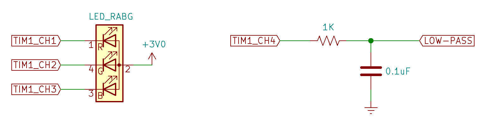
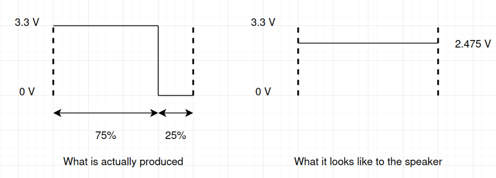
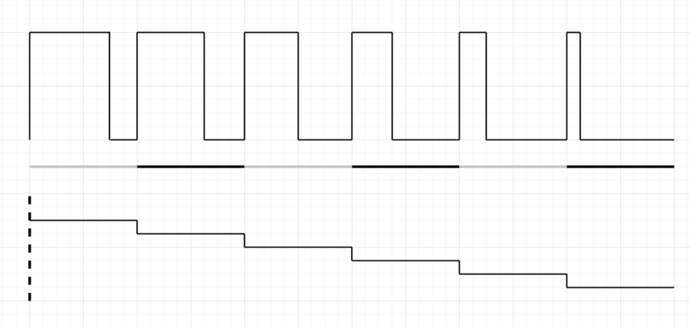
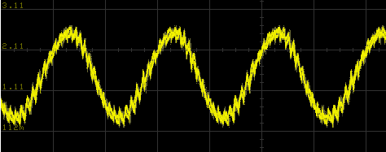

# Lab 5
## Pulse Width Modulation

### Table of Contents
<br>

| Step    | Description                               | Points |
|---------|-------------------------------------------|--------|
| 0.1     | Set up your environment                   |        |
| 0.2     | Wiring the circuit                        |        |
| 0.3     | Copy in code from the previous lab        |        |
|         |                                           |        |
| 1       | Simple PWM with Timer 3                   |   25   |
| 2       | Advanced PWM with Timer 1                 |   30   |
| 3       | PWM Sine Wave Synthesis with Timer 6      |   30   |
| 4       | PWM RGB LED Control - `setrgb()`          |   15   |
| 5       | In-Lab Checkoff Step                      |  20**  |
|         |                                           |        |
| &nbsp;  | Total:                                    | 100    |
<br>

\*\* - You must get your whole lab checked off, and submit all your work to Gradescope including a confirmation code if any, before the end of your lab section to avoid a late penalty.

## Instructional Objectives
- To set up a basic concept demonstration of pulse-width modulation.
- To implement a more sophisticated demonstration of pulse-width modulation.
- To synthesize a wave using PWM.
- To control the color of an RGB LED using PWM and a keypad.

> [!NOTE]  
> If at any point you need to get checked off, or need to get help, you can add yourself to the [lab queue](https://engineering.purdue.edu/~menon18/queup/?room=362OH).  **Bookmark this link in your lab machine browser.**  

> [!IMPORTANT]
> Autotest reporting will be binary for each function (works or does not work), and should mainly be used to generate your confirmation code.  Your primary method of debugging should now be to check the Peripheral view under the Debug panel, checking variable values using the Watch panel, and setting breakpoints to see if your code is executing as you expect.  
> 
> Ultimately, **you should not rely on the autotest to tell you what is wrong with your code** - it is just an automatic grader.  You'll want to develop these skills now because they will be essential on time-limited practicals or projects with components or microcontrollers you're not familiar with.
> 
> **As always, start early.**

## Pulse Width Modulation

A microcontroller’s interaction with the real world (and real humans) often requires the generation of voltages that can vary over a continuous spectrum. Although your microcontroller has an on-board digital-to-analog converter (DAC), it is too weak to **drive** any load that requires high power. Even with amplification, a DAC is inefficient for the purpose of driving heavy loads. Digital electronic systems are well-suited to switching circuits on and off. In circumstances where a load can be switched on and off in such a way that the average output voltage is treated (or perceived) as the signal, a solution is **Pulse-Width Modulation (PWM)**. In this experiment, you will learn how to configure and use PWM to control a high-power load (a light) and generate a variable duty-cycle waveform.

## Step 0.1: Set up your environment

Make sure to clone this repository.  Keep in mind to add, commit and push any changes you make so that your work is accessible from a lab machine.  

Similar to previous labs, there is a "code" folder that will serve as your lab code template.  Make sure to open it in VScode by clicking File > Open Folder (or Ctrl-K + Ctrl-O), and then selecting the "code" folder.  

Similar to previous labs, there is an precompiled autotest object that will provide tests for each of your functions.  It is automatically included with your code when you upload to your STM32.  Running "Upload and Monitor" will show the output of the autotest (if the function call has been uncommented) in the terminal.  If you don't see anything yet, make sure to press the reset button on the microcontroller to restart the program and print the output to your serial monitor.

You should see a prompt similar to the following:

```text
PWM Lab Test Suite
Type 'help' to learn commands.

> 
```

You can then type `help` to learn what commands you can use to test a certain subroutine.  You will use this to demo your implementation and wiring to the TAs.

## Step 0.2: Wiring your circuit

The figure below shows the wiring for the new components for this lab.  **Be sure to leave all of the other previous lab wiring in place - you'll need it for number entry and display.**  The LOW-PASS signal can be connected to the audio jack (where the DAC was connected to from the previous lab).  A set of powered speakers will have a high impedance and can be directly connected to the LOW-PASS signal. If you’re using it to drive low-impedance headphones or earbuds, you should use the LM324 op-amp between the LOW-PASS signal and the headphones.



The RGB LED looks like a white LED with four leads rather than two. The RGB LEDs in your lab kit are common-anode devices. The anode is connected to 3 V, and each of three color component LEDs has a separate cathode. By connecting a cathode to a low voltage, the particular color of the LED is illuminated. In an additive color scheme red, green, and blue combine to produce white light.  **Remember that, since the cathodes of the LEDs are connected to the pins of the STM32, they will be illuminated when the pin outputs are in the low state.**

> [!NOTE]
> If you need it, here's the datasheet for the [RGB LED](./docs/RGB_LED.pdf).

Normally, we would want to include current limiting resistors in series with the LEDs.  **In this case, we want the LED output to be as bright as possible** because we will dim each color by varying the PWM ON time of each channel, so we can do away with the resistors.  Each color of the RGB LED is able to tolerate the maximum current per pin that can be sunk by the STM32.

> [!NOTE]
> You'll have to identify the following - `TIM1_CH1`, `TIM1_CH2`, `TIM1_CH3`, `TIM1_CH4` - under the alternate function pinouts section.  You'll connect the RGB LED to 3 of these later on.

## Step 0.3: Copy in code from the previous lab

Under the section "Lab 4 code" in your `main.c` file, copy in the following functions from your previous lab's `main.c`:

- `enable_ports()`,
- `setup_dma()`,
- `enable_dma()`,
- `init_tim15()`,
- `init_tim7()`,
- `setup_adc()`,
- `init_tim2()`,
- `init_wavetable()`,
- `set_freq()`,
- `init_tim6()`
- The ISRs for each of the timers above.

We'll use these for to handle input from the keypad for the sine wave synthesis step.

## Step 1: Simple PWM with Timer 3

### 1.0 Background 

The idea behind PWM is that given a maximum value, and a "duty cycle" (i.e. the percentage of the time the signal is high), we can generate a signal that is high for that certain percentage of the time, and low for the rest of it. For example, if we have a maximum value of 1000, and a duty cycle of 500, we'll have a signal that is high for 50% of the time, and low for the other 50% of the time. If we have a maximum value of 2000, and a duty cycle of 200, we'll have a signal that is high for 10% of the time, and low for the other 90% of the time. What this does is that the signal will effectively be at a specific voltage. 

Below is an example of a PWM pulse sent on a pin, which is then connected to an analog device like a speaker: 



If you combine enough of these "pulses"...



...you could create a waveform that looks like a wave!

Sometimes, the PWM wave needs to be low-pass filtered in order to yield the analog value properly.  For devices such as LEDs, however, the human eye can act as a natural low-pass filter, which is why we can connect the (high-frequency) PWM signal directly to the LED.

### 1.1 `setup_tim3`

On STM32 microcontrollers, pulse-width modulation is integrated into the various TIM peripherals. For the purposes of this experiment, TIM1 and TIM3 will be used for PWM outputs; you may wish to revisit the basics of timer operation from the Timers lab.

Each timer peripheral that supports PWM on the STM32F0 features 4 independent channels, each of which can be set up to output a PWM signal.  We'll configure TIM3, a very simple timer, to generate PWM signals on PC6 - PC9.

Complete the `setup_tim3` subroutine to visualize what PWM channels look like. The code should do the following:

- Enable the clock for the TIM3 and GPIOC peripherals.  (Warning - these enables are not on the same register!)
- Set the mode of PC6-PC9 to alternate function mode for each of the Timer 3 channels.
  - In case you haven't already noticed them, PC6-9 are the four LEDs on your development board.
  - Alternate pin functions for GPIOC are detailed in Table 16 of the STM32F091xBC datasheet on Piazza.  Alternate function mode is specified using the GPIOx_MODER register for the appropriate GPIO port. 
  - Some pins can have more than one alternate function associated with them; specifying which alternate function is to be used is the purpose of the GPIOx_AFRL (called AFR[0]) and GPIOx_AFRH (called AFR[1]) registers.
- Set TIM3's prescaler register to divide by 48000.  (Remember - you need to subtract 1 from the actual value, since counters start from 0.)
- Set TIM3's auto-reload register such that the timer's frequency is 1 Hz.
- Configure TIM3 for PWM mode 1 so that each channel output can have a CCR value from 0 to 1000.
  - The PWM mode is specified using the OCxM bits in both TIM3_CCMR1 and TIM3_CCMR2 registers.  You'll need to look up which bits to set in the Family Reference (hint - it's two bits per register that correspond to the four channels).  Make sure to set it up for all 4 channels.
  - Enable the four channel outputs in the `TIM3 CCER` register.
  - Enable Timer 3.
- Set each of the Timer 3 CCRx registers as follows:
  - CCR1: 800
  - CCR2: 600
  - CCR3: 400
  - CCR4: 200

Visualize each PWM pulse using the diagram we had above.  The CCRx registers are the duty cycle of the PWM signal.  The higher the value, the longer the signal is high, and the lower the value, the shorter the signal is high.  The timer counts to ARR, and then resets.  The timer value is accessible via the `CNT` register.  

The value of the CCRx register is the value at which the signal will go low.  When the timer reaches 200 from 0, for example, PC9, which is connected to Channel 4 of Timer 3, goes low.  When the timer reaches 400, PC8, which is connected to Channel 3 of Timer 3, goes low.  When the timer reaches 600, PC7, which is connected to Channel 2 of Timer 3, goes low.  When the timer reaches 800, PC6, which is connected to Channel 1 of Timer 3, goes low, and all the LEDs turn off.  When the timer reaches 1000, the timer resets and the cycle repeats.

> [!IMPORTANT]
> Uncomment `#define TEST_TIMER3` in `main.c` to test your implementation. Your LEDs should all start at lit up, and then turn off one by one, starting from PC9 till PC6, until all LEDs are off, and then repeat.  Show this to your TA.  Add, commit and push.
> 
> You can run the `setup_tim3` subroutine to make sure you didn't miss anything.  At this stage, autotest will not tell you anything more than "it works" or "it doesn't work", so make sure to look back at the instructions to set it up carefully.

## Step 2: Advanced PWM with Timer 1

> [!WARNING]
> *Hic sunt dracones*!  We'll be modifying MODER the register for GPIOA in this one, where the programming pins for the STM32 are located.  Be very careful how you modify the MODER register, specifically how you assign to it (`|=` instead of `=`).  If you accidentally change pins PA13 and 14, you may not be able to program your STM32 anymore, and will start getting "Wrong device detected" or "Device not found" errors. 
>
> If this happens, fix the mistake in your code, hold down the reset button on your microcontroller, and then press the upload button in PlatformIO.  This will put the microcontroller in "bootloader" mode, where it will overwrite the last written program.  You may have to do this multiple times.  Once it's done, release the reset button and flash it again.  If you're still having trouble, go to office hours and ask a TA for help.

Now that we have a better understanding of PWM works, we'll try out a higher-frequency implementation that allows us to control the **brightness** of an LED.  In the last step, we implemented PWM at 1 Hz, so we could easily see the LED being turned on and off at a certain duty cycle.  In this step, we'll implement PWM at a much higher frequency, and change the duty cycle continually so that the LED appears to be dimming and brightening.

Implement the C subroutine `setup_tim1()` as follows:

- Enable the clock for the TIM1 and GPIOA peripherals. 
- Configure the MODER for each of the four TIM1_CHx pins to alternate function mode.  You can use the STM32F091xBC datasheet to find the pins.
- Set up the GPIOA AFR to use the alternate function for each of the four `TIM1_CHx` pins.  You can use the STM32F091xBC datasheet to find the alternate function for each pin.
- Enable the MOE bit in the `TIM1 BDTR` register.  
  - This is the main output enable bit, and it must be set to enable the outputs of the timer.  This is only specific to Timer 1, and we won't use any of the break-and-dead-time register features otherwise.
- Set the TIM1 prescaler to divide by 1.
- Set the TIM1 auto-reload register such that an update event occurs at 20 KHz.
- Configure the timer for PWM mode:
  - Set the OCxM bits for all 4 channels in both TIM1_CCMR1 and TIM1_CCMR2 registers to PWM mode 1.
  - For channel 4 of Timer 1, enable the "output compare preload enable".  This is the OC4PE bit in CCMR2.
    - We'll use this for the sine wave synthesis in the next step, but we're just setting it up for now.
  - Enable the four channel outputs in the `TIM1 CCER` register.
- Enable Timer 1.

We don't have to worry about CCR registers in the setup function, since we'll control them in `main()`.

If you haven't already, connect the RGB LED cathodes to the pins that correspond to channels 1-3 of Timer 1.  You do not need current limiting resistors, so you can just connect the LED directly to the pins, with the anode connected to one of the power rails.

This configuration can be long and tedious, and it won’t work at all if you set slightly wrong bit patterns (Your instructor has done this dozens of times and still has to ask "What did I forget?").  When it does not work, remember that you are in good company.  Patience and diligence is strongly encouraged.

Spend a little time in the debugger setting values in the `CCR1`, `CCR2`, and `CCR3` registers to see if you can get the RGB LED to light up in different colors.  You can update a peripheral register value by right clicking it, clicking "Update Value", and typing in the value.  Make sure to step over the next instruction so that the value gets saved.  If you are in lab, you might want to use use an oscilloscope to see the effect of setting a value in the register on the duty cycle of the PWM output. Initialize the `CCRx` values to their maximum value, `0xffff`, to ensure that the PWM outputs remain high, and the LEDs remain off. This will ensure you are not blinded in the time it takes to write the control software to change the intensity of the LEDs.

> [!TIP]
> The oscilloscope manual can be found [here](docs/MSO_User_Manual.pdf).

> [!IMPORTANT]
> Comment out the `TEST_TIMER3` stanza in main and uncomment `TEST_TIM1` to try out the timer 1 PWM.  You will know you have the timer 1 config and channels configured properly if the RGB LED "breathes", i.e. starts dim before ramping to full brightness, before reducing back to dimness, and repeating.  This is called a "breathing light".  Show this to your TA.  Add, commit and push. 
> 
> Run the `setup_tim1` subroutine to make sure you didn't miss anything.


## Step 3: PWM Sine Wave Synthesis with Timer 6

> [!NOTE]
> If you haven't already, make sure to copy in the necessary functions from the previous lab into your `main.c`.  Go back up to see the list of functions, or see the `main.c` file.

With low-pass filtering of the PWM output, the PWM duty cycle forms an analog output. The duty cycle is determined by the TIMn_CCRx value divided by the TIMn_ARR+1. As long as at least one full PWM cycle passes for every change in duty cycle, it will work **just as well as a DAC**.  A higher PWM frequency means a shorter period, which means fewer cycles in which to vary the duty cycle.  This means there is a trade-off between the PWM *frequency* and the PWM duty cycle *resolution*.

If you're in ECE 301, or have completed it, you'll probably see why we can do this.  If you haven't made it that far yet, you'll be there soon enough.  High frequency patterns make low frequency signals.  Low pass filters remove the high frequency patterns, so you have the low frequency output left over.

For this step, you will use a PWM frequency of 20 KHz for the sole reason of being able to do analog synthesis at the same rate you did in lab 4. The PWM frequency is, arguably, too high for LEDs. LEDs have a response time and the on-off rate is better at around 100 Hz, but the effect is not terribly degraded at 200 times this rate. It is certainly high enough that your eyes will not perceive any flickering.

Using a PWM update rate of 20 kHz means that you can take the wavetable synthesis subroutines from lab 4, and use them with some changes to produce our sine wave with PWM instead of the DAC.  **Make the following changes to your Timer 6 code** that you copied in from the previous lab:

- Turn off `TRGO` generation for Timer 6 (just comment out the `TIM6->CR2` line in your `init_tim6()`).
- In your TIM6 ISR, reduce the final combined sample with `sample = ((sample * volume)>>18) + 1200;` (replace the lines that multiply `samp`/`sample` with `volume`, shift it by 17, and add 2048)
- Instead of writing to the DAC `DHR12R1` register, write to the `TIM1_CCR4` register.  

> [!NOTE]
> One final change to your code requires that we explain some background.
>
> You may see an interesting problem if you do the sample update in one statement. The volume definition we gave you is a `uint32_t`. That means that it is a 32-bit unsigned integer.  The expression `(sample * volume)` is a signed type multiplied with an unsigned type, which is then promoted to an unsigned type.  When the resulting value is in the "negative" part of the wavetable, that product **should** be interpreted as negative.
> 
> When shifting a negative number as a signed type right, the most significant bit (a one) is duplicated.  That means if you have a 32-bit value whose MSB (bit 31) is set to 1, which is then shifted right by 8 bits, bits 31-24 will become 1.  However, when shifting an **unsigned** type right, the most significant bit is always made zero. Therefore, if we're not being careful with our signed-to-unsigned conversions, a negative value will end up being treated as a very large positive value.  
> 
> When you add 1200 to it as part of the ISR, it gets even larger.  This math worked fine when we were assigning it to the 12-bit DHR12R1 register in the previous lab.  Now, the CCR4 register is a 16-bit register. Those upper 4 bits are not chopped off. This will manifest itself as a value written to CCR4 that is much larger than 2400.  As a result, the value will be clipped at 100% duty cycle for about half the the sine wave.  
> 
> When you see this behavior, there are three ways to fix it.  (Why don't we just tell you to pick one option?  It's always good to know what options you have for dealing with quirky situations like these.)
>
> Choose **ONE** of the following things to do: (**do not do all three!**):
> - Change the type of `volume` from `uint32_t` to `int` (from unsigned to signed), **OR**;
> - Split the `sample = ((sample * volume)>>18) + 1200;` into multiple statements so that a signed value is shifted rather than the unsigned product, **OR**;
> - Mask (`AND`) the final computed `(sample * volume)` with 0xfff to limit it to a 12-bit positive value. That way it will work with CCR4 as well as it did with DHR12R1.

> [!TIP]
> A common thing that’s forgotten about is that we have that potentiometer on the breadboard from our last lab. Remember these from lab 4?  They adjust the amplitude of your output waveform. If you’re getting a signal that’s sitting at around 1.5V, your potentiometer is probably turned down to zero, and you need to turn it up.

Once these steps are done, comment the `#define TEST_TIM1` stanza in main() and uncomment the `#define MIX_TONES` to demo your work for this step. You can use the keypad as previous lab to set the frequency.  **To view the waveform, connect your oscilloscope probe to the LOW-PASS signal.**

Notice that the more slowly-changing waves in the center appear to be thicker than the waves that quickly range from 0 to 3 V. This thickness is due to the 20 kHz PWM noise that is always either pushing the capacitor higher or pulling it lower. Figure below shows more detail of the synthesized waveform:



The center of the jagged wave represents the desired signal and the jagged edges represents the noise signal. The size of the deviation from the desired signal is significant. If this were an application where such deviations would affect the operation of a piece of equipment, filtering could be used to further diminish the 20 kHz content of the waves. For instance, if you could substitute a 10 KΩ resistor for the 1 KΩ resistor, you will see a much smoother waveform even at high magnification.

If the end result is to produce an audible waveform, the 20 kHz noise content will not be audible to human ears. Dogs and cats will be greatly bothered by it. It may also cause greater power dissipation in an amplification system.

> [!IMPORTANT]
> Show the resulting waveform to your TA.  Demonstrate that you can change the frequency of the resulting waveform by entering a new frequency on the keypad and pressing "#" to confirm, eg. `A 440 #`.  Add, commit and push.  
> 
> If you are outside lab, running the `tim6_pwm` autotest routine will ensure that the timer 6 ISR and `init_tim6` have been configured correctly at the very least.  Try connecting your earbuds and typing in an audible frequency, like `A 440`, to see if you can hear it.  If you're not sure what an A 440 sounds like, you can also use the Friture software with your microphone and a speaker as demonstrated in the last lab to visualize the audio spectrum and ensure you're getting the right frequency.

## Step 4: PWM RGB LED Control - `setrgb()`

Several subroutines are provided for you that will read entire floating point and RGB number sets from the keypad while giving feedback on the seven-segment displays. The value returned by the `getrgb()` is a 6-digit BCD (4-bit representation of decimal digits) value to represent the RGB value to display using the RGB LED in the format `0xRRGGBB`. For instance, `0x009900` would be the maximum possible value for green (99) and the red and blue components turned off (00). The value `0x010005` would be the smallest visible illumination of red (01) and a slightly higher amount of blue (05). The example code in `main()` passes the return value of `getrgb()` into `setrgb()`.

Write the C subroutine named `setrgb()` so it picks apart its argument (which is a value constructed by `getrgb()`) and uses it to set the `TIM1_CCR1`, `TIM1_CCR2`, and `TIM1_CCR3` registers to set the red, green, and blue illumination appropriately. For instance, if the value is `0x112599`, the duty cycle for the output connected to the red LED should be set so that it illuminates the red LED 11% of the time. The green LED should be illuminated 25% of the time, and the blue LED should be illuminated 99% of the time. (Using this scheme, it will not possible to set the PWM output to illuminate any of the colors 100% of the time.)

You cannot treat the number passed to `setrgb()` as a normal decimal integer. For instance, the BCD value `0x112599` is `1123737` if you look at as a two’s-complement binary integer.  How will you turn that into the RGB components for the LED?  It’s important that you think of it as six separate 4-bit BCD integers.  To extract the numbers, remember that you can shift (>>) and mask (&) the value to look at different parts. For instance, if you entered the RGB value `0x123456`, you can find the ten’s-place of the red component by shifting the value right by 20 and looking at only the 4 least significant bits by ANDing it with 0xf. To get the one’s-place of the red component, you would shift the value right by 16 and AND it with 0xf.

Remember that the LEDs are on when the corresponding PWM output is low, so a little more calculation will be necessary to make the LEDs have the proper intensity.

Once these steps are done, comment the `#define MIX_TONES` stanza in main() and uncomment the `#define TEST_SETRGB` to demo your work for this step.

The user interface code in `main()` should work as follows:
- Press D followed by a 6-digit RGB value to set the three color components of the LED.
- Press A or B followed by the digits on the keypad to specify the frequency to use for the two sine waves. The ‘*’ button is the decimal point. Press ‘#’ to accept the number.

For instance, to produce a sine wave with a frequency of 426.386 Hz, press:

```
A 4 2 6 * 3 8 6 #
```

All of the analog waveform synthesis is generated using PWM channel 4 of Timer 1, which you configured earlier.

Button ‘D’ allows you to input a six-digit BCD RGB value to control Timer 1 PWM channels 1, 2, and 3. For instance, to set red to 1%, green to 9%, and blue to 5%, you would press:

```
D 0 1 0 9 0 5
```

Just enter the 6-digit BCD number. No terminating ‘#’ is needed.

> [!TIP]
> If your LED turns blue when you wanted to turn on red, flip the RGB LED around.  You'll need to turn the anode to the other side.
> 
> If setting any value lower than 99 turns the LED off entirely, one issue could be that you are performing an integer division, and so the remainder gets truncated and your result is zero.  Consider doing any multiplications first so your numerator is bigger.

> [!IMPORTANT]
> Show the resulting RGB LED color and sine wave frequency changers to your TA, and that you can set different audible frequencies with the oscilloscope, and that you can turn on the red, green and blue LEDs individually using only the `setrgb` color changer.  Add, commit and push.  
> 
> If you are outside lab, running the `setrgb` autotest routine will ensure that your `setrgb` is at least returning the correct values.  You can also use the Friture software with your microphone and a speaker as explained in the last lab to ensure you're getting the right frequency.

> [!NOTE]
> In semesters past, this lab was constructed to allow adjustment of the PWM frequency as well as the duty cycle for LEDs.  That would have complicated the calculations needed to do waveform synthesis.  You might try, on your own, the steps needed to control the frequency.  Use the `getfloat()` subroutine for number entry, and use the number to form the nearest possible PSC divisor.  When doing so, it is still possible to use the waveform synthesis subroutines, but it will be necessary to change the RATE #define macro to a global floating-point variable instead.

## Step 5: In-Lab Checkoff Step

> [!IMPORTANT]
> Run `verify` in `autotest` to generate your confirmation code.  Make sure to first set your username in the `main.c` file.  Save the confirmation code ONLY into a new file called "confirmation.txt" in the root of your repository.  
> Add, commit and push it to your remote repository, and submit your GitHub repository to the Lab 5 assignment on Gradescope.  The autograder will decode your confirmation code, and you will receive a score proportional to the tests you passed.  **You will not receive credit for this lab if you do not submit your confirmation code in your repository to Gradescope.**

Please make sure to close all windows, log out of the machine (click on your name on the top bar, and click Log Out, or similar), take all your belongings with you, and **wait for a TA to confirm that you can leave.**.  They will ask you to check that you submitted your work, that you have logged out properly, and that your station is clean.  **Failure to do so will result in a penalty (cleanliness, late) for the lab currently running in that week.**

If you did not manage to finish by the end of the lab, you should still submit the confirmation code to Gradescope, to which we will apply a late penalty on Brightspace.  Keep in mind that the late penalty period is only in effect from the time your lab section ends, to the beginning of your next lab section.  **After that, it is a zero on the lab.**

> [!CAUTION]
> Do not leave without confirming that you have been [checked off](https://engineering.purdue.edu/ece362/checkoff/).
