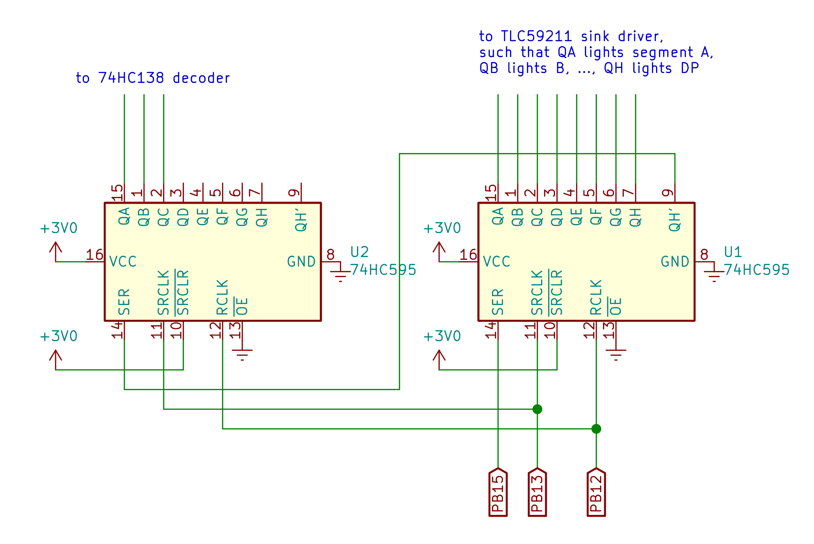
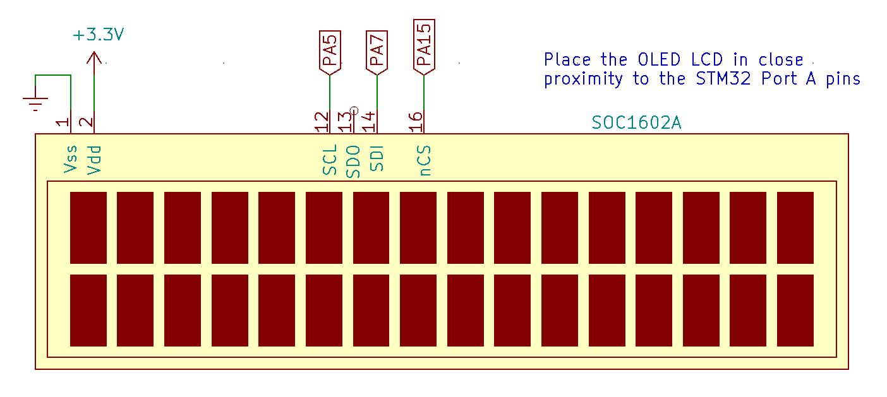
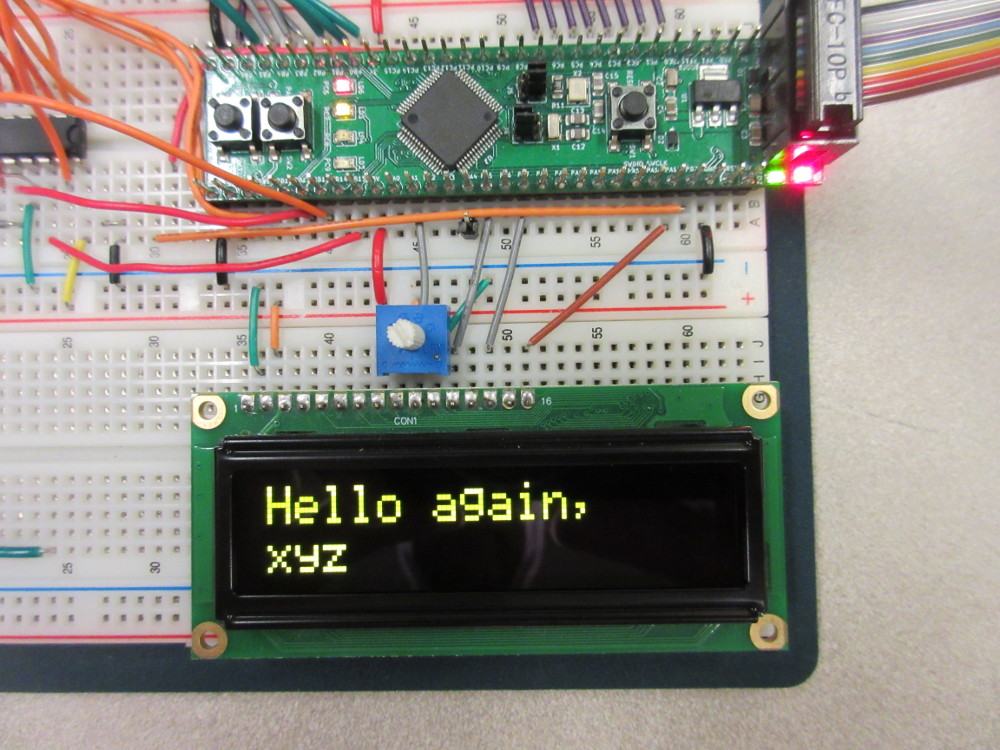

# Lab 6
## Serial Peripheral Interface

### Table of Contents
<br>

| Step    | Description                               | Points |
|---------|-------------------------------------------|--------|
| 0.1     | Set up your environment                   |        |
| 0.2     | Wiring the circuit                        |        |
|         |                                           |        |
| 1       | Software Emulation using Bit-Banging      |  30    |
| 1.1     | `setup_bb`                                |  10    |
| 1.2     | `bb_write_bit`                            |  10*   |
| 1.3     | `bb_write_halfword`                       |  10*   |
|         |                                           |        |
| 2       | Hardware-Based SPI on 7-segment displays  |  20    |
| 2.1     | Copy in code from the previous lab        |        |
| 2.2     | `init_spi2`                               |  10    |
| 2.4     | `spi2_setup_dma` and `spi2_enable_dma`    |  10    |
|         |                                           |        |
| 3       | Hardware-Based SPI on the OLED display    |  50    |
| 3.1     | `init_spi1`                               |  15    |
| 3.2     | `spi_cmd`                                 |  5*    |
| 3.3     | `spi_data`                                |  5*    |
| 3.4     | `spi1_init_oled`                          |  5*    |
| 3.5     | `spi1_display1`                           |  5*    |
| 3.6     | `spi1_display2`                           |  5*    |
| 3.9     | `spi1_setup_dma` and `spi1_enable_dma`    |  10    |
|         |                                           |        |
| 4       | Demonstrate the game                      |        |
|         |                                           |        |
| 5       | In-Lab Checkoff Step                      |  20**  |
|         |                                           |        |
| &nbsp;  | Total:                                    | 100    |
<br>

\* - These steps cannot be checked with `autotest`.  To receive points for them, you must demonstrate your implementation to a TA.  **In cases of a late submission, you must go to office hours to demonstrate your implementation**.

\*\* - You must get your whole lab checked off, and submit all your work to Gradescope including a confirmation code if any, before the end of your lab section to avoid a late penalty.

## Instructional Objectives
- To replicate Serial Peripheral Interface via software emulation, i.e. bit-banging.
- To understand the Serial Peripheral Interface packet format.
- To use and observe an SPI device.
- To use DMA to automatically transfer data to an SPI device.

> [!NOTE]  
> If at any point you need to get checked off, or need to get help, you can add yourself to the [lab queue](https://engineering.purdue.edu/ece362/lab/labutils).  **Bookmark this link in your lab machine browser.**  

> [!IMPORTANT]
> In case you missed it above, some steps will require physical checkoffs, and cannot be checked by `autotest`.  **In cases of a late submission, you must go to office hours to demonstrate your implementation**.
>
> Autotest reporting will be binary for each function (works or does not work), and should mainly be used to generate your confirmation code.  Your primary method of debugging should now be to check the Peripheral view under the Debug panel, checking variable values using the Watch panel, and setting breakpoints to see if your code is executing as you expect.  
> 
> Ultimately, **you should not rely on the autotest to tell you what is wrong with your code** - it is just an automatic grader.  You'll want to develop these skills now because they will be essential on time-limited practicals or projects with components or microcontrollers you're not familiar with.
> 
> **As always, start early.**

## Serial Peripheral Interface (SPI)

The Serial Peripheral Interface (SPI) is a widely-used method for communicating with digital devices with an economy of wires and connections. It is possible to control such devices by "bit-banging" the protocol using GPIO, but your microcontroller has high-level support for SPI devices that simplifies the use of such interfaces. This support also allows for the use of Direct Memory Access (DMA) to automatically transfer a region of memory to the device. In this lab, you will gain experience using SPI and DMA with display devices.

When communication speed is not high priority, it is helpful to minimize wiring by using a serial communication protocol over a parallel one.  It is named so because bits are sent consecutively (one at a time), one after the other.  The Serial Peripheral Interface (SPI) is a common way of doing so.  SPI turns words into a stream of bits and vice-versa. To send an entire word through the serial output, a programmer need only write the word into the SPI data register, and the hardware takes care of converting into a bit stream.

SPI is a synchronous protocol, so it requires a clock signal to indicate when each bit of data sent should be latched-in to the receiver. SPI defines devices that act in two distinct rôles:  A "master" (primary) device is responsible for directing operations by asserting a "slave" (secondary) select line, driving the clock, sending data on a MOSI (master out, slave in, also called SDI) pin, and optionally listening to input on a MISO (master in, slave out, also called SDO) pin. A secondary device responds to operations when its "slave select pin" ($\bar{SS}$ or NSS) is asserted, reads data on the SDI pin, and sends data on the SDO pin on each clock pulse. Because SPI is synchronous, there is no need for devices to agree, in advance, on a particular baud rate (data transfer rate) to communicate with each other. As long as the primary device does not drive the clock at a frequency that is higher than a secondary device can tolerate, data will be received correctly.

> [!NOTE]
> The terms master and slave, MOSI, MISO, NSS/SS, are described here so that you know what they mean in case you come across them in older datasheets, including your STM32 datasheet.  They are **outdated** terms, and the canonical terms for these signals now are as follows:
> 
> Primary for master;  
> Secondary for slave;  
> SDO (Serial Data Out) for MISO;  
> SDI (Serial Data In) for MOSI;   
> CS (Chip Select) for NSS/SS.  Do keep in mind that the chip select is still negated, i.e. you have to drive it low to "select" the secondary device.
>
> We explain both since the STM32 datasheets still use the former, and we don't want you to be confused when you see it.

## Step 0.1: Set up your environment

Make sure to clone this repository.  Keep in mind to add, commit and push any changes you make so that your work is accessible from a lab machine.  

Similar to previous labs, there is a "code" folder that will serve as your lab code template.  Make sure to open it in VScode by clicking File > Open Folder (or Ctrl-K + Ctrl-O), and then selecting the "code" folder.  

Similar to previous labs, there is an precompiled autotest object that will provide tests for each of your functions.  It is automatically included with your code when you upload to your STM32.  Running "Upload and Monitor" will show the output of the autotest (if the function call has been uncommented) in the terminal.  If you don't see anything yet, make sure to press the reset button on the microcontroller to restart the program and print the output to your serial monitor.

You should see a prompt similar to the following:

```text
SPI Lab Test Suite
Type 'help' to learn commands.

> 
```

You can then type `help` to learn what commands you can use to test a certain subroutine.  You will use this to demo your implementation and wiring to the TAs.

## Step 0.2: Wiring your circuit

In the Timers lab, you built an eight-character display out of multiplexed 7-segment LED displays. Since then, you have been using it through a parallel interface — you need to output 11 bits on Port B at the same time in order to display a character at a particular position. To reduce the number of STM32F091RC pins needed to drive your display, it is possible to use **external shift registers** as a serial interface for it.

You have two 74HC595 chips in your 362 kit.  Since each 74HC595 shift register in your lab kit only provides 8 output pins, you will need to cascade two together to effectively build a 16-bit shift register.  Connect the serial input of one 74HC595 shift reigster to PB15 (SDI). Connect the serial input of the other shift register to the serial output (Q7’) of the first. Tie both shift register clock inputs together, and connect them to PB13 (SCK). The outputs of the shift registers replace your previous Port B connections.  The schematic below shows these connections you need to make.



> [!NOTE]
> You may find it useful to place the 74HC595 shift registers on your breadboard upside-down, so the outputs of the shift registers are facing the inputs of the decoder and sink driver.

> [!NOTE]
> The chips are intended to replace the GPIO pins on your development board. You can treat PB0-PB7 as QA-QH on the rightmost 595 chip, and then PB8-PB10 as QA-QC on the leftmost 595 chip.  
> 
> So for example, to turn on PB0, you would send 0x01 to the rightmost 595 chip, and to turn on PB8, you would send 0x01 to the leftmost 595 chip.

Next, the OLED display.  Page 4 of the datasheet for the [SOC1602A OLED LCD display](https://engineering.purdue.edu/ece362/refs/SOC1602A.pdf) describes the pins for the serial interfaces. Like many SPI devices, the documented pin names differ from the canonical description of the SPI protocol. Pin 12 (SCL) is the SPI clock. Pin 14 is the SDI signal. Pin 16 (CS) is a “negated chip select”, which is connected to CS. Figure 3 describes the connection to the STM32F091 development board.




## Step 1. Software Emulation using Bit-Banging

For this experiment, you will write the subroutines to write to the shift registers to drive the 7-segment LED displays and to initialize and write to the SOC1602A OLED LCD display through the SPI interface, and then incorporate DMA to handle the data transmission for you.

**What is bit-banging?**  If you understand how a data transmission protocol works, you can *emulate* nearly any of those protocols by simply toggling corresponding pins in a way that implements the same protocol - this is called bit-banging.  This is a common method for using SPI with most microcontrollers because no specialized hardware is needed to do so. Before we figure out how to configure the SPI peripheral, we will bit-bang the SPI protocol for the shift registers connected to the 7 segment LED array.  This is really helpful for hardware platforms that may not have an SPI peripheral built-in, or (more likely) if you need to use all available SPI peripherals for something else.

### 1.1. `setup_bb`

Write a C subroutine named setup_bb() that configures GPIO Port B for bit-banging the 7 segment LED displays. To do so, set these pins:

- PB12 (Represents CS/NSS)
- PB13 (Represents SCK)
- PB15 (Represents SDI/MOSI)

To general purpose output.  (We're not doing alternate functions because we're **not** using SPI!)

Then, initialize the pins such that `CS` is high, and `SCK` is low.  It does not matter what `SDI` is set to.

### 1.2. `bb_write_bit`

Write a C subroutine named `bb_write_bit` that accepts a single integer parameter, which should always be either 0 or non-zero, and implements the following pseudocode:

```c
void bb_write_bit(int out)
{
  // Set SDI to 0 or 1 based on out
  small_delay();
  // Set SCK to 1
  small_delay();
  // Set SCK to 0
}
```

The `small_delay` subroutine is written to call `nano_wait` for a short amount of time.  When bit-banging, it is helpful to have a uniform small delay that can be made arbitrarily large.  Making it a separate function rather than just calling `nano_wait(N)` makes it easy to change the delay time for all calls to `small_delay` at once, in case we need to slow down or speed up the bit-banging process.  Once your experimentation works at slower speeds, you can then speed it up by reducing the delay time.

### 1.3. `bb_write_halfword`

Write a C subroutine named `bb_write_halfword` that accepts a single integer parameter and implements the following pseudocode:


```c
void bb_write_halfword(int message)
{
  // Set CS to 0
  // Call bb_write_bit() for bit 15
  // Call bb_write_bit() for bit 14
  ...
  // Call bb_write_bit() for bit 0
  // Set CS to 1
}
```

> [!TIP]
> You do not have to do this sequentially. You could do it in a loop form.
> 
> If you haven't figured it out yet, remember that you can use the `>>` operator to shift values to the right by an arbitrary amount.  Then use the `&` operator to AND the result with a 1 to isolate one bit.  To test, you can make 16 separate calls to bb_write_bit() in the proper sequence, and then figure out the format for the loop from that.

### Demonstrate bit-banging

Uncomment the `#define BIT_BANG` stanza in main.c. This will invoke your `setup_bb()` subroutine to configure the pins as outputs and then call your `bb_write_halfword()` repeatedly to show the entire array using the `drive_bb` function, which is implemented for you.

The display should say “ECE 362”, though it will iterate through each display element very slowly. Make sure that each digit displays correctly.  Then reduce the number of nanoseconds that `small_delay` waits until the display is smooth.  

<!-- Add AD2? -->

> [!IMPORTANT]
> Make sure you are passing the tests for the functions above by typing `bitbang` into autotest.  Add, commit, and push your code at this point, and include the step number.
> 
> In lab, demonstrate your bit-banging to a TA on the 7-segment display, and the SPI signals on the oscilloscope.  They will check the code that you wrote to do this.

### When it doesn't work...

If your display is not working, check:

- Make sure that each pin is set to output mode on the debugger (0x01 per each pin)
- Make sure that you’re using the correct pins when modifying the ODR with BSRR/BRR. You can check this by stepping through each line in your code with the debugger and seeing what pins change on the ODR.
- You can use your oscilloscope to check the signals on the pins.  You should see the clock signal (SCK) toggling, and the data signal (MOSI/SDI) changing as well.  If you don't see this, then you may have a problem with your code or your wiring. 

> [!TIP]
> In lab, you can read the oscilloscope manual for instructions on how to set up Serial mode to decode the SPI signals (or just start by pressing Serial and setting it up for the correct word size of 8, and specifying your serial clock and data signals).  This will help you see the data being transmitted in real-time.

## Step 2. Hardware-Based SPI on 7-segment displays

### 2.0. Background

The SPI driver in the STM32 can be configured for several different modes of operation. For instance, the clock output can be configured to latch data on the rising edge or falling edge. Also, the CS output can be set to automatically pulse low for each word written, but only when the clock is in a specific configuration. CS pulse generation is generally not useful in situations where multiple secondary devices share the same SDI, SDO, and SCK pins. For that, you would want to control multiple individual CS pins. Since we are using a single device, and since that device requires that CS go high after every word written to it, we will use the **NSSP** (negative slave-select pulse) feature.

The STM32 has two SPI channels that do the work of the subroutines you just wrote in a hardware format instead of a software format, which saves valuable processing time. Implement the following subroutines to initialize and use the SPI2 interface.

### 2.1. Copy in code from the previous lab

From lab 4 or 5, copy in:

- `init_tim15`
- `init_tim7`
- and the TIM7 ISR.

We'll use TIM15 to trigger the DMA update, and TIM7 to read the keypad.

### 2.2. `init_spi2`

Implement the C subroutine `init_spi2` that initializes the SPI2 peripheral to communicate with the 7-segment LED displays.  The following settings should be used:

- Ensure that the `CR1_SPE` bit is clear first. Many of the bits set in the control registers require that the SPI channel is not enabled.
- Set the baud rate as low as possible (maximum divisor for BR).
- Configure the interface for a 16-bit word size.
  - **Read the warning below about the word size carefully**.
  - We have two 74HC595 chips with 8 bits stored per chip.
  - The leftmost chip controls the 3-to-8 decoder, we're using only the bottom 3 bits.
  - The rightmost chip controls the sink driver, so we're using all 8 bits.
  - So our data will look something like: `0b00000XXX_XXXXXXXX` where the X's are the bits we want to send.
- Configure the SPI channel to be in "master configuration".
- Set the SS Output enable bit and enable NSSP.
- Set the TXDMAEN bit to enable DMA transfers on transmit buffer empty
- Enable the SPI channel.

> [!WARNING]
> The size of the word to be sent and received by an STM32 SPI channel is set with the `SPIx_CR2` `DS` field.  This 4-bit field is unique among other I/O registers in that ‘0000’ is not a legal value. An attempt to clear this field before setting it to something new will result in it being reset to ‘0111’ which defines an 8-bit word size.  
> Therefore, unlike other registers where you may first clear and then set the bits, you should set your bits **before** clearing anything in the DS field.  **Do not clear the DS field to a zero entirely.**  You'll find this warning in the STM32F0x1 Family Reference under the DS field description.

Consider what you've achieved here...  

In labs 4 and 5, you used DMA to copy 16-bit words into an 11-bit GPIO ODR to drive the 7-segment displays. Now you’ve moved the 7-segment driver to a synchronous serial interface.  Since there is a built-in peripheral that serializes bits, you can now do the same thing, with the same software. The only things you had to change were the initialization code to set up the SPI peripheral instead of parallel GPIO lines, and the output target of the DMA channel.

> [!IMPORTANT]
> Make sure you are passing the tests for the functions above by typing `spi_leds` into autotest.  Add, commit, and push your code at this point, and include the step number.
> 
> In lab, demonstrate your code by uncommenting the `#define SPI_LEDS` stanza in main.c.  You should see the same "ECE 362" message on the 7-segment displays, and be able to press keys on the keypad to show them on the same display.  The TAs will check the code that you wrote to do this.

### When it doesn't work...

If your display is not working, check the following:

- Are you setting the respective pins to Alternate Function mode? If you check inside of the debugger, each used pin should read 0x10.
- Because we are setting alternate functions in these pins, the AFRH (AFR[1]) should be reading the alternate function that can be used for these pins. These can be found in the STM32F0 datasheet, not the family reference manual.
- Are you turning on the SPI2 RCC clock? Every peripheral in the STM32F0 has a clock associated with it in the RCC. Assume that these peripherals will not work unless you turn their clock on.
- Are you turning off the SPE bit before configuration and turning it back on after?
- Are your CR1 and CR2 registers coming out to expected values? Make sure to put a breakpoint after your code, run the debugger to that breakpoint, and check the values in those registers. CR1 initializes to 0x0000 and CR2 initializes to 0x0700, so most of the things that are turned on are bits that you turn on in your code. If they are coming out different than what you expect, check through your code to make sure you are correctly setting and clearing bits.

### 2.4. `spi2_setup_dma` and `spi2_enable_dma`

This step is dead easy.  Copy in the `setup_dma` and `enable_dma` functions you wrote in previous labs, and prepend them with `spi2_`.  Make the following changes in `spi2_setup_dma`:

- Configure the DMA channel to write to SPI2->DR instead of GPIOB->ODR.
- Enable the **SPI2** bit (not on the DMA channel) that generates a DMA request whenever the TXE flag is set.

This way, we don't have to worry about the SPI peripheral being ready to accept data.  The DMA channel will automatically transfer the updated message for the 7-segment displays to the SPI peripheral whenever it is ready.  

> [!IMPORTANT]
> Run `spi_leds_dma` in autotest to verify that your DMA-to-SPI setup is at least configured correctly.
> 
> > In lab, demonstrate your code by uncommenting the `#define SPI_LEDS_DMA` stanza in main.c.  You should see the same "ECE 362" message on the 7-segment displays, and be able to press keys on the keypad to show them on the same display.  The TAs will check the code that you wrote to do this.

## Step 3. Hardware-Based SPI on the OLED display

Now that we've demonstrated how to use the SPI peripheral to drive the 7-segment displays, we can use the same peripheral to drive the far more fun OLED display.  

Most SPI devices use a 4-, 8-, or 16-bit word size - we use the 16-bit one for the 7-segment displays above.  The SOC1602A uses a 2+8-bit word size - to send 2 bits of configuration information + an 8-bit character on each transfer.  The first two bits are, respectively, the register selection and read/write.  Since we will always be writing data to the display and never reading it, we will always make the second bit a ‘0’.

The register selection determines whether a write is intended as a command or a character to write to the display. Commands are needed to, for instance, initialize the display, configure the communication format, clear the screen, move the cursor to a new position on the screen, etc.

The SOC1602A implements an old and well-known LCD protocol. You may see it in many other two-line LCD modules.  There are many commands that can be used to implement complex operations on the SOC1602A that we will not use for this lab experiment. For the sake of this lab, we will be concerned only with the initialization sequence, moving the cursor, and writing characters to display.

When the register select bit is 0, the transmission issues an 8-bit command to the display. When the register select bit is 1, the transmission represents a character to write to the display.

Page 7 of the SOC1602A datasheet lists the set of possible commands that can be sent to the display. Pay special attention to the column labeled “Max Execution Time”. Regardless of how fast data is sent to the display, some operations take significant time to complete. The sender must not start a new command before the previous one has finished. On the next page, details of the instruction format are given. Page 20 lists the initialization sequence (under the header LNITIALIATION SWUENCE[*](https://engineering.purdue.edu/ece362/about/the-nature-of-documentation.html)) that must be used to prepare the display for use. Until each step is properly completed, the display will not show anything. The greatest problem that students have with new hardware (other than poor documentation) is finding the patience to carefully implement each step of the initialization sequence.

To get our display to work properly, the operations to be done are as follows:

1. Wait 1ms for the display power to stabilize.
2. **Function Set**: The reason for issuing this command first is to set the data length for 8-bit operation. This is set by the DL bit in the command description for the 8-bit Function Set operation: 
  - `0 0 1 DL 1 0 FT1 FT0`
  - To set the data length to 8-bit, we use DL=1. The FT[1:0] bits select a font. We’ll select 0 0 to use the English/Japanese font. The 8-bit command will be 00111000 or 0x38.
  - We cannot check the BUSY flag, because we did not connect the MISO pin to the display. Instead, we will simply wait long enough that the display can be guaranteed to finish the command. This command will complete in 600µs, at most. In practice, it will finish much faster.  We could set up an interrupt handler to "watch" for the BUSY flag, but it makes more sense to wait a bit more time than waste an entire peripheral.
3. **Display OFF**: The recommendation is to turn the display off with the 8-bit command:   
  - `0 0 0 0 1 D C B`
  - where D enables the display output, C set the cursor to be visible, and B set the cursor to blink. Turn the display off with the 8-bit code 0x08. 
- **Display Clear**: Clear the display. Note that this command requires **2ms** to complete. Delay for that long before continuing. The 8-bit command is 0x01.
- **Entry Mode Set**: Set the entry mode to move the cursor right after each new character is displayed without shifting the display. This is done with the command:
  - `0 0 0 0 0 1 D S`
  - This time, we will set D=1 and leave C=0, B=0. The 8-bit command is 0x0c. 

After these initialization steps are complete, the LCD is ready to display characters starting in the upper left corner. Data can be sent with a 10-bit SPI transfer where the first bit is a 1. For instance, the 10-bit word 10 0100 0001 (0x241) would tell the LCD to display the character ‘A’ at the current cursor position. In the C programming language, a character is treated as an 8-bit integer. In general, any character can be sent to the display by adding the character to 0x200 to produce a 16-bit result that can be sent to the SPI transmitter. For instance, to write an ‘A’ to the display after initialization, the following statement could be used: 

```C
while((SPI2->SR & SPI_SR_TXE) == 0)
    ; // wait for the transmit buffer to be empty
SPI2->DR = 0x200 + 0x41;    // What's 0x41?  Not a typo.
```

### 3.1. `init_spi1`

Write a C subroutine named init_spi1() to configure the SPI1 peripheral. The configuration for SPI1 is similar to SPI2 from before with a few key differences:

- Configure NSS, SCK and MOSI signals of SPI1 to pins PA15, PA5 and PA7, respectively.
- Configure the SPI register for 10-bit data size.
- Enable it.

### 3.2. `spi_cmd`

Write a C subroutine named `spi_cmd` that accepts a single integer parameter and implements the following pseudocode:

```c
void spi_cmd(unsigned int data) {
  // wait until SPI1 TX is empty
  // copy data to SPI1 data register
}
```

### 3.3. `spi_data`

Write a C subroutine named `spi_data` that accepts a single integer parameter and implements the following pseudocode:

```c
void spi_data(unsigned int data) {
  // calls spi_cmd with (data | 0x200)
}
```

### 3.4. `spi1_init_oled`

Write a C subroutine named `spi1_init_oled` that initializes the OLED display.  This should be a sequence of calls to `spi_cmd` with the appropriate parameters to initialize the display, and wait periods to give the LCD time to initialize.  You should also include the necessary delays between each command to ensure that the display has enough time to process each command.

```c
void spi1_init_oled() {
  // wait 1 ms using nano_wait
  // call spi_cmd with 0x38 to do a "function set"
  // call spi_cmd with 0x08 to turn the display off
  // call spi_cmd with 0x01 to clear the display
  // wait 2 ms using nano_wait
  // call spi_cmd with 0x06 to set the entry mode
  // call spi_cmd with 0x02 to move the cursor to the home position
  // call spi_cmd with 0x0c to turn the display on
}
```

### 3.5. `spi1_display1`

Write a C subroutine named `spi1_display1` that accepts a single integer parameter and implements the following pseudocode:

```c
void spi1_display1(const char *string) {
  // move the cursor to the home position (this is the top row)
  // for each character in the string
    // call spi_data with the character
}
```

Strings are null-terminated, i.e. the character is equivalent to the value '\0', so keep looping through the string until you reach a null char.  Do not send the null char.

### 3.6. `spi1_display2`

Write a C subroutine named `spi1_display2` that accepts a single integer parameter and implements the following pseudocode:

```c
void spi1_display2(const char *string) {
  // move the cursor to the second row (0xc0)
  // for each character in the string
    // call spi_data with the character
}
```

Strings are null-terminated, i.e. the character is equivalent to the value '\0', so keep looping through the string until you reach a null char.  Do not send the null char.

> [!IMPORTANT]
> Make sure you are passing the tests for the functions above by typing `spi_oled` into autotest.  Add, commit, and push your code at this point, and include the step number.
> 
> In lab, demonstrate your OLED display to a TA by uncommenting `#define SPI_OLED`.  It should display "Hello again," on the first line, and your username on the second.  Your TA will check the code that you wrote to do this.

### When it doesn't work...

If your OLED isnt working right away, check these things:

- Are you turning on the RCC clock to SPI1?
- Are you setting your GPIOA pins to alternate function mode (0x10)? A common problem here is accidentally editing PA13 and PA14. If you edit these, it will make your debugger stop working. If your debugger suddenly is saying “device not detected,” then you are accidentally changing PA13 and PA14. Fix your code **first**, and hold the reset button while you’re programming it.  If you have any doubts that you are doing this, make a private post with your code on Piazza with your code in a code block (no screenshots!).
- Are you correctly setting the data size to 10 bits? Look back at the warning regarding this if you missed it.  The short version - don't clear the DS field to 0x0 or it resets to 0111.

> [!TIP]
> Some OLED displays can be **very** finicky about their startup sequence - if the wrong one is somehow sent, likely due to signal noise while you're writing the SPI functions, the OLED display gets bricked.   
> 
> If you don't see anything on the display, and you're passing the configuration tests via `spi_oled`, try pulling power from your board **entirely**, removing the OLED display from the breadboard, and putting it back in (make sure to get the OLED in the right position).  Then, hold the STM32 reset button, and reapply power.  Wait a few seconds for the power rails and components to settle at the right voltage, and then release the reset button so that the SPI functions get called and do the right thing.  Hopefully, that should get the OLED to work.

### 3.7. `spi1_setup_dma` and `spi1_enable_dma`

Write the `spi1_setup_dma` and `spi1_enable_dma` functions to set up and enable DMA for the SPI1 peripheral.  This is virtually identical to the `spi2_setup_dma` and `spi2_enable_dma` functions you wrote earlier, but: 

- You'll use the SPI1 peripheral instead of SPI2.
  - Therefore, you need to change the DMA channel used.  Look this up in the STM32 datasheets.
- It should copy data from the `display[]` array to the `SPI1->DR` register.
- It should trigger a DMA operation when the TX buffer is empty.

`spi1_enable_dma` should only enable the DMA channel associated with SPI1.

> [!IMPORTANT]
> Make sure you are passing the tests for `init_spi1` and the DMA setup functions above by typing `spi_oled_dma` into autotest.  Add, commit, and push your code at this point, and include the step number.
> 
> In lab, demonstrate your OLED display to a TA by uncommenting `#define SPI_OLED_DMA`.  It should display a reassuring message.  Your TA will check the code that you wrote to do this.

## Step 4: Demonstrate the game

If you have properly implemented all of your subroutines, you should be able to comment all of the test stanzas and play the game provided for you. This game provides several examples:

- It starts a free-running timer counter (TIM17) while it waits on the player to press a button. Once a button is pressed, the value of the counter is read and used as a seed for the random number generator. In doing so, each game will be different.
This is an example of how to wait for key events and update multiple display devices (the 7-segment displays and the OLED display).
- All of the game logic is encoded into the Timer 17 ISR.
- The ARPE bit of the timer is set. This allows us to safely modify the ARR during the operation of the game. As the game progresses, the action gets faster.
- A critical section is set up where all interrupts are temporarily disabled when a key is pressed. In this way, the display array can be safely updated rather than have two things modify it in an overlapping fashion.

It is an easy game to play (...ideally). Use the A and B keys to move the ‘>’ character on the left of the display. Use it to hit as many ‘x’ characters as you can. Each time you hit an ‘x’, you gain a point. Each time an ‘x’ goes by you, you lose a point. As your score gets higher, the game goes faster. If you can reach 100 points, you win.  We have no prizes unfortunately, but you can take pride in your immense accomplishment.

## Step 5: In-Lab Checkoff Step

> [!CAUTION]
> If you are doing this lab late, do not forget to get checked off for the physical steps of this lab in office hours.  See the Table of Contents at the top for the full list of steps.

> [!IMPORTANT]
> Run `verify` in `autotest` to generate your confirmation code.  Make sure to first set your username in the `main.c` file.  Save the confirmation code ONLY into a new file called "confirmation.txt" in the root of your repository.  
> Add, commit and push it to your remote repository, and submit your GitHub repository to the Lab 6 assignment on Gradescope.  The autograder will decode your confirmation code, and you will receive a score proportional to the tests you passed.  **You will not receive credit for this lab if you do not submit your confirmation code in your repository to Gradescope.**

Please make sure to close all windows, log out of the machine (click on your name on the top bar, and click Log Out, or similar), take all your belongings with you, and **wait for a TA to confirm that you can leave.**.  They will ask you to check that you submitted your work, that you have logged out properly, and that your station is clean.  **Failure to do so will result in a penalty (cleanliness, late) for the lab currently running in that week.**

If you did not manage to finish by the end of the lab, you should still submit the confirmation code to Gradescope, to which we will apply a late penalty on Brightspace.  Keep in mind that the late penalty period is only in effect from the time your lab section ends, to the beginning of your next lab section.  **After that, it is a zero on the lab.**