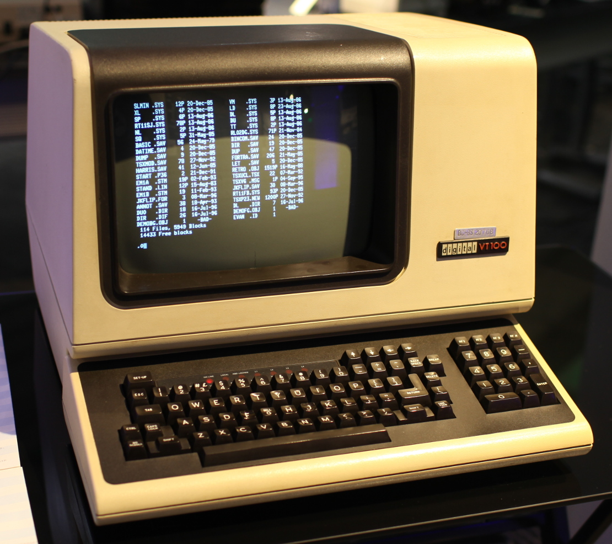
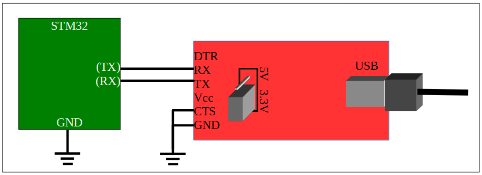

# Lab 7
## Universal Synchronous/Asynchronous Receiver/Transmitter

### Table of Contents
<br>

| Step    | Description                                    | Points |
|---------|------------------------------------------------|--------|
| 0       | Set up your environment                        |        |
|         |                                                |        |
| 1       | Initialize a USART                             |  25*   |
| 2       | Implement support for `printf()` and `fgets()` |  25*   |
| 3       | Basic line editing                             |  25*   |
| 4       | Interrupt and DMA driven serial I/O            |  25*   |
|         |                                                |        |
| 5       | In-Lab Checkoff Step                           |  20**  |
|         |                                                |        |
| 99      | Command Line Interpreter (Optional)            |        |
| 99.5    | TFT and SD Card (Optional)                     |        |
|         |                                                |        |
| &nbsp;  | Total:                                         | 100    |
<br>

\* - This entire lab must be checked off in person.  There is no `autotest`.

\*\* - You must get your whole lab checked off, and submit all your work to Gradescope including a confirmation code if any, before the end of your lab section to avoid a late penalty.

## Instructional Objectives
- To understand the configuration and programming of the STM32 USART.
- To examine and analyze a serial data stream.
- To write software to configure and interact with the STM32 USART.
- To build a command line interface that is useful for interacting with complex devices.

> [!NOTE]  
> If at any point you need to get checked off, or need to get help, you can add yourself to the [lab queue](https://engineering.purdue.edu/~menon18/queup/?room=36200).  **Bookmark this link in your lab machine browser.**  

> [!IMPORTANT]
> There will be no `autotest` for this lab.  Therefore, **you cannot rely on the autotest to tell you what is wrong with your code**.  You'll want to develop your debugging skills for **the lab practical in the following week**, and for the (potential) project that follows.
> 
> **As always, start early.**

## Universal Synchronous/Asynchronous Receiver/Transmitter (USART)

With this lab, we come full circle.  You will implement the USART code that we have been providing for your past labs in the form of your `autotest` function.  You will entirely use the PlatformIO debugger to debug your code.

### Background

Asynchronous serial communication using a Universal Asynchronous Receiver/Transmitter (UART) has been a staple of inter-computer communication since its introduction in the 1960s. Although asynchronous serial has been largely supplanted by more specialized communication protocols that are faster or more specially structured, it remains the only interface on your microcontroller that can be readily used for ad hoc interactive bidirectional communication. In this lab, you will use a UART to implement communication with an interactive program. You will examine the asynchronous serial protocol using an oscilloscope to identify the communication payload.

Decades ago, most mainframe computing equipment was large and was usually centralized in special rooms. Devices called serial terminals, like the one pictured below, were used to interact with the computers from a distance. The only function of these terminals was to take characters typed on a keyboard and send them through an asynchronous serial connection to the computer and receive characters back through the serial connection and display them on the screen. They were often called dumb terminals because they did not constitute a programmable computer system by themselves. All programmable computation happened on the remote computer.



It was very easy for a personal computer to do everything a dumb terminal could, and more. All that was needed was a program to connect the keyboard and text screen to the bidirectional serial port. This program was called a terminal emulator. There are several kinds available for any computer.

Sadly, your personal computer (likely) does not have RS-232 serial connectors. Even if it did, RS-232 voltage levels are not compatible with the serial port on the STM32. Instead, you will use a FTDI232 (also known as an FT232RL) to add a UART to your computer that is controlled through a USB connection. The pinout for the FTDI232 and connections to the STM32 are shown in figure below. Ensure that the FTDI232 is set for 3.3V operation. To do so, remove the two-pin header from the two pins labeled 5V and replace it on the two pins labeled 3.3V. (You probably did this months ago, but it's good to check again.)



**We will continue to use USART5 and the same microcontroller pins for the serial adapter as we have used all semester.** There's only one pin for GPIO Port D, and only so many things we can do with it. For this lab experiment, continue to use PC12 for the STM32 Tx and PD2 for the STM32 Rx. These should be cross-connected to the Rx and Tx pins on the FT232RL. 

While the term `USART` indicates that there is a synchronous version of the UART, we won't be using that - there are plenty of other synchronous protocols you could use instead anyway.  We'll focus on the bare minimum to establish a bidirectional asynchronous serial connection with UART.

### How does it work?

An asynchronous serial connection allows information to be sent between two devices using three wires: receive (RX), transmit (TX), and ground. Optional "handshake" lines can add flow control. For example a receiver can use a signal to output a "request to send" (RTS) to a transmitter. This tells the transmitter that it is "clear to send" (CTS). Data and handshake lines are connected between devices reciprocally. The RX signal on one device is connected to the TX signal on the other device, and similarly for RTS and CTS.

An asynchronous receiver and transmitter translates between parallel bytes and serial encodings of those bytes framed by start and stop bits. An optional parity bit in each word can be added to detect errors. When such a hardware transceiver can be configured for multiple word sizes, parity types, and number of stop bits, it is called a Universal Asynchronous Receiver/Transmitter (UART). When it can also optionally support Synchronous transmission, it is called a USART.

A USART, at minimum, supports two I/O registers used to put new bytes into the transmitter and read new bytes from the receiver. Other I/O registers are used to determine when the transmitter is ready for another byte and when the receiver contains a new character than can be read. Still other I/O registers can be used to control the generation of interrupts and DMA requests for the receiver and transmitter.

## Step 0: Add the USART5 peripheral to PlatformIO's Peripheral View

Since we are "hacking" PlatformIO by making it think our custom STM32F091 development board is a Nucleo F091 (you did this back in lab 0, and you can see it in the platformio.ini file), we won't be able to see anything related to the USART5 peripheral under the PlatformIO Peripherals view.  

To add the USART5 peripheral to the Peripheral View, we need to do a *bit* more hacking.  We'll duplicate and edit existing USART sections in the **SVD** file that defines all the peripherals for the microcontroller, to add the necessary bits for USART5.

You'll need to add the following XML to the file `<platformio_home_directory>/platforms/ststm32/misc/svd/STM32F091x.svd`.  The `<platformio_home_directory>` will vary according to your system.  On Windows, it will be under your user profile folder (`C:\Users\username`).  On MacOS/Linux, it may be called `~/.platformio`.

Find the XML field for USART4RST using Ctrl-F, duplicate that section, and modify it so that it shows this (note the change in name and bit offset!).  This adds it to the RCC->APB1RSTR register (which you can confirm by ensuring the \<register\> tag name that this falls under is "APB1RSTR").

```xml
<field>
    <name>USART5RST</name>
    <description>USART5 reset</description>
    <bitOffset>20</bitOffset>
    <bitWidth>1</bitWidth>
</field>
```

Find USART4EN, and do the same thing to create USART5EN.  Make sure it falls under the RCC->APB1ENR register.

```xml
<field>
    <name>USART5EN</name>
    <description>USART5 clock enable</description>
    <bitOffset>20</bitOffset>
    <bitWidth>1</bitWidth>
</field>
```

Finally, add the USART5 peripheral.  We don't have to recreate all the bits since all the USARTx peripherals are the same, so we just derive it from USART1.  Scroll down to where the USART2/3/4 are defined, similar to the text below, and add the following between USART4 and USART6.

```xml
<peripheral derivedFrom="USART1">
      <name>USART5</name>
      <baseAddress>0x40005000</baseAddress>
      <interrupt>
        <name>USART5</name>
        <description>USART5 global interrupt</description>
        <value>29</value>
      </interrupt>
</peripheral>
```

Then, reload your PlatformIO window with Ctrl/Cmd-Shift-P, "Reload Window", start debugging, and ensure that USART5 appears in your peripherals.

*(Thanks to Matthew Grove for the initial hacking and discovery.)*

## Step 1: Initialize a USART

Implement the function named `init_usart5()`. It should do the following things: 

- Enable the `RCC` clocks to `GPIOC` and `GPIOD`.
- Do all the steps necessary to configure pin PC12 to be routed to `USART5_TX`.
- Do all the steps necessary to configure pin PD2 to be routed to `USART5_RX`.
- Enable the `RCC` clock to the `USART5` peripheral.
- Configure USART5 as follows:
  - (First, disable it by turning off its `UE` bit.)
  - Set a word size of 8 bits.
    - The way to set this is a little weird - the bits to change are in two different places in the `CR1` register.
  - Set it for one stop bit.
  - Set it for no parity control.
  - Use 16x oversampling.
  - Use a baud rate of `115200` (115.2 kbaud). Refer to table 96 of the Family Reference Manual, or simply divide the system clock rate by `115200`.
    - No need to OR the value in - you can assign it directly.
  - Enable the transmitter and the receiver by setting the `TE` and `RE` bits.
  - Enable the `USART`.
  - Finally, you should wait for the `TE` and `RE` bits to be acknowledged by checking that `TEACK` and `REACK` bits are both set in the ISR. This indicates that the USART is ready to transmit and receive.

> [!IMPORTANT]
> Once you are finished, uncomment the `#define STEP1` stanza at the top of `main.c` to test this step. The program will initialize USART5, and continually wait for a character to be received (`RXNE`), read it, wait for the transmitter to be empty (`TXE`), and send the received character.  (We did this in lab 0, remember?  Look how far you've come!)
> 
> When in lab, demonstrate using the instructions below.

To test your implementation, connect your oscilloscope to the RX and TX pins, configure it to watch for a UART signal using the Serial button, and do the following on the serial monitor: 

- Press letters and digits to make sure they are echoed back to the terminal emulator.

- Press [Enter] on the terminal to send a carriage return that moves the cursor back to the beginning of the line. You can then overwrite the characters you typed (and echoed) earlier.

## Step 2: Implement support for `printf()` and `fgets()`

Very understandably, we, as digitally inclined human beings, have an overpowering expectation that when we type into a text field in a program on our computer, we will see the character we typed appear.  At a very low level, what you are doing is sending a stream of bits with each key, and your operating system will receive that stream and automatically send it to the program that you're typing into.

When you write your C programs using functions like `printf()` and `fgets()`, they rely on low-level system calls to send and receive characters.  The `printf()` function sends characters to the **standard output**, and `fgets()` reads characters from the **standard input**.  These are usually connected to the terminal emulator that you are using to interact with your program.

Now that we have bidirectional communication working with the STM32, we can now **combine** that with the standard functions we're familiar with.  The C library for the STM32 has standard I/O libraries that are built to call two central input and output subroutines if they exist. These subroutines are declared in the `syscalls.c` file that is included for you in every project:

```C
extern int __io_putchar(int ch) __attribute__((weak));
extern int __io_getchar(void) __attribute__((weak));
```

The strange `__attribute__((weak))` stanza declares these references to be weak symbols. That means that you can create your own functions with these names and prototypes, and standard library subroutines, such as `putchar()`, `getchar()`, and `printf()` will use them. 

If you look into the `main()` function after `#define STEP2`, it will first call the `setbuf()` functions to turn off buffering of characters.  By default, the first call to a function like `printf()` or `fgets()` allocates an internal buffer to store 1024 characters before it releases anything. (It actually calls `malloc()` to create this buffer.) This buffering makes the system more efficient, but results in confusion about why the first 1023 characters printed are not seen.  **We turn off buffering to avoid those problems.** Always make sure you make these three calls to `setbuf()` to ensure buffering is turned off when using standard I/O functions. 

You will find that the program prompts for you to enter a name, reads the name, (without echoing characters), you must use [Ctrl]-J to finish typing the name, and it prints and advances to a new line, but it doesn't set the cursor back to the beginning of the line. That's because it sends only a '\n' (newline) and not '\r' (carriage return). After that, the program echoes every character you type as it did in Step 4.1. This time, it is using `getchar()` and `putchar()` to handle characters.

> [!TIP]
> If you did not see the prompt, reset the microcontroller or open the monitor before you start debugging.

### Turn on character echo and carriage-return handling

To work around the deficiencies of the implementation, you could add a '\r' to the line printed so that the carriage return is emitted as well as write your own version of `fgets()` that echoes characters as it reads. It would be better, however, if these problems were fixed in the system software so that you could use the standard calls as they were intended.

Modify the code so that it does three things:

- In `_io_putchar()`, if the character passed as the argument c is a '\n' **first** write a '\r' to the USART5->TDR. Students often have a difficult time thinking about this. The things to remember are this
  - Two characters will be written to the TDR when a linefeed ('\n') is passed. The first should be a carriage return ('\r'), and the second should be the linefeed ('\n').
  - You must wait for the `TXE` flag to be set before writing any character to TDR. When a linefeed ('\n') is written, the `TXE` flag must be checked before writing the carriage return as well as before writing the linefeed.
- The recommendation is to just add an `if` statement to check if the character is a linefeed. If it is, then wait on the `TXE` flag and write a '\r'. After that, the usual code that waits on the `TXE` flag and writes the original character passed is invoked.
- In `_io_getchar()`, if the character read, c, is a carriage return ('\r'), change it to a linefeed ('\n').
- Also in `_io_getchar()`, echo the character read to the output by calling `_io_putchar(c)` just before it is returned. 

With these three improvements, the name entered will be echoed as it is typed, you can use a carriage return to complete it, and the carriage return will be written in addition to the newline. The session should look like the following:

```
Enter your name: Example Name
Your name is Example Name
Type any characters.
```
      
After that, you can still type any characters, but **each one will appear twice**. This is the expected operation when you use `getchar()` and `putchar()` together when `putchar()` returns for every character pressed. This is a consequence of the I/O system not handling line-oriented input. 

> [!IMPORTANT]
> Once you are finished, uncomment the `#define STEP2` in the `main.c` to test this step. The program will prompt you to enter your name, and then it will echo the characters you type.  
> 
> When in lab, demonstrate by typing a name when prompted, and make sure it is echoed back as you are typing it in.  Complete it by typing [Enter].  Check that the next two lines are printed with carriage returns (so it returns to the beginning of the line) as well as linefeeds (and moves to the next line).

## Step 3: Basic line editing

Even though the work in Step 2 allows characters to be echoed, you would still need to type carefully. Think about how many times per day you press the [Backspace] key when you make a mistake. It doesn't work here. Let's fix that problem.

Making characters visible as they are typed is as simple as printing each character as it is read. Making backspace work relies on knowing what those characters were. We normally expect that we can hit backspace and edit characters that were typed until we press [Return] to commit to the line we just entered. What we need is a way to buffer an entire line and undo parts of that line until [Return] is pressed. Since `fgets()` calls `__io_getchar()` to read one character at a time, it means that reading a single character should not return until the line buffer contains a newline. As long as a newline exists in the line buffer, each call to `__io_getchar()` should return the next character in the line buffer.

The data structure needed to do this is a FIFO (First-In, First-Out) queue. An implementation is already provided for you that has a built-in check for a newline character. It is in the `fifo.h` and `fifo.c` files.

A second set of files, `tty.c` and `tty.h`, implement a higher-level TTY (an abbreviation for a tele-typewriter) interface. It contains a new version of the line reader called `line_buffer_getchar()`. This implements the algorithm described above. It also checks and clears the `ORE` flag. This flag is set if multiple characters are received by the `USART` without the program reading them. When this happens, the `USART` will stop setting the `RXNE` flag, and it becomes useless. 

Do the following steps:

- Comment the `#define STEP2` and uncomment the `#define STEP3`
- Copy your `__io_putchar()` from step 4.2.
- In `__io_getchar()`, just call `line_buffer_getchar()` instead of the code that was there before. Be sure to return the value that is returned from `line_buffer_getchar()`.

At this point, characters will be echoed when you type, and you will be able to use the [Backspace] to do simple line editing. The loop that follows also allows you to do line editing because `getchar()` does not return until a linefeed exists in the FIFO.

This is the start of a system known as a **device driver**.  A device driver constitutes the software that lies between the main program and the low-level peripheral hardware. 

> [!IMPORTANT]
> Show your work to your TA. Make sure that the input and output work as before, but now the name entered can be edited by pressing [Backspace], and that entering one character does not echo it twice.

## Step 4: Interrupt and DMA driven serial I/O

A final remaining deficiency with our serial terminal interface is that, if the CPU is busy doing something other than reading characters, multiple characters might be received by the USART. These characters will be lost. We can use the interrupt features of the USART to enable event-driven update of the input FIFO.

For many systems, enabling interrupts, alone, would be enough to ensure reliable input and avoid dropped characters. For the STM32, it is not. Since the USART does not have a built-in hardware FIFO, it can hold only one received character at a time. If that character is not read before the next character arrives, an **overrun** situation will occur, i.e. the received data was not processed in time.

We lack a convenient way of demonstrating this to you.  However, you might consider the case of your previous labs where characters were continually being sent to the 7-segment displays or the keypad was being checked for button presses. When the system is busy with other activities, those activities have a higher priority than the USART interrupt, and data is being sent to the serial receiver fast enough (as in the case when someone copies and pastes a lot of characters into the terminal), then serial input data will be lost due to overruns.

The general solution to the overrun problem with the STM32 USART is to use DMA for the receiver to handle receiving the data. If you look at Table 33 of the Family Reference Manual, you will see the mappings for the second DMA controller are mostly dedicated to handling USARTs. We will use one with USART5 to implement the FIFO that it lacks in hardware. 

First, comment the `#define STEP3` and uncomment the `#define STEP4` Make sure it is the only block enabled for compilation. Implement the following data structures and subroutines. 

### 4.1 DMA Data structures

Create a global array of characters named `serfifo` and an offset counter named `seroffset` like so:

```C
#define FIFOSIZE 16
char serfifo[FIFOSIZE];
int seroffset = 0;
```      

The first will be the circular buffer that DMA deposits characters into. The second will keep track of the offset in the buffer of the next character read from it. 

### 4.2 `enable_tty_interrupt()`

Construct a subroutine named `enable_tty_interrupt()` that configures `USART5` to do two things each time a character is received:

- Raise an interrupt every time the receive data register becomes not empty. 
    - Remember to set the proper bit in the `NVIC ISER` as well.  The bit should be related to USART5.
- Trigger a DMA operation every time the **receive** data register becomes not empty.  Do this by enabling DMA mode for reception.

Both of these are simple flag updates in the USART `CR1` and `CR3` (and the `NVIC ISER`). They can be done after the USART is initialized and while it is already enabled for operation.

The subroutine should also enable the `RCC` clock for DMA Controller 2. Table 33 shows that Channel 2 of Controller 2 can be used with USART5_RX. To do so, however, the "remap" register must be set to allow it. The initialization looks like this:

```C
RCC->AHBENR |= RCC_AHBENR_DMA2EN;
DMA2->CSELR |= DMA2_CSELR_CH2_USART5_RX;
DMA2_Channel2->CCR &= ~DMA_CCR_EN;  // First make sure DMA is turned off
...
// The DMA channel 2 configuration goes here
...
DMA2_Channel2->CCR |= DMA_CCR_EN;
```

Then, configure DMA2_Channel2 for the following:

- `CMAR` should be set to the address of `serfifo`.
- `CPAR` should be set to the address of the `USART5->RDR`.
- `CNDTR` should be set to `FIFOSIZE`.
- The `DIR`ection of copying should be from peripheral to memory.
- Neither the total-completion nor the half-transfer interrupt should be enabled.
- Both the `MSIZE` and the `PSIZE` should be set for 8 bits.
- `MINC` should be set to increment the `CMAR`.
- `PINC` should not be set so that `CPAR` always points at the `USART5->RDR`.
- Enable `CIR`Cular transfers.
- Do not enable `MEM2MEM` transfers.
- Set the channel priority Level to highest.
- Finally, make sure that the channel is enabled for operation.

### 4.3 `interrupt_getchar()`

Create a subroutine named `interrupt_getchar()` that has all the same code as `line_buffer_getchar()`, except that it should neither check or clear the `ORE` flag, nor wait on new characters to be received by the USART. In fact, it should not touch the USART at all. All it needs to do is check if the `input_fifo` contains a newline.  While there is no newline, it should do an inline assembly WFI:

```C
asm volatile ("wfi"); // wait for an interrupt
```   

If it does contain a newline, it should remove the first character from the fifo and return it. Use the `line_buffer_getchar()` subroutine in `tty.c` as a template for creating this new subroutine.

Update `__io_getchar()` to call `interrupt_getchar()` instead of `line_buffer_getchar()`.  Be sure to return the value that is returned from `interrupt_getchar()`.

### 4.4 Interrupt Service Routine for USART5

To fill the `input_fifo`, construct an interrupt handler for USART5. (You remember how to look up the name of an interrupt handler, right? You definitely want to copy and paste the name of that ISR.)

Now that the USART characters received are being copied by DMA, overrun is no longer possible. Instead, what might happen is that there might be two or more characters available in the `serfifo`. All that is needed is to copy them into the `input_fifo` and advance the `seroffset` to indicate we have done so. The code looks like this:

```C
void replace_me_with_name_of_ISR(void) {
    while(DMA2_Channel2->CNDTR != sizeof serfifo - seroffset) {
        if (!fifo_full(&input_fifo))
            insert_echo_char(serfifo[seroffset]);
        seroffset = (seroffset + 1) % sizeof serfifo;
    }
}
```

This seems a little too magical, which is why we just give it to you. Here's how it works:

Throughout a circular DMA operation, a DMA channel's `CNDTR` is decremented. The `CNDTR` can be read to find out how many more transfers must be done before `CNDTR` reset back to the original value. For instance, before any characters are received, the CNDTR will be `FIFOSIZE` (16). That is the same as sizeof `serfifo` - `seroffset`. When one character is received, the character will be transferred from `USART5_RDR` to `serfifo[0]`, and `CNDTR` will be decremented to 15. Then the while loop body will be invoked to put `serfifo[0]` into the `input_fifo`. The `seroffset` is incremented by one to indicate that the character has been read. If it is already 15, it will wrap around back to zero.

There is no need to manually acknowledge USART5.  When the DMA reads from the `RDR`, it will acknowledge the interrupt.

You should be able to follow the progression of characters through the system by setting a breakpoint on the ISR.

### 4.5 Adjust `main()` to enable interrupts and DMA

In `main()` add a call to `enable_tty_interrupt()` just after the call to `init_usart5()`.

> [!IMPORTANT]
> Show your work to your TA.  Look over the code to ensure that it looks correct. Run the code to make sure that the input can be edited and printing is correct. 

### 4.6 When it doesn't work...

There is a great deal of things going on here. How should you debug it when it does not work?

- Set a breakpoint in the USART ISR and type a character. If it is never reached, the interrupt was not enabled, or the name of the ISR was mistyped, or the interrupt was not unmasked in the `NVIC_ISER`. Check the IO Register debugger to see the value of the USART receive interrupt enable flag.
- If the ISR is invoked, is the character at the position `serfifo[seroffset]` the one you typed? Examine the array to find out. If not, perhaps DMA is not working. Check the IO Register debugger to see the values for `DMA2_Channel2` and the USART receive DMA enable.
- If the ISR is invoked, while the debugger is paused in the ISR, type more characters. Does the while loop continue for each of the characters?

## Step 5: In-Lab Checkoff Step

> [!IMPORTANT]
> There is no `autotest`, so you **must** demostrate all work by the end of your lab section.  If you do not complete it by then, take the late penalty and demonstrate the rest of the work in office hours.  
>   
> Add, commit and push it to your remote repository, and submit your GitHub repository to the Lab 7 assignment on Gradescope.  **You will not receive credit for this lab if you do not submit your repository to Gradescope.**

Please make sure to close all windows, log out of the machine (click on your name on the top bar, and click Log Out, or similar), take all your belongings with you, and **wait for a TA to confirm that you can leave.**.  They will ask you to check that you submitted your work, that you have logged out properly, and that your station is clean.  **Failure to do so will result in a penalty (cleanliness, late) for the lab currently running in that week.**

If you did not manage to finish by the end of the lab, you should still submit the confirmation code to Gradescope, to which we will apply a late penalty on Brightspace.  Keep in mind that the late penalty period is only in effect from the time your lab section ends, to the beginning of your next lab section.  **After that, it is a zero on the lab.**

<hr>
  
**And that's a wrap on the embedded labs!  Congratulations on making it through!**  

You are strongly encouraged to complete the steps below to learn how to build a command line interpreter, and use it to test out the TFT display and SD card reader in your kit!  You may find it useful in future classes, and it will be good to have in your "back pocket" for future projects.  However, it is not required for this lab.  
  
<hr>

## Step 99: Command Line Interpreter
Now that we have the structure to get and interpret lines, what do we do with it?  

At this point, you've seen how our autotest suite functions when testing your circuit. By typing in commands, it turns on individual functions, checks registers to make sure that they're set correctly, and other things that happen in the background not worth mentioning.  It will be really helpful for you to consider writing something similar for your own projects if you'd like the ability to invoke (or reverse the effect of) certain functions in your code when debugging using a "terminal", like the one you've seen in `autotest`.

**Open the files `commands.c` in your `src` folder and `commands.h` in your `include` folder, and review the code in it with the guide below.**

### 99.1: Parsing Commands
You're likely used to a Linux terminal where you may enter commands where, for example, `ls -l` lists the files in the current directory in long format.  You might want to write a function that can parse a command like this and execute it.  **This parser is the first step in creating a command line interpreter.** 

`parse_command()` is a simple command parser that takes a string and breaks it into an array of strings.  It then calls a function named `exec()` to execute the command, which we'll go over below.

```C
void parse_command(char *c)
{
    char *argv[20];
    int argc=0;
    int skipspace=1;
    for(; *c; c++) {
        if (skipspace) {
            if (*c != ' ' && *c != '\t') {
                argv[argc++] = c;
                skipspace = 0;
            }
        } else {
            if (*c == ' ' || *c == '\t') {
                *c = '\0';
                skipspace=1;
            }
        }
    }
    if (argc > 0) {
        argv[argc] = "";
        exec(argc, argv);
    }
}
```

#### What does this do?
This function takes in an argument as a character array. Inside, it checks through the character until it hits a space (" ") that's not generated by a tab ("\t"). While it's doing this, it is filling the `argv` array with everything that it finds to not be a space. Once it hits that point, it fills the rest of the array with null characters ("\0"). After, if the arguement is nonzero (in other words, is a string), the program turns the whole arguement into *a pointer to a different pointer,* which is where my understanding drops off a little bit. This is passed off into the next function.

### 99.2 Executing Commands
Inside of the `commands.c` file, there's a function declared as `void exec(int argc, char *argv[])` that we must fill in to get commands from our inputs. Insert this code snippet here:

```C
void exec(int argc, char *argv[])
{
    //for(int i=0; i<argc; i++)
    //    printf("%d: %s\n", i, argv[i]);
    for(int i=0; usercmds[i].cmd != 0; i++)
        if (strcmp(usercmds[i].cmd, argv[0]) == 0) {
            usercmds[i].fn(argc, argv);
            return;
        }
    for(int i=0; i<sizeof cmds/sizeof cmds[0]; i++)
        if (strcmp(cmds[i].cmd, argv[0]) == 0) {
            cmds[i].fn(argc, argv);
            return;
        }
    printf("%s: No such command.\n", argv[0]);
}
```

#### What does this do?
Note that `exec` has the same function signature as `main` for some of your regular C programs - we implement two arguments, `argc` and `argv`, to represent the number of arguments and the set of arguments themselves.  This gives us a consistent "interface" to work with, putting the responsibility of having to sort through the arguments within the functions, rather than having the parser do it for them.

If run in a regular terminal, this `exec` function would look a little different - it would need to search through the system's `PATH` variable to find the command you're looking for.  Since we don't have a filesystem (and it would be completely unnecessary to implement one), we're just going to search through a predefined set of command strings, which are linked to existing C functions.

If you scroll a little further up in the `commands.c` file, you'll find the `commands_t` structure.  If it matches up with a predefined command (initially, only "dino"), then it will execute that command. If it doesn't, it'll print an error line and return to the **command shell**, which we will create next.

### 99.3 The Command Shell
This is the simplest of the three.  It gives a `>` line prompt where you can type a command, waits for a user input, and then passes it off to the parser.  All these functions are included in the `stdio` library, which is a core library included with any programming environment that uses C (be it your computer or your STM32).

```C
void my_command_shell(void)
{
  char line[100];
  int len = strlen(line);
  puts("This is the STM32 command shell.");
  for(;;) {
      printf("> ");
      fgets(line, 99, stdin);
      line[99] = '\0';
      len = strlen(line);
      if (line[len-1]) == '\n'
          line[len-1] = '\0';
      parse_command(line);
  }
}
```

> [!IMPORTANT]
> Give it a try!
> 
> In your `main.c` file, comment out `#define STEP4`, create a new test case called `SHELL` and add the following code snippet:

```c
#ifdef SHELL
#include "commands.h"
#include <stdio.h>
int main() {
    internal_clock();
    init_usart5();
    enable_tty_interrupt();
    setbuf(stdin,0);
    setbuf(stdout,0);
    setbuf(stderr,0);
    my_command_shell();
}
#endif
```


> [!IMPORTANT]
> Don't forget to add the `#define SHELL` at the top of the file.  
> 
> You'll have to copy the DMA data structures, `__io_putchar`, `__io_getchar`, `enable_tty_interrupt` from STEP4 outside the `#ifdef STEP4` block to use it with this `main` function.  `init_usart5` should already be outside any of the define-step blocks.
> 
> When you run this, you should get the shell prompt. Type `dino` and click the enter key. At this point, you should see a dino!

### 99.4 Adding Your Own Functions
At this point, you have a working command shell. Now, we can add other things to it! For example, let's add an `add` command, a `muls` command, and a `bird` command. In order to do this, go back into your `commands.c` file. Find the `user_cmds[]` structure. Directly below, add in this code snippet:

```C
void add(int argc, char *argv[])
{
  int sum = 0;
  for(int i=1; i < argc; i++) {
      sum += strtol(argv[i], 0, 0);
  }
  printf("The sum is %d\n", sum);
}

void mul(int argc, char *argv[])
{
  int prod = 1;
  for(int i=1; i < argc; i++) {
    prod *= strtol(argv[i], 0, 0);
  }
  printf("The product is %d\n", prod);
}

// Define your bird command function here

struct commands_t usercmds[] = {
  { "add",    add },
  { "mul",    mul },
  // 🐦 - define the bird command pointer here 
};
```
**Here's the catch**  - the compiler wants these special structures described in the same way as before.  Make sure when you define this function and structure, it looks like the restof the associated function and structures.  They should have the same input arguements and the same order, as the compiler arranges them in that order and with those specific arguements and pointers. For the `bird` function, just write a function that prints `/\_/\` in the middle of the screen. If you need help figuring out how to print a picture on the terminal, see the `dino` command in the `commands.c` file.

>**NOTE:** An issue that's popping up is that for some people, the compiler won't redefine the weak definition. I am not sure why, as you're doing something similar in each task in the main lab. It could be that it's located in the same file, and the compiler might not like that. Either way, comment out the previous definition of `usercmds[]` before running if you're having trouble.

> [!IMPORTANT]
> Show us `dino`, `bird`, `add 3 5 7`, and `mul 3 4 5.`

### 99.5 Adding LCD and SDcard support

In your kit, there is a TFT display with an SDcard slot - two applications in one!  You may consider using this for future projects.

The TFT display is a 240x320 pixel display that can be used to display images, text, and other graphics.  The SDcard slot can be used to store images, text, and other data that can be displayed on the TFT display.  You can use the SDcard to store data that can be read and written to by the STM32.

Read [this](TFT_SD.md) to learn how to use the TFT display and SDcard slot.
