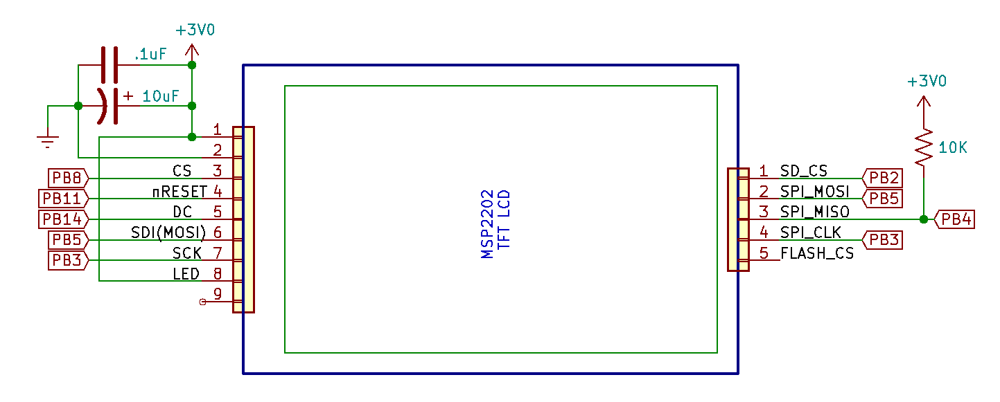
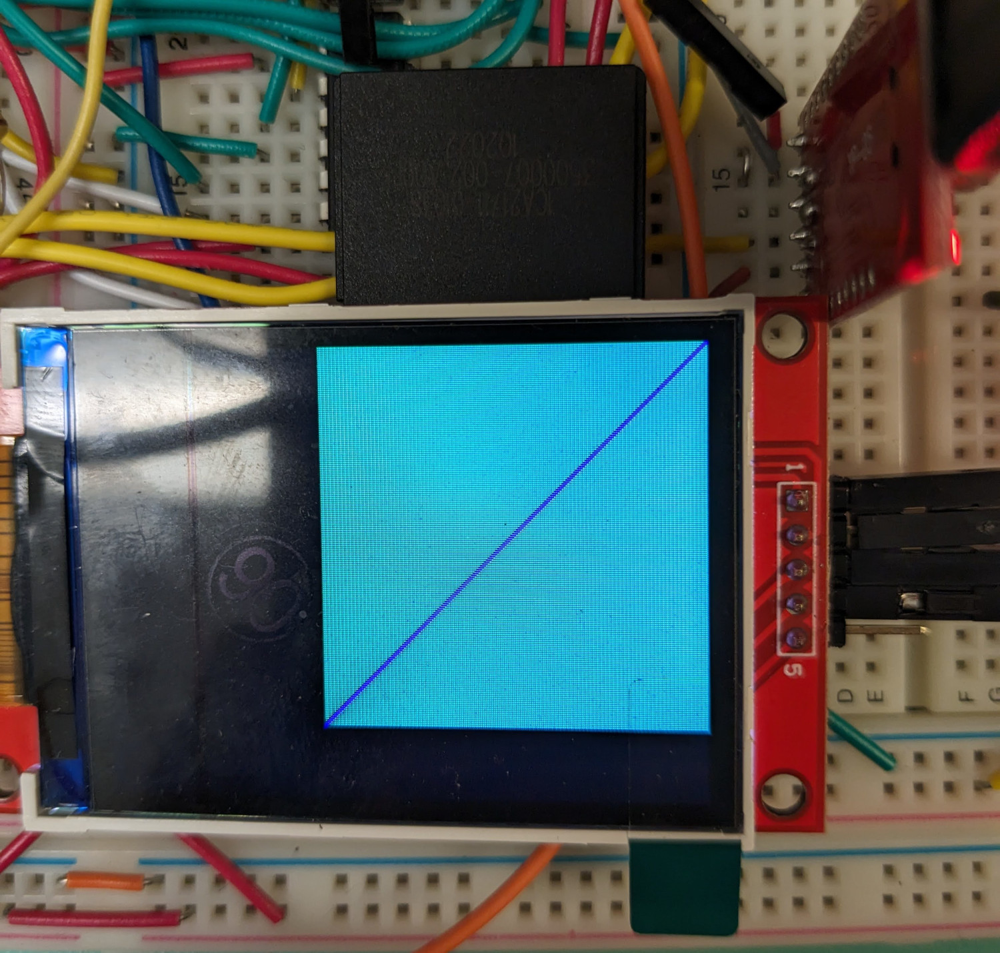

# TFT Display with SD card

This document describes how to use the TFT display with SD card.  Before you tackle this, make sure you have completed the SPI and UART labs prior to reading this document.

## Step 0.1: Read the documentation

Start with the MSP2202 TFT display schematic here: https://engineering.purdue.edu/ece362/refs/MSP2202-2.2-SPI.pdf and identify the SPI pins for both the display and the SD card.

## Step 1: Wiring the TFT LCD and SD card interface

Hopefully you're reading this just after finishing the USART lab.

Having a bidirectional serial communication link means that you can use the STM32 as though it were one of the old computing systems you saw in the lab. The utility of the STM32 is somewhat limited since it has so little persistent storage. Nevertheless, the MSP2202 graphical TFT LCD module has an SD card port that allows you to add a large amount of storage.

Wire the TFT LCD and SD card interface as shown in Figure 3 below. Note that, although the SD card's SPI interface is separate from the SPI interface for the LCD, it is still powered by the VDD and VSS pins for the display. There are five pins on the SD card SPI interface, but pin 5 is for an on-board SPI Flash memory chip (which is not populated). Pin 5 is not used.

To connect the SD card interface, use the male-to-female jumper wires in your lab kit to plug in to the pin header and breadboard. 



The TFT LCD is best used as a unidirection SPI device like the ones used previously. Data will only be sent to it. There is a complex initialization procedure (provided for you) that must be used before the display will be useful. A code library is also provided for you that can be used to draw objects and pictures on the display. Once it is initialized, and subroutines are set up to send SPI data to it, the TFT LCD is easy to use. 

By comparison, an SD card is obviously a bidirectional communication device.  Until now, lab experiments have only sent data to SPI peripherals (like the OLED display, the TFT LCD, and the shift registers used for the 7-segment drivers). Here is a brief overview of how bi-directional SPI works. 

Recall that an SPI transaction is one where a parallel word on the primary (formerly master) device is exchanged with a parallel word on a secondary (formerly slave) device through the SDI (MOSI) and SDO (MISO) pins. When doing only writes to a secondary device, the SDO pin is not even needed. When doing reads, the primary device must first tell the secondary device what it expects to read. In doing that, it reads back a word through the SDI pin. The secondary device cannot respond to a read request before it has received information on what must be read, so this word read from the secondary device is junk. 

Once the SPI primary device has finished telling the secondary device what it wants to read, the next transfer will read back data from the secondary device. Every SPI transaction is a two-way transfer, so the primary device must write something to conduct the read. In this case, the primary device sends junk to the secondary device. 

The SPI primary device alternates between sending commands and reading back junk, and sending junk and reading back data. Usually, this "junk" is something like 0xff that will not be misinterpreted as a command or data. That's exactly what the SD card interface does.

An SD card uses this "write command/read junk" and "write junk/read data" protocol to send and receive blocks of data. Historically, these blocks have been 512 ($2^9$) bytes in size, and that is what we'll use.

An SD card has a native interface protocol that is similar to SPI, but not quite the same. It can be forced into "SPI mode" by holding the NSS and MOSI signals high, and completing at least 74 oscillations of the SCK signal at a rate between 100 kHz and 400 kHz. This can be accomplished by using the SPI hardware to send ten repetitions of 0xff for 80 clock oscillations. An SD card does not need to have transactions bounded by asserting and deasserting NSS, and the words sent and received are expected to be much longer than can be supported by the SPI peripheral in the STM32. This is similar to how you set up the MSP2202 TFT LCD display to work. A GPIO pin will be used to assert NSS for the duration of a an entire SD card command or block transfer. Enabling and disabling NSS is helpful when using a protocol analyzer to figure out why the SD card protocol is not working.

After forcing an SD card into SPI mode and sending some initialization commands, it is ready for block transfer. It can also run at a much higher rate. The SD card electrical interface recommends a 10 kΩ pull-up resistor on the MISO pin, but there is not such a pull-up built in to the MSP2202 display assembly. You should add one. The interface will not work without a pull-up resistor. In that regard, the MISO pin of the SD card interface is similar to I2C. An SD card should be able to run with a 24 MHz SPI clock, but certain conditions like long wires may require using a slower communication rate.

The 3.0V output on the STM32 development board is sometimes inadequate to power the SD card interface, which expects something closer to 3.3 V. The suggested capacitors for the power and ground pins are helpful, but may not be enough to let the card work. Be sure to put the capacitors as close as possible to the power and ground pins of the TFT LCD assembly. If you are unable to get the SD card initialization routine to work, consider adding a 3.3 V external power supply, such as the AD2 power supply.  **Be sure to never set the power supply to higher than 3.3 V or the STM32 chip will be irreparably damaged.**

The SD card transfer protocol consists of single-byte commands that are always followed by a 32-bit argument, and a single-byte CRC (cyclic redundancy check). (When operating in SPI mode, an SD card requires correct CRC bytes for only two commands. Thereafter, the CRC is ignored.)

The initialization and block read/write subroutines for SD card access are provided for you in the `diskio.c` and `diskio.h` files, which should already exist from your USART lab.  Reading and writing simple 512-byte blocks would force an embedded system designer to come up with allocation and organization mechanisms for coordinating storage — a daunting task. Instead, these subroutines are meant to work with the [FatFs filesystem module](http://elm-chan.org/fsw/ff/00index_e.html). This system provides a higher-level file system view of the SD card. This is generally what you think of when you work with an SD card. **It also allows you to move the SD card between the STM32 and your computer to share these files.** All that is necessary is a program on the STM32 that uses the FatFs subroutines to read and write the files. 

## Step 2: Add commands to your interpreter

You will need to add the following functions to your main module to set up the SPI configuration and enable and disable various output signals.

### 2.1 `init_spi1_slow`

This function should configure SPI1 and the GPIOB MODER and AFR registers for pins PB3 (SCK), PB4 (MISO), and PB5 (MOSI). Configure it as follows:  

- Set the baud rate divisor to the maximum value to make the SPI baud rate as low as possible.
- Set it to "Master Mode".
- Set the word (data) size to 8-bit.
- Configure "Software Slave Management" and "Internal Slave Select".
- Set the "FIFO reception threshold" bit in CR2 so that the SPI channel immediately releases a received 8-bit value.
- Enable the SPI channel.

### 2.2 `enable_sdcard`
This function should set PB2 low to enable the SD card.

### 2.3 `disable_sdcard`
This function should set PB2 high to disable the SD card.

### 2.4 `init_sdcard_io`
Create a subroutine named init_sdcard_io that does the following:  
- Calls `init_spi1_slow()`.
- Configures PB2 as an output.
- Calls `disable_sdcard()`.

### 2.5 `sdcard_io_high_speed`
This function is called after SPI1 is initialized. It should do the following:
- Disable the SPI1 channel.
- Set the SPI1 Baud Rate register so that the clock rate is 12 MHz. (You may need to set this lower if your SD card does not reliably work at this rate.)
- Re-enable the SPI1 channel.

### 2.6 Try the SD card
In the `main` function you added from the end of the USART lab after the last step, change `my_command_shell` to `command_shell`.  This will initialize the current date and time for you and set up the command line interpreter to call your SD card and LCD functions.  The date and time are needed to set things like date modified/created on your SD card.

With the previous five functions written, try the following commands with the command line interpreter:

```
Enter current date 20211108103000
This is the STM32 command shell.
Type 'mount' before trying any file system commands.
Type 'lcd_init' before trying any draw commands.
> mount
> input abc.txt
To end input, enter a line with a single '.'
one
two
three
.
> ls
ABC.TXT
> cat abc.txt
one
two
three
>
```


### 2.7 Initialize the LCD
Write a function named `init_lcd_spi()` that does the following:
- Configure PB8, PB11, and PB14 as GPIO outputs.  Don't forget the clock to GPIOB.
- Call `init_spi1_slow()` to configure SPI1. 
- Call `sdcard_io_high_speed()` to make SPI1 fast. 
    - The LCD can work at a rate that is usually - higher than the SD card. If you use the MSP2202 for your project, consider putting it on a separate SPI channel than the SD card interface and running it at a 24 MHz baud rate.

### 2.8 Try the LCD

With the previous function written, try the following commands with the command line interpreter:
```
Enter current date 20211108103000
This is the STM32 command shell.
Type 'mount' before trying any file system commands.
Type 'lcd_init' before trying any draw commands.
> lcd_init
> clear 0000
> drawfillrect 0 0 200 200 0f0f
> drawline 0 0 200 200 0
> drawline 1 0 200 199 0
> drawline 0 1 199 200 0
>
```

Your LCD should look like this.  Keep in mind to look directly at it and not at an angle, since the colors will look different due to the polarized display.



> [!NOTE]
> Give it a try!  If you have any questions, post on Piazza so that way everyone can absorb and learn, and pay attention to project posts so you can absorb and learn as well.  