# Lab 8.0: RISCV assembly lab setup

This tutorial will direct you to set up your first RISCV assembly lab and debug a simple assembly program on it via Visual Studio Code (VSCode).

**This part of the lab is just setup - make sure to look at [lab 8.1](./lab_08_1.md) for the rest of the lab!**

| Step    | Description                                    |
|---------|------------------------------------------------|
| 0       | Environment Setup                              |
| 1       | A sample debug process                         |
| 2       | Under the hood                                 |
| 3       | Troubleshooting                                |

## Introduction

Starting with this lab, we'll tackle RISC-V assembly.  Like the embedded labs, you can complete this lab on your personal machine or on a lab machine.

The difference with personal machines however is that you won't be able to do it locally - you'll have to use our tools on `eceprog.ecn.purdue.edu` via the Remote-SSH extension.  This portion of the lab will help you set that up.

## 1. Environment Setup

### 1.1 Setting up RISC-V tools on login

We'll be doing these labs in VScode, but before we spin that up, we need to set up our ECN accounts so that they load the correct tools when you log in.

SSH to `eceprog.ecn.purdue.edu`, or any one of the lab machines (there are 34 you can use, and their addresses have the same format of `ecelnxYY.ecn.purdue.edu`, where YY is 01-40.  If you're in Indy, the format is `indlnxYY.ecn.purdue.edu` instead, and YY ranges from 01-33.)

Once you've logged in, add the following to the bottom of both your `~/.bashrc` and `~/.profile` files (create the latter if it doesn't exist):

```bash
case $(hostname) in ecelnx* | eceprog* )
  module load riscv
esac
```

(change ecelnx to indlnx if you're in Indy.)

If you don't have a `.bashrc` file in your home directory (`~`), you should copy the template one as follows:

```bash
cp -n /etc/skel/.bashrc ~/.bashrc
```

where `-n` ensures you don't accidentally overwrite an existing `.bashrc` (it stands for **no clobber**).  If it already exists, continue to edit it as follows.  If you're no longer in 264, do not use their `.bashrc` - it creates complications with our newer tools, and you should remove it and copy in the default Linux one.

This case structure checks if you're on any of the `eceprog` cluster nodes or any of the lab machines in EE 69, and then loads the RISC-V module, configured for us by ECN.  This ensures we don't accidentally conflict with RISC-V tools that may be installed on other servers.  Once you've added it, close the session and log in again.  You should see a bit of a delay as the tools load, and then type `which riscv64-unknown-elf-gcc`.  If it says "/package/riscv-gnu-toolchain/bin/riscv64-unknown-elf-gcc", that means your shell is now able to find the RISC-V `gcc` compiler, and VScode will find it as well when it logs in remotely.

If you get an error that says "module: command not found" on an ECN machine, **ensure that you are on an `eceprog` cluster node or EE 69 machines first**!  If you are, you may need to add the following **before** the `case` structure above:

```bash
module () {
	eval $($LMOD_CMD bash "$@")
	[ $? = 0 ] && eval $(${LMOD_SETTARG_CMD:-:} -s sh)
}
```  

### 1.2 Visual Studio Code

To make the environment consistent for everybody, the recommended editor for the assembly lab will be Visual Studio Code (VSCode), but we'll be running a remote version of it on ECN servers (you may have done this already for previous classes) so that you can work on it from home with the same tools as the lab machines.  On your own machine, download and install it from [here](https://code.visualstudio.com/).

> [!Note] 
> You can also opt out of VSCode and use your own editor, provided you are familiar with `gdb` and `make`.  This lab is entirely doable on the command line as well.  You will need to manually create a debug session to the RISC-V QEMU emulator and attach `gdb` to it. You can checkout the **Makefile deep dive** section further down for more info.

#### 1.2.1 VSCode extensions

In order for the debugging part to function properly, we will need the following extensions to be installed:

1. [C/C++](https://marketplace.visualstudio.com/items?itemName=ms-vscode.cpptools): gives us debugger to work with
2. [RISC-V](https://marketplace.visualstudio.com/items?itemName=zhwu95.riscv): gives us syntax highlights within assembly file

To install them, you could either click on the links above and follow the install steps, or you could search them on extension tab on VSCode:

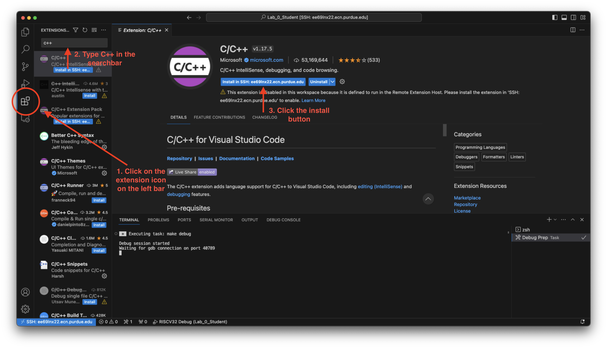

For the last extension, we will be installing a modified version of [Native Debug](https://marketplace.visualstudio.com/items?itemName=webfreak.debug), which gives us the ability to set breakpoints in assembly files. The installation process will be a bit different:

1. First download the `riscv-debug.vsix` file [here](./assets/riscv-debug.vsix) to your lab machine.
   1. If you are working with the Remote-SSH extension on VScode to log in to `eceprog`, you will need to copy the `.vsix` file to your ECN account.  See [`scp`](https://www.geeksforgeeks.org/scp-command-in-linux-with-examples/) to copy it from your local machine to `eceprog`, or download it using the `eceprog` terminal by copying the URL for the `vsix` file, and typing `wget URL` into it to download it to your ECN account.
2. Then click on the extension tab and press the `...` button on the top right of extension window.
3. Select `Install from VSIX...` and locate your downloaded `riscv-debug.vsix` path to install it:
    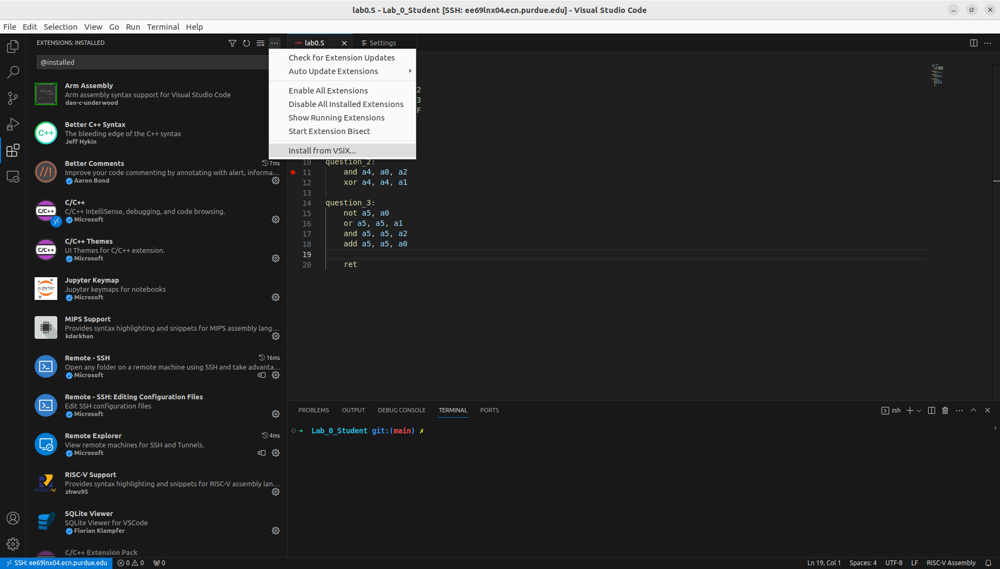
4. You might need to reload VSCode to let the installation completed as prompted on the bottom right. Or you could do `Ctrl + Shift + P` and type `reload` to reload VSCode window.

#### 1.2.2 Remote access to the lab machines

> [!Note] 
> This section is meant to be run on your own PC, or other machine that is not a lab machine.

In addition to using VSCode in the lab, you could also remotely access the lab machine you normally sit at, in order to finish your assembly assignments.  We highly recommend using the lab machine you typically sit at, so everyone gets a different machine to connect to.

If you live off campus, you may need to connect to `eceprog.ecn.purdue.edu`, instead of the lab machines (unless you're using the Purdue VPN).

After downloading and installing VSCode, open it and locate the remote connection button on the bottom left of VSCode:

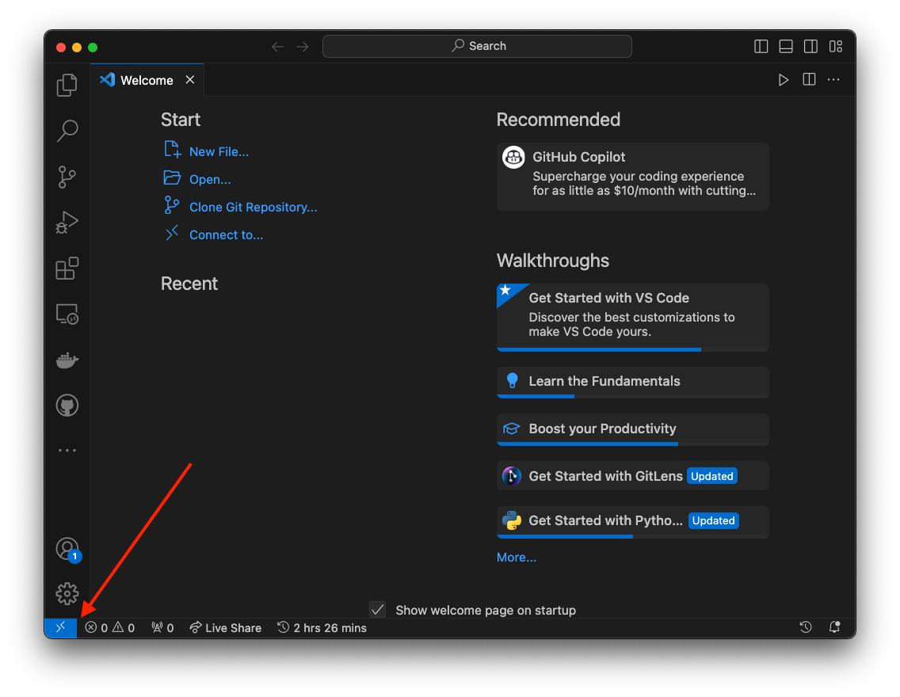

> [!Note] 
> If you could not find this button, you will need to download the `Remote - SSH` manually [here](https://marketplace.visualstudio.com/items?itemName=ms-vscode-remote.remote-ssh) or by searching it in the extension tab.

Click on the button and select `Connect to Host...` on the drop-down menu:


Then in the drop-down, enter `CAREER_LOGIN@LAB_MACHINE_HOSTNAME` and click on it. The `CAREER_LOGIN` is your career account login, and you can find `LAB_MACHINE_HOSTNAME` on your lab machine mainframe case's label, which is something like `(ecelnx23|indlnx23).ecn.purdue.edu`.  If you're off-campus, you may also use `eceprog.ecn.purdue.edu`.  (All ECN machines load the same data.)

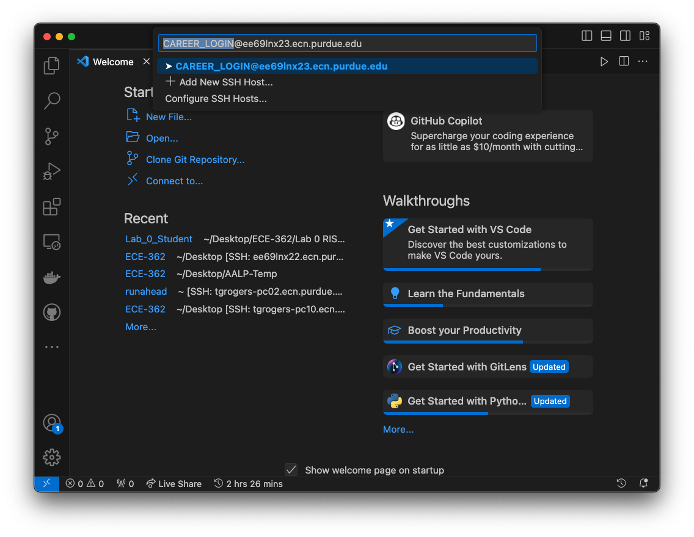

This should open up a new VSCode window. If you encounter something like `"(ece|ind)lnx23.ecn.purdue.edu" has fingerprint "SHA256:xxxxxxxxx"`, choose `continue`.  You'll see this message when you're connecting to a server for the first time, to have you confirm you know what server you're connecting to.  This isn't usually an issue when you're connecting to Purdue machines on campus, but it is a concern if you see this message if you're reconnecting to the machine.

You may see a prompt for a password, if you haven't already set up SSH keys (which we'll explain further down.)  Enter your Purdue Login password, with the ",push" as necessary, hit Enter, and approve it from your 2FA device.  Once you set up SSH keys, you'll be able to skip this step.

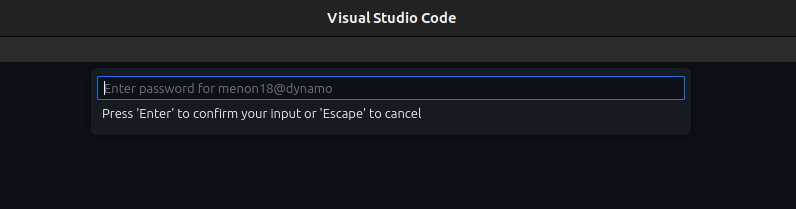

You should then have a window opened similar to this:

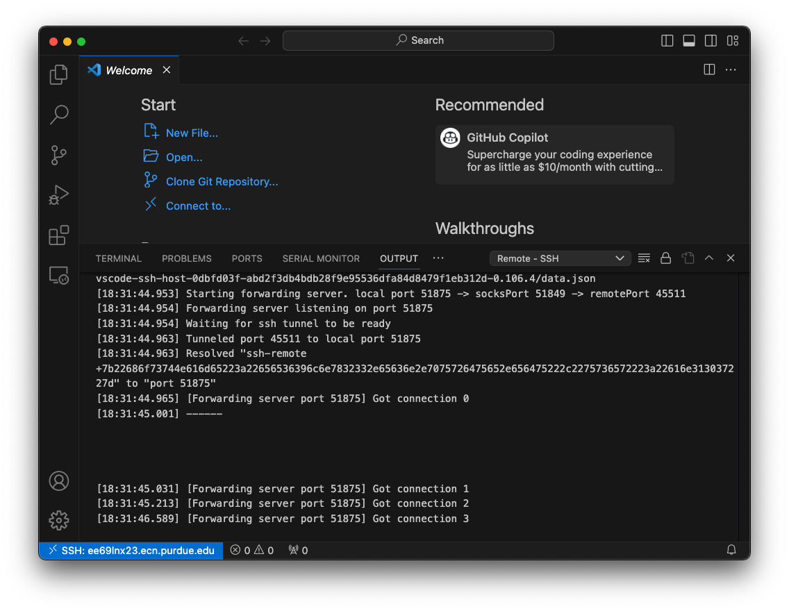

You could then open up your lab project, or use `TERMINAL` tab open a terminal and clone it via Git from the course website.

You might need to install some extensions again with remote ssh VSCode to debug lab ([section 1.2.1](#121-vscode-extensions)). Check your installed extensions to find the missing one (if you have finished setup on a lab machine, this should just be the `RISC-V Assembly` extension as it is the only one installed locally).

> A reminder: Once you've finished setup on one machine, you don't need to redo the setup process on a different lab machine, since all ECN machines load the same data when you log in.  Whether you log in to eceprog or a different-numbered lab machine, they will all have the same setup you were using.

#### 1.2.3 Adding an SSH key to your ECN account

> [!Note]
> This section is not required, but still highly recommended.  Setting this up will save you from having to deal with two-factor authentication by using SSH keys instead.
> 
> The key can also be added to GitHub so that you won't need to use password every time for push/pull. Here is a [guide](https://docs.github.com/en/authentication/connecting-to-github-with-ssh/adding-a-new-ssh-key-to-your-github-account) on how to do this.

It is likely you already have a `ssh` key on your computer and lab machine from lab 0.  The simplest thing to do is then add the public key into the file `~/.ssh/authorized_keys` on your ECN account.  This will allow you to log in without a password, and will also allow you to use the Remote-SSH extension without needing to enter your password every time.

##### 1.2.3.1 Linux & MacOS

If you don't have an ssh key on your machine, you can generate it with `ssh-keygen`:

```bash
ssh-keygen -t ed25519 -C "your_email@example.com"
```

This will prompt you for passphrase and key location. You can keep those configuration at default.

After you have your key ready, we can upload to lab machine by doing:

```bash
ssh-copy-id CAREER_LOGIN@LAB_MACHINE_HOSTNAME
```

Where `CAREER_LOGIN` and `LAB_MACHINE_HOSTNAME` are the same when you setup VSCode remote ssh.

You will then be prompted with password and two-factor auth from duo. After this is done, you can access lab machine with the key only:

```bash
ssh CAREER_LOGIN@LAB_MACHINE_HOSTNAME
```

A more detailed guide is [here](https://docs.github.com/en/authentication/connecting-to-github-with-ssh/generating-a-new-ssh-key-and-adding-it-to-the-ssh-agent) from GitHub.

##### 1.2.3.2 Windows
For Windows machines, here is a detailed [guide](https://www.purdue.edu/science/scienceit/ssh-keys-windows.html) from ITaP.

### 1.3 Setting up your first lab workspace

Using your terminal, do the following:
- Create a folder called `ece362` under your home directory (where you should start by default) and `cd` inside it.
- Clone this repository - https://github.com/ece362-purdue/riscv-lab-8.0
  - This is not to be submitted, it's provided as a sample lab.

Once it's cloned, you'll need to reopen the folder in VScode so that all the automation we've set up for you can be properly registered by VScode.  Click File > Open Folder, navigate to the folder you just cloned, and open it.  

This is a good test of whether you added your SSH key correctly, because the VScode window will refresh.  If it was properly added, VScode should not ask you for your password.  If it does, double-check that copy-pasted your SSH public key into `~/.ssh/authorized_keys` correctly.  Ask on Piazza if this doesn't seem to working, and upload the contents of your `authorized_keys` file.

You should now see your lab 8 folder open in the left sidebar, and various files - some you will edit, others will help you edit.

In this folder, open up the `lab8.S` file and examine its content. Then, use the instructions in [section 2](#2-a-sample-debug-process) to run the sample program. Make sure to set a breakpoint after the `main:` and verify that the registers have the corresponding values loaded in as you step each instruction.

## 2. A sample debug process

This section will walk you through the process of debugging lab code on VSCode.

### 2.1 Running the lab

At the beginning of every session, when your terminal has just started, make sure to run `module load riscv`.  It may take a few seconds to load, but when it does, you should now have the RISC-V compiler in your PATH (a set of locations that your shell will look in to find programs.)

If you don't mind waiting a few seconds whenever you open a new terminal, you can also add it permanently to your `.bashrc`.  (Keep this in mind if you ever need to have a RISC-V compiler again in the rest of your student career - you will be able to use these long after ECE 36200.)

To run the lab, in the VSCode integrated terminal (access via the `TERMINAL` tab), type `make`:

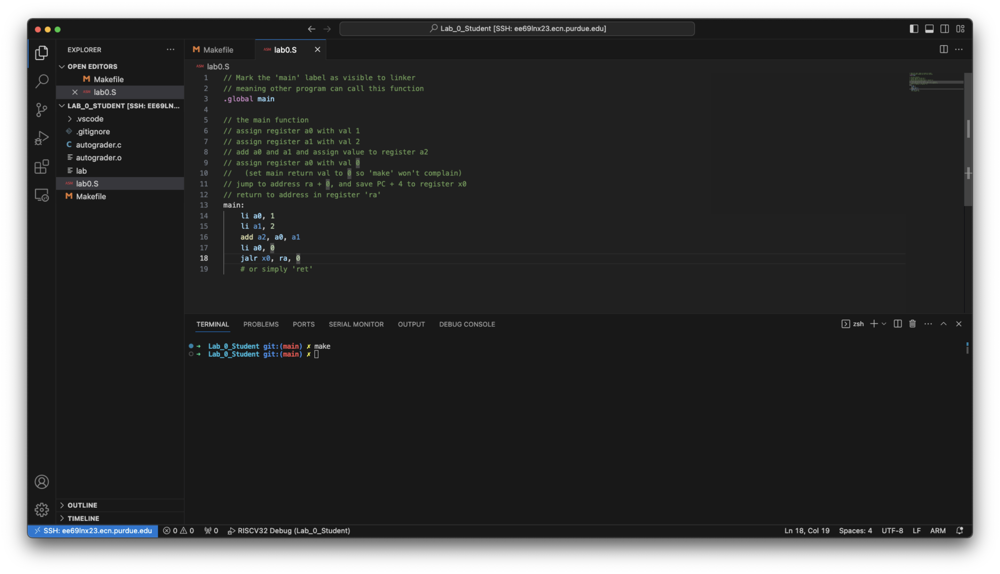

Hmm... nothing happened... or did it? Two files will appear on the left: `lab` and `autograder.o`, meaning we did compile the lab successfully. However the `main` function did not print anything to the console as it is somewhat equivalent to:

```C
int main() {
    int x = 1;
    int y = 2;
    int z = x + y;
    x = 0;
    return x;
}
```

> [!Note] 
> You can also use `make run` to compile and run the lab. `make lab` will just compile. Checkout the `Makefile` or use `make help` to find out more.

### 2.2 Begin debugging

Before debugging, you will need to set breakpoints in the assembly file (the file with a `.s` extension) by clicking on the right of the line number like this:

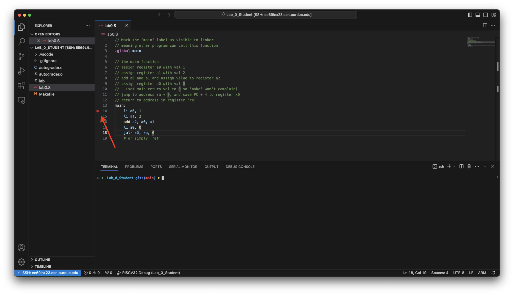

To start debugging, press the debug button on the left panel and run the `RISCV32 Debug` debug target:

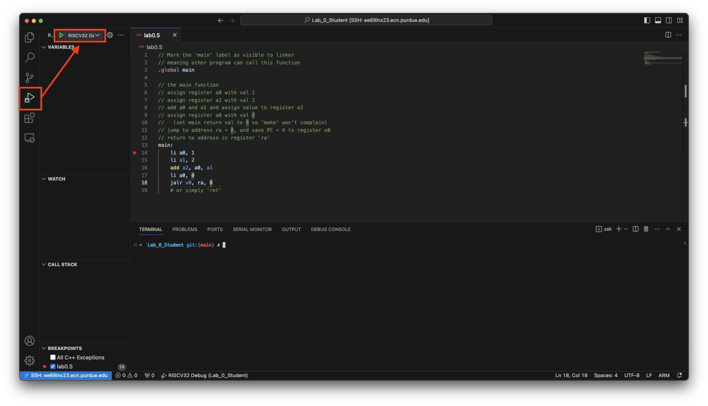

This will build your assembly program and launch the emulator to wait for gdb connection. If you encounter errors in your program, the debug session will fail and you could see red lines under the wrong lines of code:

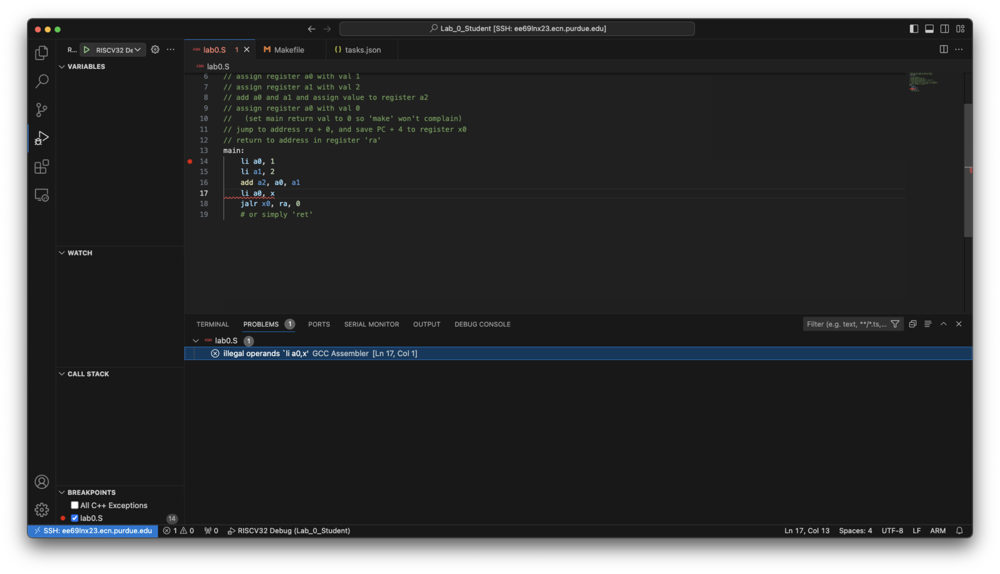

You could find the error messages by hovering on the wrong lines of code, check out the `Problems` tab below, or in the `TERMINAL` tab in terminal `Build Task`:

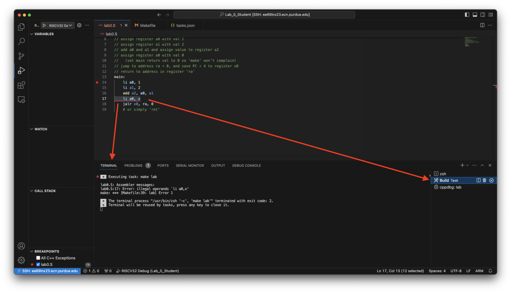

After the debugging begins, you will see VSCode pause at the first breakpoint you set:

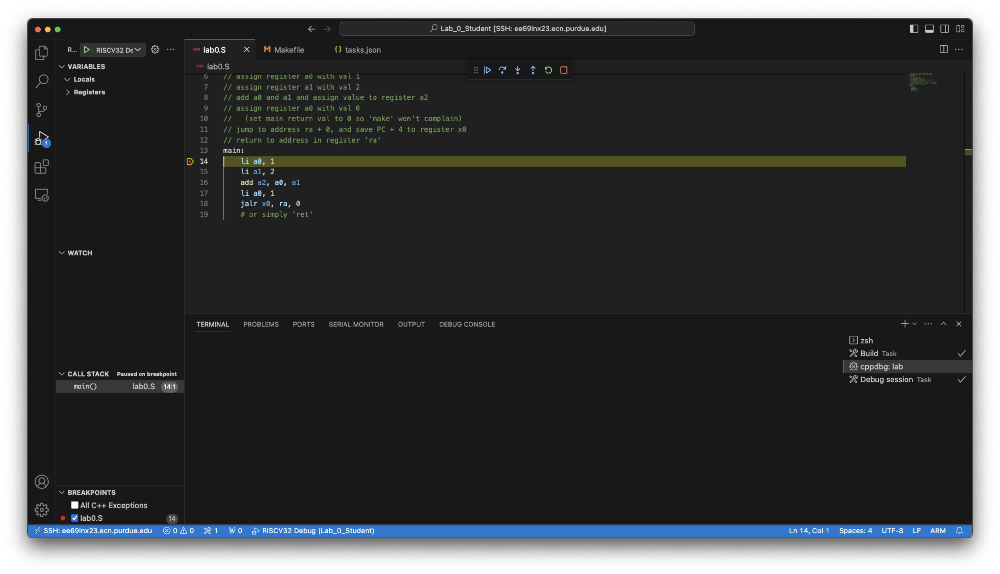

To view the program output, click on `Terminal` and select the `Debug session` tab on the right:

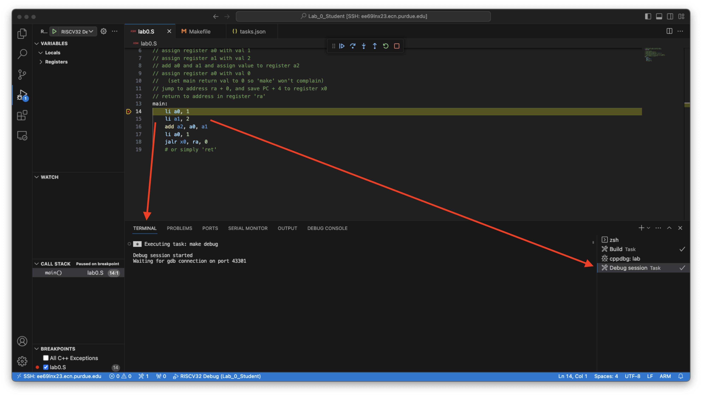

#### 2.2.1 Debugger control buttons

As you launch the debugger, you could see a control panel on top like:


From left to right, for each button:

1. Continue to next breakpoint
2. Step over an instruction, will not enter subroutine
3. Step into an instruction, if it is a function call, will enter the function
4. Step out a function call
5. Restart debugging
6. Stop the debugging

#### 2.2.2 View register value

You can view the registers value on the left under `Registers/CPU`.

#### 2.2.3 View memory content

To get values at some memory address, you will need to use the `Debug Console` tab in VSCode and type the command `-exec x [address]`. Reference guides can be found [here](https://visualgdb.com/gdbreference/commands/x) and [GNU website](https://sourceware.org/gdb/onlinedocs/gdb/Memory.html).

You could also directly examine content at address in registers. Said if I want to examine the string starting at address storing in register `a0`, I could do:

```bash
# s: print the memory content as C string
# $a0: use the value in register a0 as the address
-exec x/s $a0
```

### 2.3 Finish debugging

After you are done with the lab, please make sure to stop your debugging session using the control buttons.  **Do not close the VScode window immediately - if you quit too soon, you'll create [orphaned processes](https://en.wikipedia.org/wiki/Orphan_process) that will keep running on the server, slowing it down over time.

> [!Note] 
> Most of the debugging work is encapsulated in VSCode and the `Makefile`. If you want to know more about this, checkout [section 3](#3-under-the-hood).
> 
> Demonstrate that you can run and debug in this environment to your TA.  

## 3. Under the hood

This section explain how the lab works under the hood and is entirely optional. You can skip directly to the actual lab in [lab 8.1](./lab81.md).  If you are a budding **computer engineer** looking to actually learn how these things work (as you should be), this section is for you.

If you want to setup and run RISC-V labs on your own computer, this section will list out the required packages and procedures.

### 3.1 Running RISC-V?

You might be wondering how the x86-based CPU of your lab computer is capable of running a RISC-V program, which is completely different from x86 assembly.  That's easy - we don't!  We actually use something called a system emulator called **QEMU**.  This is a specialized program that has been compiled to run on x86 hardware, which can execute RISC-V instructions.  (This kind of compilation, where the host architecture running the compiler is *different* than the target system for which you are compiling code, is also commonly referred to as **cross-compilation**.)

In addition, to support syscalls (system calls, part of the operating system that allows programs to interact with resources like a keyboard or mouse) like those underneath `printf` and `malloc`, we choose the QEMU user space emulator (`qemu-riscv32-static`) which will capture those syscalls and use the host OS (x86 Linux) to execute them instead, since QEMU does not emulate the entire Linux system - just instructions.

### 3.2 Install the toolchain on own machine

> **Note: Do not run this on a lab machine or eceprog!**  This is only if you have your own Linux machine.

If you wish to run the lab on your own Linux machine, here are the packages you will need:

- QEMU emulator
  - Download [QEMU user space emulator](https://www.qemu.org/download/)
  - Ubuntu: `apt install qemu-user-static`
- RISC-V GNU Compiler Toolchain
  - Repo: `https://github.com/riscv-collab/riscv-gnu-toolchain`
  - We are using the [32-bit/64-bit newlib compiler](https://github.com/riscv-collab/riscv-gnu-toolchain#installation-newliblinux-multilib), make sure to run `configure` as follows:
    - `./configure --prefix=/path/to/riscv --enable-multilib`
  - Execute `make` directly - do not run `make linux`.

After downloading, building and installing the RISC-V toolchain, you will need to add it to your `PATH` variable like what we did for lab machine (change command depending on your shell):

```bash
echo "export PATH=$PATH:/path/to/riscv/bin" >> ~/.bashrc
```

If you wish to set up on MacOS or Windows, you will need to use docker or other virtualization tool to create a Linux VM to run the `qemu-riscv32-static`.  Microsoft also offers WSL2, which is a fully functional Linux environment that runs alongside Windows.  It might be tempting to use Docker to run a full system RISC-V Linux (yes - [this exists!](https://www.omgubuntu.co.uk/2021/01/beaglev-risc-v-board-for-linux)), but then you will need to compile Linux from source targeting RISCV32 as most Linux distros only have official images for 64-bit RISC-V, which is why we're not using Docker.

### 3.3 Makefile Deep Dive

This section will provide an overview on the few `make` commands that you  used in section 2 to help debugging.

> [!Note] 
> Use `make help` to get short descriptions for all the make commands.

#### 3.3.1 Debugging lab with gdb

```Makefile
# Debug the lab
debug: lab port kill
	@echo "target remote localhost:`sed -n '1 p' port.env`" > ./qemu_riscv32.gdbinit
	@echo "Debug session started"
	@echo "Waiting for gdb connection on port `sed -n '1 p' port.env`"
	@$(QEMU) $(QEMU_FLAGS) -g `sed -n '1 p' port.env` $(EXE)
```

In a terminal, `make debug` will start the QEMU emulator and let it wait for gdb connection on an unused port in `port.env`, which is generated with the recipe:

```Makefile
# Obtain an unused port
port:
	@ruby -e 'require "socket"; puts Addrinfo.tcp("", 0).bind {|s| s.local_address.ip_port }' > ./port.env
```

This one line ruby command will ask the system for an unused port via `Addrinfo.tcp("", 0)` and get its port number by `.bind {|s| s.local_address.ip_port }`. With `puts` and `>`, this will be printed out and redirected to a file, `./port.env`.

Also, as we have set `port` to be a `PHONY` target, it will get called every time we invoke it, thus providing an *almost* guaranteed available port.

> [!Note] 
> By "almost", it is possible to get a port collision during the time span after `port.env` gets generated, and before QEMU is launched. This process is not atomic but it is unlikely this will happen unless you plan to do it - there are 65536 ports on Linux, and you and the other person would need to be on the same machine and issue `make port` at the exact same time.

Besides the port file, the `debug` recipe will also create a `qemu_riscv32.gdbinit` file, which is "consumed" by the VSCode debugger at launch so that it will know the remote `gdb` port number we have given:

```Makefile
@echo "target remote localhost:`sed -n '1 p' port.env`" > ./qemu_riscv32.gdbinit
```

To debug with `gdb` directly, run `make debug` in a terminal, which invokes the QEMU emulation.  Then, open another terminal and run:

```bash
riscv64-unknown-elf-gdb -x ./qemu_riscv32.gdbinit lab
```

Which should let you attach to the QEMU gdb session and start debugging via the command line.

### 3.2 Closing QEMU

You might notice that you cannot just `ctrl + c` in the terminal where you have `make debug` running. This is because the SIGINT signal indicated by `ctrl + c` is forwarded to the running RISC-V program inside the QEMU emulation. However, since we are using the baremetal RISC-V toolchain with no Linux support, it won't respond to most Linux system signals sent to it.

If you wish to close QEMU, you could either start a debug session with VSCode or gdb and close it to let QEMU ends, or you could use the Makefile target `make kill`, which will send a kill signal to QEMU.

## 4. Troubleshooting

### 4.1 `make: riscv64-unknown-elf-gcc: No such file or directory`

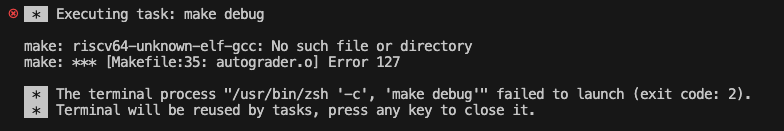

Solutions:

- Make sure you ran `module load riscv` first.  You must be on a lab machine, or eceprog, for this to work.
- If this does not work, make a post on Piazza.

### 4.2 `Configured debug type 'cppdbg' is not supported.` when debugging in VSCode


Solutions: Just click the `Install cppdbg Extension` button and relaunch debug session once it completes.

### 4.3 `Check your miDebuggerPath` or similar errors while debugging


- This usually happens if students ran VScode before running `module load riscv`.  On the machine that you are connecting to, start a separate SSH session, and run `pkill -f code-server`.  This will close all remaining VScode Remote instances.  
- Then, double-check that your `~/.bashrc` and `~/.profile` files to ensure that you copy-pasted the `case` statement from step 1.1 of this lab in order to load the RISC-V tools correctly.  Double-check that you can find the compiler after logging in.
- Then, try reconnecting to the same server with VScode Remote.
- If this still does not work, you can also try hardcoding the path to the debugger.  This isn't usually recommended, but since it's limited to this project folder, it should be fine for the time being.  Remember to do this for each lab folder you work on.
  - In a terminal, run `which riscv64-unknown-elf-gdb`.  This returns the location of the gdb executable.
  - Copy this path, and open `.vscode/launch.json` in your lab folder.
  - Change the value of the key "miDebuggerPath" to the path you just copied.
